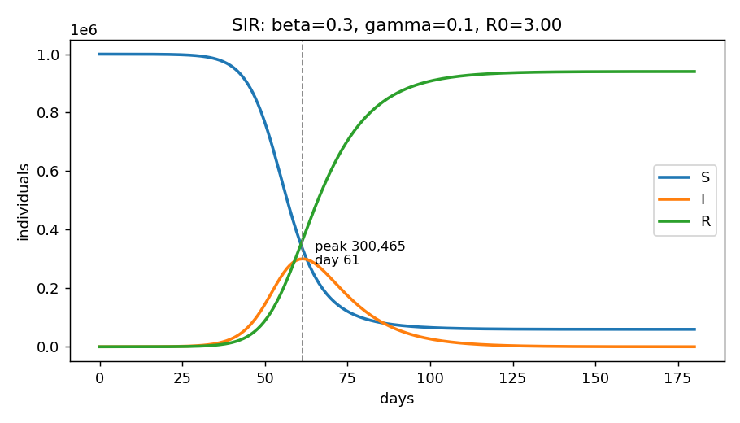

# Axiomize


**Turn any idea into a rigorous mathematical model.** An [Agent Skill](https://github.com/anthropics/skills) for AI coding agents (Claude Code, opencode, Cursor, ...) that takes a vague idea and returns formal mathematics: decomposed sub-problems, active parameter tables, models from **six perspectives**, an honest comparison, runnable validation code — and what would falsify the model.

## Why

LLMs answer "how do I model X?" with a single plausible guess. Real modeling discipline is different: you decompose, extract parameters with units, attack from several mathematical lenses, compare honestly, and state falsifiable predictions. This skill enforces that discipline.

## Three rigor levels

The same workflow serves a curious beginner and a thesis chapter — you pick the depth:

- **basic** — *"just tell me quickly"* → top parameters, 2 lenses, informal math, plain words
- **standard** *(default)* → the full 8-phase discipline
- **research** — *"rigorous / for my thesis"* → ≥ 3 lenses + model criticism, dimensionless reduction (Buckingham π), uncertainty quantification, reproducibility statement

Whatever the tier, every report opens with a **plain-language summary** (≤ 5 sentences, no jargon) and follows an **escalation rule**: if a quick run hits a threshold or lenses disagree, that sub-problem is automatically promoted one level deeper. See [`skills/axiomize/rigor.md`](skills/axiomize/rigor.md).

## The workflow

```
idea
 │
 ├── 1. Parse ............... system / state / goal / horizon
 ├── 2. Decompose ........... flow | interaction | decision | uncertainty
 │        + match against the archetype catalog (SIR, newsvendor, M/M/c...)
 ├── 3. Parameters .......... symbol - unit - range - sensitivity
 ├── 4. Assumptions ......... each with its violation consequence
 ├── 5. Multi-perspective ...
 │        deterministic | stochastic | optimization |
 │        agent-based | network | control
 ├── 6. Compare ............. scored table, one recommended model
 ├── 7. Implement ........... Python + sanity checks + sensitivity sweep
 └── 8. Falsifiability ...... what observation kills this model? + confidence ledger
```

## Install

Copy `skills/axiomize/` into your agent's skills directory:

```bash
# Claude Code
git clone https://github.com/Furox-Art/axiomize
cp -r axiomize/skills/axiomize ~/.claude/skills/

# opencode
cp -r axiomize/skills/axiomize ~/.config/opencode/skills/
```

Then just ask your agent:

> "Model this idea mathematically: a coffee shop wants to decide how many baristas to schedule"

## The twelve lenses

| Lens | Answers | Signature tool |
|------|---------|----------------|
| [Deterministic](skills/axiomize/perspectives/deterministic.md) | trends, equilibria, thresholds | ODEs, fixed-point & stability analysis |
| [Stochastic](skills/axiomize/perspectives/stochastic.md) | risk, rare events, fade-out | Markov chains, Monte Carlo |
| [Optimization](skills/axiomize/perspectives/optimization.md) | best decision under constraints | LP/NLP/ILP, shadow prices |
| [Agent-based](skills/axiomize/perspectives/agent-based.md) | emergence from heterogeneous local rules | parameter sweeps over N-agent sims |
| [Network](skills/axiomize/perspectives/network.md) | who-connects-to-whom effects | centrality, R_eff = R₀·⟨k²⟩/⟨k⟩ |
| [Control](skills/axiomize/perspectives/control.md) | how to steer & regulate | feedback laws, stability margins |
| [Game theory](skills/axiomize/perspectives/game-theory.md) | outcomes when rivals anticipate you | Nash equilibria, price of anarchy |
| [Causal inference](skills/axiomize/perspectives/causal-inference.md) | what happens IF we intervene | DAGs, backdoor adjustment, DiD/IV |
| [Information theory](skills/axiomize/perspectives/information-theory.md) | what can be known or compressed | entropy, mutual information, capacity |
| [Reliability](skills/axiomize/perspectives/reliability.md) | when things break; maintain or wait? | Weibull hazards, renewal–reward cost |
| [SPC](skills/axiomize/perspectives/spc.md) | is this change a signal or noise? | control charts, EWMA/CUSUM, Cpk |
| [Thermodynamic analogies](skills/axiomize/perspectives/thermodynamic.md) | stock-flow equilibria & bottlenecks | conservation discipline, resistance maps |

Lenses **compose**: e.g., queueing theory computes the wait, an integer program schedules the staff ([example](examples/coffee-shop-staffing.md)).

## Worked examples

| Idea | Becomes | File |
|------|---------|------|
| "A disease appears in a city of 1M" | SIR + R₀ threshold + stochastic fade-out check | [epidemic-sir.md](examples/epidemic-sir.md) |
| "How much stock should a retailer hold with uncertain demand?" | (s,Q) policy via newsvendor + safety stock + control view | [supply-chain-inventory.md](examples/supply-chain-inventory.md) |
| "How many baristas per hour?" | Erlang-C wait cliff inside a staffing ILP | [coffee-shop-staffing.md](examples/coffee-shop-staffing.md) |

## Validate the reference implementation

```bash
pip install numpy scipy

# deterministic SIR vs final-size theory + sensitivity sweep + plot
python skills/axiomize/tools/validate.py --model sir --beta 0.3 --gamma 0.1 --sweep --plot curve.png

# exact CTMC simulation -> extinction probability matches (1/(1+R0))^I0
python skills/axiomize/tools/validate.py --model gillespie --N 10000 --I0 1

# M/M/c staffing cliff -> minimal baristas for a 3-minute wait promise
python skills/axiomize/tools/validate.py --model queue --lam 60 --mu 20 --target-wait 3
```



## Calibrate with your own data

Phase 7 placeholders become real models when you feed observations. The bundled fitter estimates parameters with confidence intervals and derived quantities (R₀ with uncertainty, carrying capacity K, doubling times):

```bash
python skills/axiomize/tools/fit.py --model sir --data mycases.csv --plot fit.png
python skills/axiomize/tools/fit.py --model logistic --data adoption.csv
```

CSV format: time column first, observed values second (`day,infected`). Both models ship with `--selftest` modes that recover known ground truth from noisy synthetic data — the same honesty standard we demand from the models themselves.

Each mode prints internal-consistency checks (conservation laws, bounds, monotonicity, theory match) — the same checks Phase 7 demands from every model the skill produces.

## Related work

Idea→mathematics automation is an active research area; axiomize differs in scope and delivery format:

| Work | Focus | Difference |
|------|-------|------------|
| [OptiMUS](https://arxiv.org/abs/2402.10172) | multi-agent optimization modeling | one lens (optimization); research prototype, not installable |
| [OptimAI](https://arxiv.org/abs/2504.16918) | NL → optimization pipeline | single-perspective pipeline |
| [ORMind](https://arxiv.org/abs/2506.01326) | operations-reasoning framework | OR-specific |
| [LLM4OPT](https://github.com/ishmael233/LLM4OPT) | survey/taxonomy of LLM-for-optimization | catalog of papers |

Axiomize covers **twelve mathematical lenses** (not only optimization), adds **archetype recognition**, enforces **falsifiability and a confidence ledger**, and ships as a **standard Agent Skill** that any Claude Code / opencode / Cursor user can install by copying one folder.

## Repository layout

```
skills/axiomize/
├── SKILL.md              # the 8-phase workflow (the brain)
│                          + Parallel Dispatch Protocol (Phase 5)
├── archetypes.md         # idea-pattern catalog → canonical models (SIR, newsvendor, M/M/c...)
├── rigor.md              # three-tier ladder: basic / standard / research
├── perspectives/         # one file per mathematical lens
│   ├── deterministic.md  # ODEs, difference equations, thresholds
│   ├── stochastic.md     # Markov chains, Monte Carlo, risk
│   ├── optimization.md   # objectives, constraints, equilibria
│   ├── agent-based.md    # local rules → emergence
│   ├── network.md        # graphs, centrality, dynamics on networks
│   └── control.md        # feedback, regulation, steering
└── templates/
    ├── assumptions.md    # checklist with violation consequences
    ├── parameters.md     # active parameter table contract
    ├── subagent-brief.md # self-contained brief for each parallel lens agent
    └── report.md         # standardized final deliverable skeleton

examples/                 # full end-to-end case studies
docs/sir-example.png      # sample Phase-7 output plot
skills/axiomize/tools/    # bundled with the skill itself
├── validate.py           # consistency checks & sensitivity sweeps
├── fit.py                # calibrate parameters from your own CSV data
├── parallel_sweep.py     # real process-pool parallel execution engine
└── check_skill.py        # skill metadata & link linter
```

## Parallel lens dispatch

Phase 5 doesn't have to run lenses one-by-one. On runtimes with a subagent tool (Claude Code, opencode), the skill **freezes** the shared context (idea, decomposition, parameter table, assumptions), fills `templates/subagent-brief.md` once per applicable lens, and dispatches all briefs **in a single message** so they execute concurrently:

- each subagent sees exactly ONE perspective — independence kills anchoring bias between lenses
- coupled sub-problems stay in one brief; conflicts surface as explicit `ASSUMPTION CONFLICT` flags to resolve at merge time
- no subagent support? graceful sequential fallback, noted in the report

The same pattern is proven in code: [`skills/axiomize/tools/parallel_sweep.py`](skills/axiomize/tools/parallel_sweep.py) splits parameter grids and Monte Carlo chunks across a real process pool:

```bash
python skills/axiomize/tools/parallel_sweep.py --job sweep   # 28 ODE tasks, 8 workers, ~1.4s
python skills/axiomize/tools/parallel_sweep.py --job mc      # 400 CTMC runs in parallel chunks
```

## Design principles

1. **No symbol undefined** — every equation comes with every term defined.
2. **Units or it didn't happen** — parameters carry units; dimensionless is a deliberate choice.
3. **Two lenses minimum** — one perspective is a guess; two are an argument.
4. **Assumptions have consequences** — if you can't say what breaks when it's violated, you haven't examined it.
5. **Falsifiability required** — a model that can't be wrong isn't a model.

## Contributing

See [CONTRIBUTING.md](CONTRIBUTING.md). Perspective files follow a fixed contract; PRs adding lenses (information-theoretic, thermodynamic analogies, game-theoretic...) are welcome.

## License

MIT
