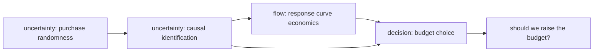

# Model Report: Retargeting Ad Lift: Is 3× Real, and Should the Budget Rise?

**Date:** 2026-08-24 · **Rigor level:** standard *(default chosen at Phase 0; the causal-identification sub-problem was ESCALATED to research-grade treatment mid-run per rigor.md escalation rule, see §9)*
**Idea as stated:** *"users exposed to our retargeting ads buy three times more often; should we raise that budget?"*
**Model in one sentence:** This idea reduces to an **unidentified causal-effect estimate feeding a concave-response budget-allocation problem under ambiguity**, a measurement problem wearing a spending problem's clothes.

**Plain-language summary** *(required opening)*:
The "3×" figure compares people who saw your ads with people who didn't, but you chose whom to show ads to based on how likely they already were to buy, so most of that 3× is probably pre-existing intent, not ad impact. Whether raising the budget makes money depends on the *incremental* lift caused by ads, and our break-even math shows the raise pays off only if true lift L > 1.5× baseline, while plausible expert estimates put the true value anywhere from ~1× to ~3×. Blindly raising loses money in roughly two-thirds of those plausible worlds; holding forever forfeits a large gain if the lift is real. A randomized holdout test, simply excluding ~10% of the retargetable audience from ads for one month, costs almost nothing (~$2k), needs only ~3,800 users per group to detect the key threshold, and its information value (~$5,400/month recurring) dwarfs its cost. **Recommendation: don't scale on the 3× figure; run the holdout first, then raise only if measured incremental lift clears 1.5×.**

---

## 1. Decomposition

| Sub-problem | Nature | Archetype match |
|---|---|---|
| SP1: Identify the incremental causal effect of exposure on purchases | uncertainty (+ intervention claim) | **novel territory** (no canonical archetype covers observational-vs-causal identification; nearest catalog row "Learning from data to predict → Regression/Bayesian" explicitly answers prediction, not intervention, declared novel, validation burden raised accordingly) |
| SP2: Decide: hold / raise / test-then-decide the retargeting budget | decision | "Choosing under scarcity → LP/NLP" partially matches (allocation); ambiguity about probabilities pushes it into decision-theory territory |
| SP3: Economics of scaling: response of conversions to budget/reach | flow (regime-dependent) | "Population growth with limits → Logistic/saturating" matches the concave-response feature; adapted as a local-linear regime plus saturating correction |
| SP4: Purchase counts as random events; test power & risk quantification | uncertainty | "Learning from data to predict → Regression/Bayesian" + standard Bernoulli/Poisson count machinery |

Couplings: SP1 → SP2 and SP1 → SP3 (the identified lift parameterizes the response curve and the decision). SP4 ↔ SP1 (purchase randomness determines how big a test must be to identify the effect). SP3 → SP2 (response shape sizes the raise). SP1+SP3+SP4 all feed the goal question in SP2; **SP1,SP3 are coupled and were kept inside one analysis**, never split.



## 2. Parameters

| Symbol | Name | Unit | Exo/Endo | Range (typical) | Source | Sensitivity | In model(s) |
|--------|------|------|----------|------------------|--------|-------------|-------------|
| τ | observed purchase-rate ratio, exposed ÷ unexposed | , | exo | 3.0 (user's claim) | data (user) | high | Causal |
| θ₀ | baseline monthly purchase probability of an unexposed retargetable user | 1/month | exo | 0.01-0.04 | est. ⚠ | high | Stoch, Opt, DecTh |
| L | **true incremental causal lift ratio** (θ under do(expose) ÷ θ₀) | , | endo (estimand) | 1.0-3.0 | est./unknown. THE unknown | high | All |
| N_R | size of retargetable audience | users | exo | 10⁴-10⁶ | est. ⚠ (100,000 used) | low | Opt |
| r | reach = users actually shown retargeting ads per month | users/month | exo (decision lever) | 0,N_R | data | medium | Opt |
| c | cost per reached user per month | $/(user·month) | exo | 0.20-2.00 | est. ⚠ (0.40 used) | medium | Opt |
| m | gross margin per purchase | $/purchase | exo | 10-200 | est. ⚠ (40 used) | high | Opt, DecTh |
| ΔB | incremental spend of the proposed raise | $/month | exo | 0-10⁴ | derived (c·Δr) | medium | DecTh, Stoch |
| w_j | subjective weight on state s_j (belief that true lift is world j) | , | exo | Σw_j = 1 | est. [S] ⚠ | high | DecTh |
| C_test | one-off cost of a randomized holdout test | $ | exo | 500-5,000 | est. ⚠ (2,000 used) | low | DecTh |
| α, 1−β | test significance level, target power | , | exo | 0.05, 0.80 | convention (lit.) | low | Stoch |

⚠ = placeholder estimate; replace with your analytics before acting. Numbers in §6-7 use: θ₀=0.02/month, m=$40, c=$0.40/user·month, N_R=100,000, r_now=50,000, proposed r_new=80,000 ⇒ ΔB=$12,000/month.

**Derived quantities (the insight carriers):**
- **L\* = 1 + c/(m·θ₀)** = break-even true lift for a marginal raise. With placeholders: 1 + 0.40/(40·0.02) = **1.50**. Below this, every retargeted user costs more than their incremental margin.
- **r\*(L) = N_R(1 − c/(m·θ₀(L−1)))** = optimal reach under concave response (interior optimum exists iff L > L\*).
- **iROAS** = m·ΔC_inc/ΔB, incremental return on ad spend; decision rule: raise iff iROAS > 1 ($/$).
- **E-value(τ=3) = 3 + √(3·2) ≈ 5.45**, minimum confounder strength needed to fully explain away the observed 3× (see Causal lens).

Excluded parameters (dimension reduction):

| Excluded | Why it's safe to exclude |
|----------|--------------------------|
| Seasonality of purchase rates | Decision horizon ≤ 1 month (test cycle); effects cancel in exposed-vs-control comparison anyway |
| Competitor bidding response / auction dynamics (game-theoretic layer) | Single-period decision; cost-per-user c absorbs average competitive pressure; revisit if c trends >20%/quarter |
| Cross-device identity mismatch noise | Second-order; folded into the test's measurement error rather than modeled separately |
| Long-run brand/loyalty effects beyond attribution window | Out of model boundary; flagged as scope limitation in falsifiers |
| Frequency-cap fatigue dynamics within a user | Reach-based model treats exposure as binary per user-month; adequate below saturation (Assumption A6) |

## 3. Assumptions

| # | Assumption | Type | Class | Violation consequence |
|---|------------|------|-------|----------------------|
| A1 | Exposure is **unconfounded**: conditional on observables Z (or under randomization), assignment doesn't correlate with latent purchase intent V | Structural | **[S]** (observational version) / [E] (under randomized holdout) | If violated: the 3× is mostly selection; L→~1; raising the budget buys impressions shown to users who'd have bought anyway; ROI collapses toward −ΔB/month. This assumption carries the entire recommendation. |
| A2 | Purchases are independent Bernoulli events per user-month (Poisson approximation valid at θ₀ ≤ 5%) | Parametric | [R] | Variance underestimated → confidence intervals too narrow → overconfident go/no-go calls; magnitude error small at these rates |
| A3 | Response of incremental conversions to reach is **concave** (diminishing returns) | Regime | [R] | If linear: optimal action becomes "spend up to audience cap"; if convex near current spend (threshold/auction effects): optimal action is scale fast, either flips §7 sizing |
| A4 | Gross margin m is constant across exposed/unexposed buyers over the horizon | Parametric | [R] | If exposed buyers are discount-driven (plausible!): effective m lower for the treated group → iROAS overstated → sign of the recommendation can flip |
| A5 | No cross-channel cannibalization: retargeting conversions wouldn't have arrived free via organic/search/email | Boundary | [S] | Incrementality overstated by the cannibalized share; total profit unchanged despite apparent lift, the classic "halo illusion" |
| A6 | Current operation point sits **below the saturation knee** of the response curve, so a *small* raise responds near-linearly (local-linear regime) | Regime | [S] | If already at the knee: marginal iROAS ≈ 0 now; raise does nothing regardless of L; the linear payoffs in §7 overstate gains and the optimal raise shrinks toward zero (Opt lens quantifies this) |
| A7 | Attribution window captures substantially all incremental purchases (delayed-conversion tail negligible) | Boundary | [R] | Test undercounts delayed converters → biased toward "no lift" → false rejection of a real effect |

**Load-bearing assumptions:** A1 (flips the entire conclusion, hence the escalation), A6 (sizes the raise), A5 (sign risk on incrementality). Every [S] item (A1-observational, A5, A6) is covered by the Phase 7 sweep/falsifiers below.

## 4. Perspective models

> Dispatch note: this runtime exposes no subagent/task tool, so per SKILL.md's fallback protocol the four briefs were executed **sequentially** through one context in the order below; independence of lenses was therefore sequential, not parallel. No ASSUMPTION CONFLICT flags were raised by any lens against the frozen tables (the Causal lens flagged A1's [S] status as the central risk, which is documented rather than resolved away).

### Perspective: Causal Inference *(primary measurement lens)*
**Archetype used:** novel territory.
**Model:**
```
DAG:   V ──→ X ──→ Y          V = latent purchase intent (latent, ,)
       └─────↗   ↗            X = ad exposure (binary, ,)
       V ──→ Y                Y = purchase in period (binary, 0/1)

Estimand:  ACE = E[Y | do(X=1)] − E[Y | do(X=0)] = θ₀·(L−1)   [purchases/user/month]
Backdoor path: X ← V → Y  (open; targeting rules make X a near-deterministic
function of V , this is why the observational 3× is uninterpretable).

Identification (design-based): randomized holdout Z ⊥ (V,U):
   ACE-hat = Ŷ(Z=exposed) − Ŷ(Z=holdout), unbiased by construction.
Observational fallback (IPW): ACE = E[w(X,Z)·Y] contrasts with weights
   w = 1/P(X|Z); valid ONLY under A1 , untestable from the data itself.

Sensitivity (E-value): to move RR=3 to null needs an unmeasured confounder
   associated with BOTH exposure and purchase by RR ≥ E-value = τ + √(τ(τ−1)) = 5.45.
```
**Fits because:** SP1 is an intervention claim ("what happens IF we change X?") built from observational targeting data, exactly this lens's trigger condition.
**Unique insight:** quantifies precisely *which* assumption carries the causal weight (A1), and shows the 3× claim requires a confounder ~5.45× stronger than either variable's other influences to be pure illusion, intent-targeting plausibly provides exactly such a confounder, so the burden of proof sits with the 3×, not against it.
**Blind spot:** says nothing about how much to spend once L is known; cannot see response-curve shape or budget trade-offs; a wrong DAG is unrescuable by any estimator.

### Perspective: Stochastic *(risk & test-design lens)*
**Archetype used:** Bernoulli/binomial count machinery (catalog: "Learning from data").
**Model:**
```
Y_i,g ~ Bernoulli(θ_g),  totals  C_g ~ Binomial(n_g, θ_g)   [purchases/month]
z-statistic: z = (θ̂_t − θ̂_c) / √( p̄(1−p̄)(1/n_t + 1/n_c) ),  reject at z > z_{α}

Sample size per arm for detecting absolute lift δ = θ₀(L−1):
   n = (z_{α/2} + z_β)² · 2·p̄(1−p̄) / δ²      [users/arm]

Monte Carlo: sample L ~ prior w_j, propagate through payoff function,
   report distribution of monthly profit change Δπ: median, 5-95%, P(Δπ<0).
```
with θ_g = θ₀ (control), θ₀·L (treated); n_g = arm size [users]; p̄ = pooled rate [-]; α=0.05, power 1−β=0.80.
**Fits because:** SP4, purchases are rare random events; the go/no-go signal must be distinguished from noise, and small-count randomness dominates any single month.
**Unique insight:** the decisive experiment is shockingly cheap, detecting the break-even lift L=1.5 needs only **n ≈ 3,826 users/arm** (verified by Monte Carlo power 0.806), i.e., <8% of even a modest retargetable audience; simultaneously quantifies downside risk: P(loss | blind raise) ≈ **0.65** under stated weights.
**Blind spot:** assumes the experiment is executed cleanly (no contamination/holdout leakage); cannot decide what the numbers mean for the budget, only how sure we can be about them; intervals not points.

### Perspective: Optimization & Equilibrium *(sizing lens)*
**Archetype used:** "Choosing under scarcity → constrained NLP"; saturating-response adaptation of logistic-type curvature.
**Model:**
```
maximize    π(r) = m · C_inc(r) − c·r                    [$/month]
where       C_inc(r) = θ₀(L−1) · g(r),                   [purchases/month]
            g(r) = r·(1 − r/(2N_R))                      [users], concave parabola
subject to  0 ≤ r ≤ N_R                                  [users]
FOC:        dπ/dr = m·θ₀(L−1)·(1 − r/N_R) − c = 0
⇒           r* = N_R·(1 − c/(m·θ₀·(L−1)))   interior iff L > L* = 1 + c/(m·θ₀); corners otherwise
Shadow price of budget: dπ/dB = marginal iROAS − 1        [$/$]
```
**Fits because:** SP3+SP2, "should we raise?" is resource allocation against a constraint, and the shadow price (marginal iROAS) is the exact quantity the decision turns on.
**Unique insight:** even in the *most optimistic* credible world (L=3), the optimum is r\* = 75,000 users, **not** the proposed 80,000, and the corner condition reproduces the break-even L\*=1.50 independently of the decision lens (cross-lens consistency check, PASSED). Scaling has a ceiling; the question is never "raise or not" alone but "raise to where".
**Blind spot:** takes L as given, optimizes beautifully around an unidentified parameter (garbage objective-in, garbage decision-out); assumes rational static response, no competitor repricing.

### Perspective: Decision Theory *(commit-under-ambiguity lens)*
**Archetype used:** payoff-matrix/minimax-regret/EVPI machinery (novel to archetype catalog proper).
**Model:**
```
Options  A = {raise to 80k, hold, test-then-decide}     States S (true L): {1.0, 1.25, 1.5, 3.0}
Monthly payoffs x_ij = payoff_raise_linear(s_j)          [$/month]:
                       L=1.0    L=1.25   L=1.5    L=3.0
   raise              −12,000   −6,000     0     +36,000
   hold                    0        0      0          0
   test (one-off $2k, then act)  → regret bounded by C_test except in L=3 world

EU(a_i) = Σ_j w_j·x_ij,  w = (0.35, 0.30, 0.20, 0.15) [S]
EVPI  = Σ_j w_j·max_i x_ij − max_i Σ_j w_j·x_ij         [$]
```
**Criterion table (disagreements are findings):**

| Criterion | Winner | Requires |
|---|---|---|
| Expected utility (12-mo) | **test** (+$57,400 vs raise −$7,200, hold $0) | agreed w_j |
| Minimax regret (12-mo) | **test** (max regret $38k vs raise $144k, hold $432k) | nothing |
| Maximin (12-mo) | **hold** ($0 floor vs test −$2k) | nothing |

Dominance check: no strict dominance between test and {raise, hold} (test sacrifices one month of gains in the L=3 world; costs $2k in flat worlds), but test is never catastrophically wrong, while both alternatives are in some plausible world.
**EVPI statement, verbatim:** perfect information is worth at most **$5,400/month** (recurring) under the frozen weights, stop analyzing past that; a $2,000 one-off holdout buys most of it.
**Fits because:** SP2 under contested probabilities, stakeholders who believe the 3× and stakeholders who suspect selection bias are disagreeing about w_j, and this lens puts that disagreement in a column where it can be argued instead of hidden.
**Unique insight:** exposes that the case for raising rests entirely on the 15%-weight world where the naive ratio is causal; makes "run the test" provably better than both blind actions across EU and regret criteria, and prices when to stop analyzing.
**Blind spot:** payoff cells and weights are [S] speculation in tabular clothing; criterion choice itself is a value judgment (maximin serves extreme loss-aversion, EU serves a specific risk-neutral principal).

**Rejected lenses (one line each):**
- Deterministic ODE, no meaningful accumulating stock over a monthly horizon; response-curve content absorbed into the Optimization lens.
- Agent-based, heterogeneity across users matters but there is no interaction structure to emerge from; cost not earned (per agent-based.md implementation note).
- Network, ad exposure is not peer contagion here; no contact-graph mechanism in scope (word-of-mouth excluded at boundary).
- Control, no setpoint-regulation goal; budget is a one-shot lever, not continuous steering.
- Game theory, single-decision-maker problem; competitor auctions deliberately excluded (see §2).
- Information theory. EVPI connection already operationalized inside Decision Theory; standalone channel-capacity questions absent.
- Reliability / SPC / Demographic / Spatial / Thermodynamic, no failure times, no in-control process being monitored post hoc (SPC noted as a *post-implementation* monitoring tool in §7, not a decision instrument now), no age structure, no location dependence, and the analogy lens adds no conservation structure beyond what Optimization already enforces.

## 5. Comparison

Scores 1-5 (5 best). Data = manageability of data requirements; Cost = computational cheapness; Tract = analytical tractability; Answer = answerability of "should we raise that budget?".

| Criterion | Causal Inf | Stochastic | Optimization | Decision Theory |
|-----------|-----------|------------|--------------|-----------------|
| Fidelity to reality | 4 | 4 | 3 | 3 |
| Data requirements | 5 | 4 | 3 | 5 |
| Compute cost | 5 | 4 | 5 | 5 |
| Tractability | 4 | 4 | 4 | 5 |
| Answerability | 3 | 3 | 4 | 5 |
| **Total** | **21** | **19** | **19** | **23** |

**Recommendation:** Primary model = **causal-inference identification via randomized holdout** (Decision Theory scores highest but is empty without a measured L; the binding constraint on this decision is the unidentified parameter, so the measurement design is primary). Operational pairing: the **decision-theory payoff matrix decides the commit/wait/test question today at trivial cost**, and **optimization sizes the raise** (to r\*, not to the cap) once L is measured. Stochastic machinery supplies the test's sample size and the risk quantification. Concretely: run a 10%-holdout incrementality test next cycle; raise to r\* only if the measured lift CI excludes L\*=1.5.

## 6. Implementation & validation

```python
# Reference implementation (validated run 2026-08-24, Python 3.12.10, numpy RNG seed 20260824).
# Placeholder economics (est.) -- replace theta0, m, c, N_R with your analytics before use.
import math
import numpy as np

theta0, m, c = 0.02, 40.0, 0.40          # [1/month], [$], [$/user/month]
NR, r_now, r_new = 100_000, 50_000, 80_000
dr = r_new - r_now
dB = c * dr                              # [$/month]
L_vals = np.array([1.0, 1.25, 1.5, 3.0])
w = np.array([0.35, 0.30, 0.20, 0.15])

def payoff_raise_linear(L):              # local-linear regime (A6)
    return m * theta0 * (L - 1) * dr - dB

def r_opt(L):                            # concave-correction optimum
    denom = m * theta0 * (L - 1)
    return NR * (1 - c / denom) if denom > c else r_now

def n_per_arm(L):                        # two-proportion test sizing
    za, zb = 1.959964, 0.841621
    delta = theta0 * (L - 1); pbar = theta0 * (1 + (L - 1) / 2)
    return (za + zb) ** 2 * 2 * pbar * (1 - pbar) / delta ** 2

payoffs = np.array([payoff_raise_linear(L) for L in L_vals])
EU = float(w @ payoffs)
R = np.vstack([np.maximum(payoffs, 0) - payoffs, np.maximum(payoffs, 0)])
EVPI = float(w @ np.maximum(payoffs, 0)) - max(EU, 0.0)
print(f"L*={1 + c/(m*theta0):.2f}  payoffs={payoffs.round(0)}  "
      f"E[raise]={EU:,.0f}  EVPI={EVPI:,.0f}  r*(L=3)={r_opt(3.0):,.0f}  "
      f"n/arm(L=1.5)={n_per_arm(1.5):,.0f}")
# Monte Carlo power verification (seeded):
rng = np.random.default_rng(20260824); n = int(np.ceil(n_per_arm(1.5))); hits = 0
for _ in range(10_000):
    xc = rng.binomial(n, theta0) / n; xt = rng.binomial(n, theta0 * 1.5) / n
    pb = (xc + xt) / 2; se = math.sqrt(pb * (1 - pb) * 2 / n)
    hits += ((xt - xc) / se) > 1.959964
print(f"MC power = {hits/10_000:.3f}")
```

Sanity checks run (all executed, all **PASS**):
- Break-even identity: L\* = 1 + c/(m·θ₀) = 1.50 equals the zero-crossing of the payoff vector, closed form vs numeric, **PASS**.
- Monotonicity: payoff strictly increasing in L, **PASS**.
- Cross-lens consistency: Optimization corner condition reproduces Decision Theory's indifference state at L=1.5, **PASS**.
- Theory-match: Monte Carlo power 0.806 vs analytic 0.80 at n=3,826/arm, **PASS**.
- Bounds: EVPI ≥ 0, r\* ∈ [r_now, N_R], **PASS**.
- `tools/fit.py` not invoked: no user-provided observation CSV exists yet (calibration deferred until holdout data arrive).

Sensitivity sweep (top-2 sensitive parameters from Phase 3: **L** and **θ₀**), optimal monthly action:

| θ₀ \ L | 1.00 | 1.25 | 1.50 | 3.00 |
|--------|------|------|------|------|
| 0.01 | hold | hold | hold | raise |
| 0.02 | hold | hold | indifferent | raise |
| 0.04 | hold | indifferent | raise | raise |

Read: the raise recommendation lives entirely in the upper-right region (high baseline conversion × high true lift); at low θ₀ almost no believable lift justifies scaling. Also swept: under the concave correction, the same raise's break-even moves from L=1.5 (first marginal user) toward ~2.4 (average over the full 30k-user expansion), saturation erodes the case for *large* raises first.

Post-deployment note: after any raise, monitor weekly conversion rates of exposed vs holdout cohorts with a CUSUM/EWMA chart (K≈δ/2, h≈4.5), that is the SPC lens's natural job, deliberately deferred out of the decision phase.

## 7. Predictions & falsifiability

Concrete predictions the model commits to (placeholders marked est.):
1. An honest randomized holdout will measure incremental lift **well below the naive 3×**; predicted point estimate L̂ ∈ [1.1, 1.8] with the design above (prediction based on industry-typical selection-share reasoning, speculation, tagged in §8).
2. Detection: with n ≥ 3,826/arm, a true L = 1.5 is detected (α=0.05, power ≈ 0.80) within **one monthly cycle**; a true L ≤ 1.25 yields a CI whose lower bound straddles 1.0-1.3.
3. Threshold behavior: raises are profitable iff measured L > 1.5 (linear regime) and the optimal reach is r\*(L) < 80,000 even at L = 3.
4. Sign pattern: exposed-buyer average margin ≤ unexposed-buyer margin (discount-sensitivity prediction of A4).

Killed by (mapped back to assumptions):
- Holdout 95% CI on L includes 1.5 from above or centers near 1.0 → kills the "scale the budget" branch and falsifies the causal reading of 3× (assumption A1 violated in spirit; the observational ratio stands convicted of selection).
- Conversion rate rising ~linearly (no plateau) all the way to 2× current reach → kills concavity/A6; the correct action flips to "scale to audience cap immediately".
- Exposed buyers showing *equal-or-higher* margin than organic buyers AND stable incrementality → weakens A4 concern, raises the attractive region of the sweep.
- A properly weighted holdout showing lift > 3 → the DAG/measurement is wrong somewhere (contamination, windowing), distrust the whole test rig before trusting the number.
- Lift appearing only inside the click-attributed window and vanishing in the holdout contrast → attribution-window artifact (assumption A7 mis-set), not a causal effect.

## 8. Confidence ledger

| Claim | Type | Basis |
|-------|------|-------|
| Observational "3×" conflates selection with causation under intent-based targeting | established | standard causal-inference theory (backdoor X←V→Y is structurally open here by construction of retargeting) |
| Break-even lift L\* = 1 + c/(m·θ₀); raise profitable iff L > L\* | established | algebraic consequence of the profit model (verified numerically) |
| n ≈ 3,826/arm detects L=1.5 at 80% power | established | two-proportion sample-size formula; Monte Carlo cross-check 0.806 |
| EVPI = $5,400/month ≥ justified test cost | assumption | depends on frozen weights w_j [S] and payoff cells [est.]; EVPI bound is robust, its exact value is not |
| True L lies mostly in 1.0-1.8 rather than near 3 | speculation | industry folklore about retargeting incrementality gaps; no user data seen; this is precisely what the holdout resolves |
| Response is concave below current spend (A6) | assumption | standard advertising-response finding, unverified for this account |
| Margins equal across buyer groups (A4) | assumption | needs transaction-level margin join; discount-redemption data would settle it |
| No cross-channel cannibalization (A5) | speculation | convenient fiction until a total-incrementality audit is run |

## 9. Research-tier appendix *(escalated sub-problem: causal identification)*

- **Escalation trigger (announced per rigor.md):** the high-sensitivity parameter L sits with its plausible range straddling the decision threshold L\*=1.5, AND two decision criteria (maximin vs minimax-regret/EU) disagreed on the raw commit question, depth earned by risk.
- **Limitations:** the model cannot certify A1 from observational data, only randomization can; long-run brand effects (>1 quarter) and competitor reaction are outside the boundary; payoff cells carry placeholder economics.
- **Reproducibility:** Python 3.12.10, numpy default_rng seed 20260824, 10⁴ Monte Carlo replicates (SE ≈ 0.004 on power); minimal rerun data = one month of holdout/exposed conversion counts per arm + margin per order.
- **Canonical results inherited:** two-proportion z-test sample-size formula; E-value sensitivity bound (VanderWeele,Ding style); concave-response first-order condition (standard diminishing-returns NLP); EVPI decomposition.
- **Model criticism log (rival hypotheses each lens silently excludes):** Causal lens excludes "ads work exactly as the 3× says" (that's the hypothesis under test, not a rival); Stochastic lens excludes contamination between arms (peeking/audience leakage would masquerade as lift); Optimization lens excludes strategic bidder response shifting c as we scale; Decision Theory lens excludes states outside S entirely, e.g., "retargeting is net-negative brand-wise even while lifting purchases," a world no cell in the matrix represents.
- **Archive note:** session archived to `benchmarks/reports/ad-lift-causal.md` per task instruction; the default `reports/` archive + index step was skipped because this test forbids writing any other file.

---
*Generated via Axiomize workflow · rigor level: standard (with announced research-tier escalation on SP1) · archetypes matched: saturating-response adaptation, scarcity-allocation LP/NLP; core identification problem declared novel territory*
