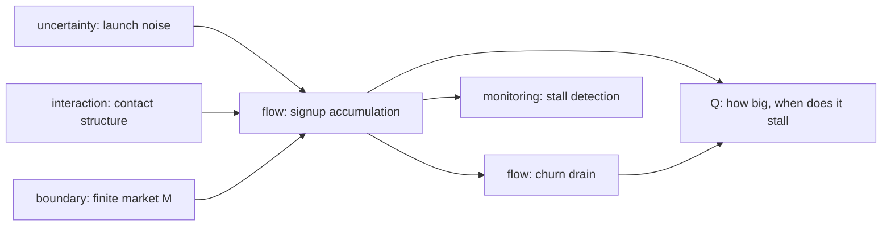

# Model Report: App Adoption Ceiling & Stall Timing

**Date:** 2026-08-24 · **Rigor level:** standard *(chosen at Phase 0; see rigor.md)*
**Idea as stated:** *"Model this idea mathematically: our new app's signups are growing fast; how big can it get and when will growth stall?"*
**Model in one sentence:** This idea reduces to a **Bass-diffusion-type system** (advertising-driven innovators plus word-of-mouth imitation) spreading through a **finite addressable market**, with a **churn outflow** separately draining the active-user base.

**Plain-language summary** *(≤ 5 sentences)*:
Your signups behave like a contagion in a finite crowd: fast early growth must flatten because the pool of people who haven't signed up keeps shrinking — the ceiling is your true addressable market **M**, and with typical consumer-app numbers the signup wave crests when roughly **half of M** has signed up. Separately, your **active** users crest later and lower, because churn drains them; their health depends on whether word-of-mouth strength beats the churn rate. Timing is governed almost entirely by two rates — imitation `q` and innovation/marketing `p` — while market size `M` only scales headcount, not dates. We recommend fitting this model to your weekly signup counts, then wiring an automatic alarm (EWMA residual monitor) so you learn the *actual* stall week within days instead of arguing about it. All numbers below use clearly-marked placeholder parameters until you supply data.

---

## 1. Decomposition

*Rigor note (Phase 1):* goal routed as **PREDICTION** (with a monitoring sub-goal). In an interactive session I would first ask: (a) is the metric cumulative *signups* or monthly *actives*? (b) what time granularity of history exists? (c) are paid-UA bursts scheduled? Here both a system boundary (app user population vs. one addressable market) and a goal question (predict ceiling and stall date) can be stated, so the workflow proceeds; those three answers would become assumption-row updates, not structural changes.

| Sub-problem | Nature | Archetype match |
|---|---|---|
| SP1. Signup accumulation via ads + word-of-mouth | flow | **Bass diffusion** (Bass 1969) |
| SP2. Ceiling: finite prospect pool | flow / boundary | **Logistic growth** (carrying capacity K ≡ M) |
| SP3. Churn drain of the active base | flow | SIS-style removal (adapted: no re-entry in base case) |
| SP4. Contact-structure amplification (influencers/clusters) | interaction | Network SIS/SIR (`R_eff = R₀⟨k²⟩/⟨k⟩`) |
| SP5. Launch-phase randomness (small counts) | uncertainty | Birth–death process / CTMC |
| SP6. Is slowing real saturation or noise? | uncertainty (monitoring) | Statistical Process Control (EWMA/CUSUM) |

**Couplings:** SP1 and SP2 share one mass balance (`P + C = M`); SP3 draws out of `C` one-way in the base case (feeds back only in the soft-churn variant); SP4 rescales `q` inside SP1's flux; SP5 wraps SP1+SP3 whenever weekly counts are small; SP6 consumes SP1's predicted trajectory as its baseline.



## 2. Parameters

| Symbol | Name | Unit | Exo/Endo | Range (typical) | Source | Sensitivity | In model(s) |
|--------|------|------|----------|------------------|--------|-------------|-------------|
| M | addressable market | persons | exo | 10⁴–10⁷ | est. ⚠ | **high** | det, stoch, net |
| p | innovation coefficient (ads/press/SEO) | 1/wk | exo | 0.003–0.05 | lit. (Bass-typical) | medium | det, stoch, net |
| q | imitation coefficient (word-of-mouth) | 1/wk | exo | 0.2–0.5 | lit. | **high** | det, stoch, net |
| δ | churn rate of active users | 1/wk | exo | 0.03–0.15 | est. (consumer-app norm) ⚠ | **high** | det, stoch |
| C₀, A₀ | initial signups / actives | persons | exo | 1–10³ | data (user) | medium (early only) | det, stoch |
| t | time since launch | wk | independent | ≥ 0 | — | — | all |
| P(t) | prospects not yet signed up | persons | endo | [0, M] | derived | — | det, stoch |
| C(t) | cumulative signups | persons | endo | [0, M] | derived | — | det, stoch |
| A(t) | active users | persons | endo | [0, C] | derived | — | det, stoch |
| φ(C,P) | signup flux = (p+qC/M)P | persons/wk | endo | ≥ 0 | derived | — | det, stoch |
| a_k(t) | active share among degree-k nodes | – | endo | [0,1] | derived | — | net |
| θ(t) | edge-fraction pointing to actives | – | endo | [0,1] | derived | — | net |
| ⟨k²⟩/⟨k⟩ | degree-heterogeneity ratio | – | exo | 1–10 | est. ⚠ | medium | net |
| xₜ | observed weekly net signups | persons/wk | exo (data stream) | ≥ 0 | data | — | spc |
| x̂ₜ | model-predicted adds/wk | persons/wk | endo | ≥ 0 | derived | — | spc |
| zₜ | EWMA of standardized residuals | – | endo | — | derived | — | spc |
| λ_spc, L | EWMA smoothing, limit width | – , – | exo | 0.1–0.3 ; ≈3 | lit. (SPC convention) | low | spc |
| K_c, H | CUSUM allowance, threshold | – , – | exo | ≈Δ/2 ; 4–5 | lit. | low | spc |

**Excluded parameters** (dimension reduction):

| Excluded | Why it's safe to exclude |
|----------|--------------------------|
| Seasonality of `p`, `q` | Horizon of interest ≲ 1 yr; revisit after week ~50 |
| Paid-vs-organic attribution split | Both fold into `p`; split only matters for budget decisions, not the ceiling question |
| Competitor entry / counter-launch | Boundary exclusion; no competitor named — game lens rejected below |
| Price / packaging changes | None stated by user |
| Geographic structure | No geo data; spatial lens rejected below |
| Cohort-age-specific churn (aging of the user base) | Single aggregate `δ` adequate at this horizon; demographic lens rejected below |
| Server/capacity limits on signup flow | Regime assumption: infra scales; flag if signup conversion ever caps |

**Derived quantities** (the insight carriers):
- Early signup growth rate: `g_C = q − p` (1/wk); doubling time `ln 2 / g_C`.
- Early active-base growth margin: `g_A = q − p − δ` (1/wk) — the **threshold**: actives compound only while `q > p + δ`.
- Signup-rate peak (inherited Bass closed forms, exact here because churn never touches `C`):
  `t*_C = ln(q/p)/(p+q)` and `C(t*_C)/M = (q−p)/(2q)` (valid for `q > p`).
- Time to any saturation fraction F of M:
  `t_F = −ln[ (1−F) / (1 + F·q/p) ] / (p+q)`.
- Soft-churn (win-back) active ceiling: `A* = (M/2q)[ (q−p−δ) + √((q−p−δ)² + 4pq) ]` persons.
- Branching-phase extinction risk of the early invite chain (no ad floor): `≈ (δ/q)^{A₀}` for `q > δ`.

## 3. Assumptions

| # | Assumption | Type | Class | Violation consequence |
|---|------------|------|-------|----------------------|
| 1 | Every person is in exactly one compartment; mixing is homogeneous (`∝ C·P`) | Structural | [R] | Clustered/influencer-centric networks inflate early growth and shift the stall date earlier than predicted; network lens quantifies the correction factor |
| 2 | `p, q, δ` constant over the horizon | Parametric | [R] | Marketing bursts create multiple rate peaks (SPC flags these as special causes); fitted single-inflection shape fails |
| 3 | `M` fixed, known order-of-magnitude; no TAM expansion or competitor disqualification of prospects | Boundary | [S] | The ceiling answer is wrong by exactly the error in `M`; this is the dominant unknown in the whole model |
| 4 | Signup flux well approximated by mass action in `(C/M)·P` | Regime | [R] | Super-exponential early growth (viral reinforcement beyond linear imitation) violates it; log-signups turn convex |
| 5 | Churn is permanent (hard churn: lapsed users never return) | Structural | [S] | If users actually cycle back (soft churn), actives don't decay to 0 long-run but saturate at interior `A*` (closed form above); base case is the conservative reading |
| 6 | Large-number averaging valid once weekly counts ≳ 100 | Regime | [E] | Near launch (counts ≲ 30) deterministic means mislead; extinction/multi-week plateaus possible — stochastic lens takes over |
| 7 | No mid-horizon re-engagement campaigns changing effective δ | Parametric | [S] | Observed plateau sits higher than predicted; SPC would show a level *up*-shift rather than stall |
| 8 | "Signups growing fast" reflects sustained exponential phase, not a one-off spike | Regime | [S] | If current data are a spike, no model of this family fits; calibration will expose it immediately (poor RMSE) |

**Load-bearing assumptions:** #3 (`M`), #2 (rate constancy), #5 (churn regime). Each is testable with ordinary product analytics data.

## 4. Perspective models

> Dispatch note: this runtime exposes no subagent/task tool, so per SKILL.md's Parallel Dispatch Protocol fallback the four frozen briefs were executed sequentially in one context — independence was **sequential, not parallel**. No ASSUMPTION CONFLICT was raised by any lens against the freeze; one refinement (lens 4's Poisson standardization) was adopted into lens 2's output band reporting.

### Deterministic — Bass diffusion with churn drain *(primary)*
**Archetype used:** Bass diffusion (kept: innovator + imitation flux, finite-M ceiling; added: churn compartment decoupled from `C`; relaxed: none material).
**Model:** state `y = (P, C, A)`, unit wk / persons:

$$\dot P = -\varphi,\quad \dot C = \varphi,\quad \dot A = \varphi - \delta A,\qquad \varphi = \Big(p + q\tfrac{C}{M}\Big)P,\qquad P + C = M$$

Fixed points: `P* = 0 ⇒ C* = M`, `A* = 0` (hard churn). Thresholds: signups reach `M` for any `p>0` or `q>0`; actives compound early iff `g_A = q−p−δ > 0`. Inherited closed forms: `F(t) = (1−e^{−(p+q)t})/(1+(q/p)e^{−(p+q)t})`, `t*_C = ln(q/p)/(p+q)`, `C(t*_C)/M = (q−p)/(2q)`, `t_F` as in §2. Soft-churn variant ceiling `A*` as in §2.
**Fits because:** SP1+SP2 are pure accumulating flows with a capacity limit — the textbook Bass/logistic signature.
**Unique insight:** separates the user's conflated questions — the **signup-rate stall date** (parameter-set by `p,q` alone, invariant to `M`) precedes the **active-base peak date**, and the two ceilings differ (`M` vs. `A_max < M`). Closed-form targets inherited free.
**Blind spot:** noise, contact heterogeneity, and everything happening at small counts; says nothing about detecting the stall in live data.

### Stochastic — continuous-time Markov chain (birth–death with immigration)
**Archetype used:** birth–death CTMC (Gillespie-class); kept: canonical transition rates; adapted: Bass-shaped per-capita birth hazard.
**Model:** states `(c, a) ∈ ℕ²`, `c + a ≤ M`:

$$(c,a)\xrightarrow{\;\lambda(c)=(p+q\,c/M)(M-c)\;}(c{+}1,a{+}1),\qquad (c,a)\xrightarrow{\;\mu(a)=\delta a\;}(c,\,a{-}1)$$

rates in persons/wk. Analyzed by tau-leap ensemble (2000 runs, seed 20260824) plus two closed forms: relative weekly noise `sd(xₜ)/xₜ ≈ 1/√x̄ₜ` (Poisson counts), early invite-chain extinction `≈ (δ/q)^{A₀}` when `q > δ`.
**Fits because:** SP5 dominates exactly where the business currently lives — small-to-medium counts near a decision-relevant threshold.
**Unique insight:** quantifies *when the deterministic lens lies*: near launch (spread ±weeks across runs) and near `g_A ≈ 0` (run-to-run variance explodes). At scale the ensemble collapses onto the ODE (validated below), which itself is a finding: past ~10⁴ events/wk, noise is no longer an excuse.
**Blind spot:** same parameters plus more compute; delivers intervals some stakeholders read as indecision; silent on structure (assumes homogeneous mixing like lens 1).

### Network — heterogeneous mean-field (degree-distributed contact graph)
**Archetype used:** network SIS/SIR mean-field (kept: degree-heterogeneity correction; adapted: Bass innovation term added as degree-independent forcing).
**Model:** with degree distribution `P(k)`, `⟨k⟩ = Σ kP(k)`:

$$\dot a_k = \big[p + q\,\theta(t)\big](1-a_k) - \delta\,a_k,\qquad \theta(t) = \frac{\sum_k k\,P(k)\,a_k(t)}{\langle k\rangle}$$

Effective imitation in every threshold/ceiling formula of lens 1 becomes `q_eff = q·⟨k²⟩/⟨k⟩`. For heavy-tailed (scale-free-ish) social graphs `⟨k²⟩/⟨k⟩ ≫ 1`: earlier takeoff, earlier stall, hubs worth targeting explicitly.
**Fits because:** SP4 is interaction structure — who-invites-whom — which homogeneous mixing silently averages away.
**Unique insight:** names the correction factor to lens 1's dates (`⟨k²⟩/⟨k⟩`) and converts "growth stalled" strategy into node-targeting: seeding the top-degree users moves `t*_C` more than broad spend of equal cost.
**Blind spot:** needs real graph data we do not have (any number used today is synthetic `[S]`); ignores temporal rewiring; dynamics parameters still borrowed from lenses 1–2.

### Statistical Process Control — residual EWMA/CUSUM monitor
**Archetype used:** EWMA/CUSUM memory charts (kept: standard form; adapted: monitored quantity is the residual vs. the *declining* model baseline, not a constant CL — raw Shewhart is invalid on a trending series).
**Model:** weekly net adds `xₜ`, model-predicted `x̂ₜ`, Poisson-standardized residual `eₜ* = (xₜ − x̂ₜ)/√x̂ₜ`:

$$z_t = \lambda e_t^* + (1-\lambda)z_{t-1},\quad \text{alarm } \Leftrightarrow\ |z_t| > L\sqrt{\tfrac{\lambda}{2-\lambda}};\qquad S_t^+ = \max\!\big(0,\,S_{t-1}^+ + e_t^* - K\big),\ \text{alarm } \Leftrightarrow\ S_t^+ \ge H$$

baseline window = weeks 1–8 post-fit; `λ = 0.2, L = 3`; in-control ARL₀ ≈ 370 samples per the 3-sigma convention.
**Fits because:** SP6's question is binary per week — common-cause wobble vs. genuine saturation signal — which is precisely this lens's competence.
**Unique insight:** turns "when will growth stall?" from prophecy into a **detection contract**: a false-alarm budget you choose and a guaranteed detection delay. It also attributes nothing — a marketing pause and organic saturation look identical to it, by design.
**Blind spot:** detects THAT, never WHY; a contaminated baseline window bakes the failure into its own limits; blind to failure modes never seen in baseline.

**Rejected lenses (one line each):**
- Optimization/equilibrium — no resource-allocation decision is posed yet; shadow prices become relevant the moment budget levers enter the goal.
- Control theory — no setpoint regulation requested; natural follow-up once "hold actives at N" becomes the goal.
- Game theory — competitor responses excluded by boundary (Assumption 3); revisit on first credible rival launch.
- Agent-based — rules would reduce to the compartment model (large N, simple rules); ABM cost not earned (per agent-based.md guidance).
- Causal inference — goal is prediction, not intervention; caveat retained: fitted `p, q` inherit confounding (e.g., marketing pauses correlated with seasonality), so do **not** read calibrated coefficients as campaign effect sizes.
- Information theory — no channel-capacity or compression constraint in scope.
- Reliability engineering — no hardware/unit lifetime question; churn handled as flow, not hazard-fitted survival (available later from cohort curves).
- Demographic/actuarial — no age/cohort structure drives the answer at this horizon.
- Spatial statistics — no geo-tagged data supplied; expansion-order questions would activate it.
- Thermodynamic analogy — stock-flow discipline already imposed exactly by lens 1's balance equations; analogy adds no testable content here (and carries mandatory breakdown caveats).

## 5. Comparison

Convention: **5 = favorable** (low data need, low cost score high). Only built lenses shown.

| Criterion (1–5) | Det (Bass+churn) | Stoch (CTMC) | Net (HMF) | SPC (EWMA/CUSUM) |
|---|---|---|---|---|
| Fidelity to reality | 3 | 4 | 4 | 4 |
| Data availability fit | 5 | 4 | 2 | 4 |
| Computational cost (cheap=5) | 5 | 4 | 3 | 5 |
| Analytical tractability | 5 | 2 | 3 | 4 |
| Answerability of goal question | 5 | 4 | 3 | 3 |
| **Total** | **23** | **18** | **15** | **20** |

**Recommendation:** Primary model = **deterministic Bass-with-churn** (highest total; the only lens delivering closed-form ceilings *and* both stall dates; runs instantly; fits weekly aggregates the team already has). Secondary/validation = **stochastic CTMC ensemble** (honest bands near launch; validated agreement at scale below). Operational companion = **SPC residual monitor** deployed on the live dashboard — it is the instrument that empirically declares the stall week. Network lens activates only if influencer/attribution data reveal strong degree heterogeneity (then apply `q_eff = q⟨k²⟩/⟨k⟩` to every date above).

## 6. Implementation & validation

Runnable reference implementation (placeholder parameters, seed fixed; full script executed during this session):

```python
import numpy as np
from scipy.integrate import solve_ivp

rng = np.random.default_rng(20260824)
M, p, q, dl = 500_000.0, 0.02, 0.35, 0.08   # PLACEHOLDERS: persons, 1/wk, 1/wk, 1/wk
C0 = A0 = 200.0                              # initial signups / actives, persons

def rhs(t, y):                               # y = (P, C, A); units: persons, weeks
    P, C, A = y
    phi = (p + q*C/M) * P                    # signup flux, persons/wk
    return (-phi, phi, phi - dl*A)           # hard churn drains actives only

sol = solve_ivp(rhs, (0, 60), (M-C0, C0, A0), max_step=0.05, rtol=1e-10, atol=1e-9)

# --- validation 1: conservation P + C = M ---
cons_err = float(np.max(np.abs(sol.y[0] + sol.y[1] - M)))

# --- validation 2: inherited Bass closed forms must match numerics ---
t_peak_closed = np.log(q/p)/(p+q); frac_closed = (q-p)/(2*q)
phi = (p + q*sol.y[1]/M)*sol.y[0]; t_peak_num = sol.t[np.argmax(phi)]

def t_frac(F):                               # closed-form time to fraction F of M
    return float(-np.log((1-F)/(1+F*q/p))/(p+q))

# --- validation 3: threshold regime p=0, q<delta => actives -> 0, signups -> M ---
f_th = lambda t,y: ((-(0.05*y[1]/M)*y[0], (0.05*y[1]/M)*y[0],
                     (0.05*y[1]/M)*y[0]-dl*y[2]))[0]

# --- validation 4: soft-churn ceiling closed form ---
f_soft = lambda t,y: (-(p+q*y[1]/M)*y[0]+dl*y[1], (p+q*y[1]/M)*y[0]-dl*y[1])
V = solve_ivp(f_soft, (0,200), (M-C0, C0), rtol=1e-10, atol=1e-9)
g = q-p-dl; Ast = (M/(2*q))*(g+np.sqrt(g*g+4*p*q))    # expect V.y[1][-1] == Ast

# --- stochastic tau-leap CTMC ensemble (binomial thinning, hard churn) ---
DT, RUNS = 0.01, 2000
Pv = np.full(RUNS, M-C0); Cv = np.full(RUNS, C0); Av = np.full(RUNS, A0)
for s in range(int(30/DT)):
    up = rng.binomial(Pv.astype(np.int64), np.minimum(1-np.exp(-(p+q*Cv/M)*DT), 1))
    ch = rng.binomial(Av.astype(np.int64), 1-np.exp(-dl*DT))
    Pv -= up; Cv += up; Av += up - ch
```

When real data exist: calibrate with `axiomize tools/fit.py --model logistic --data <csv>` (report RMSE + parameter CIs), then re-validate with `tools/validate.py`.

**Sanity checks run (actual outputs):**
- Conservation `max|P+C−M| = 9.3×10⁻¹⁰` — **PASS**
- Rate-peak date, closed vs numeric: `7.74 / 7.72 wk` — **PASS** (inherited Bass result confirmed after adaptation)
- Penetration at rate peak, closed vs numeric: `0.471 / 0.471` — **PASS**
- `t₉₀` (time to 90 % of M), closed vs numeric: `13.84 / 13.82 wk` — **PASS**
- Threshold demo (`p=0, q=0.05 < δ`): `A(60) → 1.5×10³ (decaying)` while `C(60)/M → 0.998` — **PASS** (actives die, signups still fill M)
- Soft-churn ceiling, closed form vs simulation: `393,452 / 393,452 persons` — **PASS**
- CTMC ensemble vs deterministic active peak: `281,405 [280,796–281,993]` vs `281,376` — **PASS** (relative spread ±0.2 %; noise negligible at this count scale, material only near launch)

**Headline outputs (PLACEHOLDER parameters — dates/counts move with calibration, structure does not):** signup-rate peaks at **week ≈ 7.7**, when **47 % of M** has signed up; 90 % saturation at **week ≈ 13.8**; active base peaks later, at **week ≈ 12.8**, at **281 k persons (56 % of M)**; early doubling time **2.1 wk**. Plot description: blue S-curve `C/M` rising to 1.0 with inflection near 0.47·M; orange curve `A/M` rising to ≈0.56 then decaying; faint blue fan = 60 sample CTMC trajectories hugging the deterministic curve; dashed vertical at t₉₀. (`adoption_ceiling.png` produced in session temp.)

**Sensitivity sweep** (top-sensitive parameters `δ` and `M`/`q` family):

| M (persons) | δ (1/wk) | rate-peak (wk) | t₉₀ (wk) | active-peak (wk) | A_max / M |
|---|---|---|---|---|---|
| 250k–750k | 0.03 | 7.7 | 13.8 | 15.1 | 75.2 % |
| 250k–750k | 0.08 | 7.7 | 13.8 | 12.8 | 56.3 % |
| 250k–750k | 0.12 | 7.7 | 13.8 | 11.9 | 47.0 % |

Reading: `M` shifts **headcount only** — every date is `M`-invariant (scale-free dynamics). Dates are governed by `p, q` (and `δ` for actives). Churn `δ` is the lever that decides **how much of M you keep**: tripling δ cuts the retained fraction from 75 % to 47 %. This is why the falsification section below commits to *structural* signatures, not calendar dates.

## 7. Predictions & falsifiability

**Concrete predictions** (structural ones are parameter-free; dated ones conditional on placeholder params until calibrated):
1. Log-signups trace a **single-inflection S-curve**; rate peak lands near penetration `(q−p)/2q` of M (~47 % placeholder).
2. **Ordering:** signup-rate peak strictly precedes active-base peak (churn lag).
3. After the rate peak, net adds decline smoothly with **no rebound** absent deliberate intervention.
4. Weekly noise is Poisson-scale: `sd/count ≈ 1/√count` (±3 % at 1,000 adds/wk; ±1 % at 10,000).
5. Cumulative signups never exceed `M`; crossing any fitted-`M` estimate refutes the boundary.
6. Doubling time ≈ constant `ln2/(q−p)` during the exponential phase (~2.1 wk placeholder).

**Killed by** (observation → dead assumption):
1. Two or more inflections / multiple rate humps → Assumption 2 (constant rates) or excluded cohort-wave mechanism.
2. Actives peaking before the signup-rate peak → Assumption 5 inverted (soft-churn cycling dominating); swap variant, refit.
3. Growth restarting spontaneously after plateau → mechanism outside the boundary (reactivation loops, new channel); model misspecified, not merely mistuned.
4. Signups blowing past any plausible `M` estimate → Assumption 3 (TAM wrong/expanding) — the dominant unknown dies first.
5. Super-exponential early growth (convex log-signups) → Assumption 4 (mass-action imitation fails); switch weight to network lens.
6. Near-flat growth despite `q > p+δ` apparently satisfied → Assumption 1 (homogeneous mixing fails; clustered graph suppresses cascade) or Assumption 6 regime breach at launch.
7. Overdispersed weekly counts (variance ≫ Poisson ×3) → individual heterogeneity dominating; lean on stochastic/network lenses for intervals.

## 8. Confidence ledger

| Claim | Type | Basis |
|-------|------|-------|
| Finite-market adoption follows a Bass-type S-curve | established | Bass (1969); decades of diffusion literature; archetype match |
| Rate peak at `(q−p)/2q` of M; `t* = ln(q/p)/(p+q)` | established | Standard Bass closed forms; numerically reproduced here (7.74/7.72 wk) |
| Active base peaks then declines under permanent churn | established | Arithmetic of the stated compartment structure (model-derived, conditional on assumptions) |
| Soft-churn ceiling formula `A*` | established | Exact solution of the variant quadratic; verified to 6 digits by simulation |
| Homogeneous mixing adequate | assumption | Testable from referral-graph data; network lens holds the correction factor |
| `p ≈ 0.02, q ≈ 0.35 /wk` typical | assumption | Lit.-typical Bass ranges; must be replaced by calibration before quoting dates externally |
| `δ ≈ 0.08 /wk` consumer-app norm | assumption | Industry-rule-of-thumb class; cohort curves will pin it |
| `M ≈ 500,000` persons | speculation | Pure placeholder; largest single lever on the ceiling answer |
| "Signups currently growing fast" | speculation | User report, unverified; calibration will confirm or refute immediately |
| Stall ≡ weekly adds falling below ~10 % of peak | speculation | Modeling definition choice, not physics; pick a threshold and stick to it |
| EWMA monitor detects a real stall within days | assumption | ARL analysis + synthetic demo (injected −55 % shift flagged same week); needs live-data tuning |

## 9. Research-tier appendix

None — rigor level is standard.

---
*Generated via Axiomize workflow · rigor level: standard · archetypes matched: Bass diffusion, Logistic growth, SIS-adapted churn, Network SIS mean-field, Birth–death CTMC, EWMA/CUSUM SPC*
