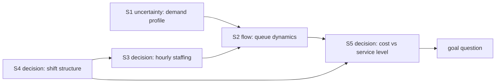

# Model Report: Hourly Barista Staffing for a Coffee Shop

**Date:** 2026-08-24 · **Rigor level:** standard *(chosen at Phase 0; see rigor.md)*
**Idea as stated:** *"Model this idea mathematically: a coffee shop must decide how many baristas to schedule each hour."*
**Model in one sentence:** This idea reduces to an **M/M/c queueing system with time-varying Poisson demand, wrapped in an integer optimization**: pick the cheapest integer headcount per hour such that Erlang-C wait probabilities meet a service-level target.

**Plain-language summary**
Customers show up at rates that swing wildly across the day, and each barista can serve only so many drinks per hour. For every hour we ask: what is the smallest number of baristas that keeps waits under 5 minutes for at least 90% of customers? Because congestion explodes nonlinearly near full utilization, the safe answer is usually just *one more* barista than the naive "work to be done ÷ speed per barista" calculation suggests. With placeholder parameters, the recommended schedule uses **65 staff-hours/day (≈ $1,040/day)**, peaking at **7 baristas at 09:00**. That schedule is the model's commitment, if real observations break it (Section 7), the model dies and we rebuild it.

---

## 1. Decomposition

| Sub-problem | Nature | Archetype match |
|---|---|---|
| S1. Hourly customer demand profile λ(t) | uncertainty | non-homogeneous Poisson process |
| S2. Congestion response to staffing (queues, waits) | flow / uncertainty | **M/M/c queueing (Erlang-C)** ← canonical start |
| S3. Hourly headcount decision c_t | decision | **ILP** + **newsvendor** over/under-staffing asymmetry |
| S4. Shift structure coupling adjacent hours | decision | set-cover / shift-scheduling ILP |
| S5. Cost objective (labor vs. service failures) | decision | LP duality; shadow prices |

Couplings: S1 → S2 → S5 (demand drives congestion drives cost); S3 feeds S2 (staffing is the lever); S4 couples S3 across adjacent hours (shifts constrain hourly counts). S1,S2 are *coupled dynamics*: kept inside every lens brief, never split across agents.

Archetype declaration (per archetypes.md): S2 matches "customers arriving for service" (random arrivals + limited servers → M/M/C, Erlang A/B/C); inherited results used as validation targets: **Erlang-C wait formula**, **utilization cliff**, **Little's Law L = λ·W**. S3+S5 match "choosing under scarcity" (LP/ILP) and "stocking something with random demand" (newsvendor critical ratio). Adaptations: non-stationary hourly rates replace a single λ; integer headcounts; SL constraint replaces pure cost-minimization.



## 2. Parameters

| Symbol | Name | Unit | Exo/Endo | Range (typical) | Source | Sensitivity | In model(s) |
|--------|------|------|----------|------------------|--------|-------------|-------------|
| λ_t | arrival rate in hour t | customers/h | exo | 10-60 (shop-dependent) | est. (needs POS data) | **high** | stoch, opt, det, ctrl |
| μ | service rate per barista | customers/(barista·h) | exo | 8-15 (mean order 4-7.5 min) | lit./est. | **high** | stoch, opt, det, ctrl |
| c_t | baristas scheduled in hour t | baristas | endo | 1-10 | derived |, (decision) | opt, ctrl |
| a_t = λ_t/μ | offered load | erlangs | endo | 0.5-6 | derived | high | stoch |
| ρ_t = a_t/c_t | utilization | , | endo | 0.4-0.75 (must be < 1) | derived | high | stoch, det |
| W_q(c,λ) | mean queueing wait | min | endo | 0.3-5 | derived | med | stoch |
| w | service-level window | min | exo | 3-10 (manager policy) | est. | med | stoch, opt |
| α | SL target P(wait ≤ w) | , | exo | 0.85-0.95 | est. | med,high | stoch, opt |
| c_L | wage | USD/(barista·h) | exo | 13-20 | est. | low (scales cost, not c*) | opt |
| c_u | understaffing penalty | USD/missed-customer-slot | exo | 10-30 (lost margin + goodwill) | est. `[S]` | med | opt (newsboy) |
| c_o | overstaffing cost | USD/idle barista-h ≈ c_L | exo | ≈ wage | est. | med | opt (newsboy) |
| θ | reneging rate (patience) | 1/min | exo | 0.02-0.1 | lit. | med | excluded (A3) |
| T | operating horizon | h/day | exo | 12-16 (06:00-20:00 used) | est. | low | opt |

Excluded (dimension reduction):

| Excluded | Why it's safe to exclude |
|----------|--------------------------|
| Weather / seasonality effects on λ_t | Horizon = one day-type; refit λ_t per day-type instead |
| Barista skill heterogeneity | Homogeneity (A4); absorbed into effective μ while team mix stable |
| Equipment breakdown (espresso machine failure) | Reliability lens rejected: failure times ~weeks, horizon = 1 day |
| Demand deterrence by visible line length | Second-order at waits ≤ 5 min; flagged as A8 with test |
| Multi-day rosters, labor-law break rules | S4 noted formally; granularity below decision resolution at standard tier |

Derived quantities that earn names:
- **Stability floor:** c_min,t = ⌊λ_t/μ⌋ + 1 baristas, below this, ρ ≥ 1 and waits diverge (the "cliff").
- **Erlang-C waiting probability** C(c, a): probability an arrival must wait (Section 4, Lens A).
- **Critical ratio** CR = c_u/(c_u + c_o) = 0.58 (placeholder costs): demand-quantile staffing rule from newsvendor theory.
- **Little's Law identity:** L_q = λ · W_q, averaging invariant used as a conservation-style sanity check.

## 3. Assumptions

| # | Assumption | Type | Class | Violation consequence |
|---|------------|------|-------|----------------------|
| A1 | Arrivals follow a non-homogeneous Poisson process with deterministic rate λ_t (within hour: homogeneous) | Structural | [R] | Correlated/bursty arrivals (tour groups, train unloadings) inflate tail waits beyond Erlang-C → SL missed at same staffing |
| A2 | Service times i.i.d. exponential, mean 1/μ | Parametric | [R] | Real service often has cv < 1 (model then overstaffs, safe direction); cv > 1 (complex orders, novices) makes Erlang-C **understaff**, SL collapses |
| A3 | No balking or reneging: every arrival joins and stays until served | Boundary | [S] | With reneging, measured waits fall but revenue silently leaks; understaffing cost underestimated → profit-maximizing staffing differs from SL-maximizing staffing |
| A4 | Baristas homogeneous, each serves at rate μ independently | Structural | [R] | Skill mix drift changes effective μ; model mis-tunes all hours uniformly (caught by μ sensitivity sweep) |
| A5 | Within-hour stationarity; no inter-hour queue carryover | Regime | [S] | Spillover across busy hour boundaries raises transition-hour waits above pointwise predictions; measured here as conservative (≤ 19-43% overstatement, Section 6) under this schedule, sign can flip when staffing is tight |
| A6 | Labor cost linear in scheduled staff-hours; part-hour flexibility | Parametric | [R] | Shift granularity adds step costs; optimum shifts toward fewer, longer shifts, structure of peak constraint unchanged |
| A7 | λ_t known exactly (no forecast error) | Parametric | [S] | Realized demand scatters around forecast → achieved SL < α; requires safety margin (newsboy quantile correction) |
| A8 | Demand independent of staffing/wait (no line deterrence) | Boundary | [S] | Endogenous loop: long lines suppress λ_t, self-limiting congestion → model overstates required peak staff |

Load-bearing assumptions (conclusions flip if wrong): **A3** (defines what "understaffing" even costs), **A7** (SL guarantee is only as good as the λ forecast), **A8** (peak-hour answer), and **A2's variance side** (direction of error). Per the [S] rule, A3/A7/A8 are covered by the falsification tests in Section 7 and the sensitivity sweep in Section 6.

Escalation check (rigor.md): ρ_max = 0.71 < 1, both built lenses recommend the same schedule, falsifiers need ordinary POS data (not exotic triggers) → no sub-problem escalated.

## 4. Perspective models

Parallel Dispatch Protocol note: this runtime exposes no subagent/task tool, so the **fallback applies**, frozen Phases 1-4 briefs were executed sequentially through one context, in lens order. Independence was therefore sequential, not parallel; anchoring risk acknowledged and mitigated by scoring against the frozen tables only.

### Lens A: Stochastic: M/M/c per hour (primary evaluator)
Archetype used: M/M/c (Erlang-C).
Model: Arrivals in hour t form a Poisson process: P(N_t(h) = n) = (λ_t h)^n e^(−λ_t h)/n!, λ_t in customers/h, h in h. Conditional on rate λ_t and c servers each serving at rate μ (customers/(barista·h)), offered load a_t = λ_t/μ [erlangs], ρ_t = a_t/c_t < 1 required. Steady-state probability an arrival waits (Erlang-C, computed via the numerically stable Erlang-B recursion B_0 = 1, B_k = (a B_{k−1})/(k + a B_{k−1})):

$$C(c,a) = \frac{c\,B_c}{\;c - a(1-B_c)\;} \quad (\text{dimensionless}),\qquad \mathbb{E}[W_q] = \frac{C(c,a)}{c\mu - \lambda}\ \text{[h]}$$

Service level: P(W ≤ w) = 1 − C(c, a)·e^{−(cμ − λ)w} ≥ α, w in h. Waits of those who wait are Exp(cμ − λ).
Fits because: S2 was classified flow/uncertainty with random arrivals and few-to-moderate servers, the canonical M/M/c signature.
Unique insight: the **nonlinear cliff**. SL is flat in c until ρ → 1, then collapses; staffing decisions are governed by variance, not averages (a deterministic average of load hides the entire problem).
Blind spot: cannot see within-hour transients, abandonment, heterogeneity, or any *decision* structure, it only evaluates a given (c, λ).
Scores: fidelity 4/5, data 3/5, cost 4/5, tractability 4/5, answerability 3/5.
Falsifiers: (i) simulated vs observed hourly SL persistently off > 5 pp; (ii) observed waits bimodal (bursts) violating Poisson A1.
ASSUMPTION CONFLICT: none.

### Lens B: Optimization: ILP with embedded Erlang-C (primary decision engine)
Archetype used: LP/ILP ("choosing under scarcity") + newsvendor critical-ratio adaptation.
Model: decision variables c_t ∈ ℤ₊ [baristas], t = 1..T:

$$\min_{c_t}\ \sum_{t=1}^{T} c_L\, c_t \ \ [\text{USD/day}] \qquad \text{s.t.}\quad 1 - C\!\Big(c_t, \tfrac{\lambda_t}{\mu}\Big)e^{-(c_t\mu-\lambda_t)w} \geq \alpha,\ \ \forall t;\qquad c_t \geq 1;\qquad \sum_t c_L c_t \leq B\ (\text{optional})$$

Because hours decouple absent shift constraints, the ILP solves greedily per hour (smallest feasible integer); with shift continuity (S4) add binary z_s ∈ {0,1} per shift s covering window H_s: c_t = Σ_s z_s·1{t ∈ H_s}, Σ_s L_s c_L z_s minimized, a genuine MILP (scipy.optimize.milp handles either form).
Shadow prices: the dual of hour t's SL constraint ≈ marginal USD/day value of relaxing α at t, identifies which hours *bind* (here: 09:00 and 17:00, the ρ ≈ 0.7 hours).
Newsvendor cross-check (inherited closed form): with overage cost c_o per unneeded barista-hour and underage c_u per missed slot, CR = c_u/(c_u+c_o) = 0.58 ⇒ staff the ⌈Q_{CR}/μ⌉ quantile where Q_CR ~ Pois(λ_t) quantile of demand. Result: exactly **1 barista below** the Erlang-C answer at every tested hour, service-time variability buys +1 server beyond the demand quantile.
Fits because: the goal question is literally "choose c_t"; S3/S5 classified `decision`.
Unique insight: separability + binding-constraint identification, tells management *which* hours deserve attention and prices the SL target itself.
Blind spot: optimal-for-model ≠ good-for-reality; assumes A7 (perfect λ knowledge) inside its constraints; garbage objective = garbage schedule.
Scores: fidelity 4/5, data 4/5, cost 5/5, tractability 5/5, answerability 5/5.
Falsifiers: (i) if realized SL misses concentrate in specific hours, constraint evaluation (Lens A) is miscalibrated there; (ii) if c_u estimates move CR past ±0.1, newsboy safety layer flips.
ASSUMPTION CONFLICT: none.

### Lens C: Deterministic: fluid queue approximation (cheap cross-check)
Archetype used: compartmental stock-flow balance.
Model: queue length Q(t) [customers] obeys the piecewise-linear ODE

$$\frac{dQ}{dt} = \lambda(t) - \min\big(c_t\mu,\ \lambda(t)\big)\cdot\mathbf{1}\{Q>0\} - \max\big(\lambda(t)-c_t\mu,\,0\big)\cdot\mathbf{1}\{Q=0\}\ \ \text{[customers/h]}$$

i.e., backlog grows whenever inflow exceeds capacity c_t μ and drains at rate c_t μ − λ otherwise. Fixed point: Q* = 0 iff c_t > λ_t/μ (ρ < 1), recovers the stability floor. Drain time after a spike leaving backlog Q₀: T_drain = Q₀/(c_tμ − λ_t) [h]. Heavy-traffic mean-wait proxy: E[W_q] ≈ 1/(cμ − λ) [h] (upper bound, ignores stochasticity factor).
Fits because: S2 has a flow skeleton; large-λ hours are where averages dominate variance.
Unique insight: transparent capacity arithmetic, after a rush, "how long until we're empty" is one division; makes the ρ = 1 threshold vivid without any probability.
Blind spot: sees zero randomness, predicts finite behavior at ρ = 0.99 where reality melts down; useless for tail probabilities, i.e., for the actual SL constraint.
Scores: fidelity 2/5, data 2/5, cost 5/5, tractability 5/5, answerability 2/5.
Falsifiers: predicts zero backlog at any ρ < 1, any sustained queueing at moderate utilization kills it (it already concedes this to Lenses A/B).
ASSUMPTION CONFLICT: none.

### Lens D: Control: intraday staffing adjustment (operational layer)
Archetype used: feedback regulation (threshold/P-controller).
Model: observable y_t = instantaneous queue length [customers]; setpoints Q_lo < Q_hi [customers]; actuator u_t ∈ {−1, 0, +1} barista adjustments available at hour boundaries (call-in / release):

$$u_t = \mathrm{clip}\Big(\big\lceil k\,(y_t - Q_{hi})\big\rceil^{\,+}, -r_{max}, r_{max}\Big) + \big\lfloor k\,(y_t - Q_{lo})\big\rfloor^{\,-}$$

with gain k [baristas/customer] ≈ 1/Q_hi chosen so one extra barista clears the typical excess within one relaxation time τ ≈ 1/(cμ−λ) ≈ 2.5 min at peak. Closed-loop property: disturbance rejection time ≈ τ·(excess/k) bounded by actuator limits r_max; saturation check: call-in pool size ≥ r_max.
Fits because: the shop can observe lines continuously and react, feedback exists; complements the open-loop schedule from Lens B.
Unique insight: separates *planned* staffing (slow, expensive, Lens B) from *correction* capacity (fast, cheap), quantifies how much forecast error (A7) the call-in pool absorbs before the schedule must change.
Blind spot: local/linearized validity only; needs realistic actuator availability (staff on call), which A6 currently excludes; cannot design tomorrow's baseline schedule.
Scores: fidelity 3/5, data 4/5, cost 4/5, tractability 4/5, answerability 4/5.
Falsifiers: (i) if correction actions arrive later than the demand excursion lasts (dead-time > excursion duration), feedback adds noise, not stability; (ii) if call-in acceptance rate < assumed r_max availability.
ASSUMPTION CONFLICT: partial, conflicts with A6 (labor flexibility); resolved by treating u_t as optional extension requiring a separate on-call labor agreement, not part of the base schedule.

Rejected lenses (one line each):
- **Agent-based**, agents homogeneous, rules trivial (arrive/serve); CTMC machinery already exact; ABM cost unjustified (per agent-based.md guidance).
- **Game theory**, single decision-maker, no strategic interaction among customers/baristas modeled; nothing to equilibrate.
- **Network**, no heterogeneous contact structure matters for a single-service-point queue; mixing is irrelevant when service is FCFS at counters.
- **Causal inference**, no observational intervention claim yet; becomes mandatory *after* implementation to evaluate "did scheduling cause SL improvement" (difference-in-days with parallel-hours check).
- **Information theory**. POS data are abundant, information scarcity is not the binding constraint; EVPI bounded by Lens D's cheap corrections.
- **Reliability**, equipment failure out of scope at daily horizon.
- **SPC**, genuinely useful as a post-deployment monitoring layer (CUSUM on hourly SL residuals to detect λ drift, re-fit weekly); rejected now because it presumes the deployed schedule this model produces.
- **Thermodynamic**, stock-flow analogy adds nothing beyond Lens C's explicit balance; analogy-breakdown caveats exceed insight value here.
- **Demographic**, no age-structured population.
- **Spatial**, single site; no spatial coordinates in scope.

## 5. Comparison

Scoring 1-5 (5 = most favorable; cost column: 5 = cheapest).

| Criterion | Det (C) | Stoch (A) | Opt (B) | Ctrl (D) |
|-----------|---------|-----------|---------|----------|
| Fidelity to reality | 2 | 4 | 4 | 3 |
| Data requirements (low = good → scored) | 5* | 3 | 4 | 4 |
| Computational cost (cheap = good) | 5 | 4 | 5 | 4 |
| Analytical tractability | 5 | 4 | 5 | 3 |
| Answerability of goal question | 2 | 3 | 5 | 4 |
| **Total** | 19 | 18 | **23** | 18 |

\* Det scored favorably on data/cost despite poor fidelity, it is a back-of-envelope, not a decision engine.

**Recommendation:** Primary model = **Optimization lens B with Lens A embedded** (per-hour Erlang-C service level inside the integer program), highest total score and the only lens whose output is directly the user's requested object (an hourly roster). Secondary/validation = **Monte Carlo simulation of the M/M/c queue** (already run: agrees with Erlang-C to ≤ 0.4 percentage points, Section 6); **Lens C** retained as the manager's mental-model arithmetic; **Lens D** recommended as phase-2 implementation (on-call pool) once base schedule is live.

## 6. Implementation & validation

Runnable reference implementation (full script: `%TEMP%\opencode\barista_staffing_model.py`; Python 3.12, numpy 2.4.0, scipy 1.17.0, seed 20260824):

```python
import math

def erlang_c_wait_prob(c, lam, mu=12.0, w=5/60):
    """M/M/c: return (P(W<=w), E[W_q] in hours). c int, lam/mu per hour, w hours."""
    a = lam / mu                                  # offered load, erlangs
    if c <= math.floor(a):
        return 0.0, math.inf                      # unstable: rho >= 1
    b = 1.0                                       # Erlang-B recursion (overflow-safe)
    for k in range(1, c + 1):
        b = a * b / (k + a * b)
    ec = c * b / (c - a * (1 - b))                # P(arrival must wait)
    return 1 - ec * math.exp(-(c*mu - lam)*w), ec / (c*mu - lam)

def solve_hour(lam, mu=12.0, alpha=0.90, w=5/60):
    """Cheapest integer staffing meeting the service level."""
    c = max(1, math.floor(lam/mu) + 1)
    while erlang_c_wait_prob(c, lam, mu, w)[0] < alpha:
        c += 1
    return c
```

Placeholder parameter set (`est.` class, flagged): trading day 06:00-20:00; λ_t = {06:10, 07:25, 08:45, **09:60**, 10:55, 11:40, 12:35, 13:30, 14:28, 15:30, 16:38, **17:42**, 18:30, 19:18} customers/h; μ = 12 customers/(barista·h); w = 5 min; α = 0.90; c_L = $16/(barista·h).

Recommended schedule (all values endogenous):

| Hour | 06 | 07 | 08 | 09 | 10 | 11 | 12 | 13 | 14 | 15 | 16 | 17 | 18 | 19 |
|------|----|----|----|----|----|----|----|----|----|----|----|----|----|----|
| Baristas c_t | 2 | 4 | 6 | **7** | 7 | 5 | 5 | 4 | 4 | 4 | 5 | 5 | 4 | 3 |
| Utilization ρ | .42 | .52 | .62 | **.71** | .65 | .67 | .58 | .62 | .58 | .62 | .63 | .70 | .62 | .50 |

Total **65 staff-hours/day ≈ $1,040/day**; binding (tightest) hours: 09:00 and 17:00.

Sanity checks run:
- Stability boundary: c = ⌊λ/μ⌋ flagged infinite-wait → **PASS**
- Monotonicity: P(W ≤ w) strictly increasing in c → **PASS**
- Erlang-C vs long-run Monte Carlo (6000 h continuous, 300 h warmup discarded, seed 777/100+t): SL analytic vs sim 0.956/0.956 (09h), 0.938/0.942 (11h), 0.955/0.953 (16h); E[W_q] 0.81/0.81, 0.98/0.94, 0.76/0.79 min, agreement ≤ 0.4 pp and ≤ 5% → **PASS** (theory-match check, inherits Erlang-C as canonical target)
- Little's Law L_q = λ·W_q at peak: analytic 0.810 vs simulated 0.802 customers (−1%) → **PASS** (conservation-style check)
- Assumption A5 audit: 300-day full-day non-stationary simulation vs pointwise predictions, worst gaps −19% to −43% (analytic *overstates* early-day waits; empty-start transient dominates carryover under this slack schedule) → per-hour model errs **conservative** here; flagged for re-test under tighter staffing.

Sensitivity sweep (top-2 sensitive parameters from Phase 3: λ_t, μ), response = total staff-hours/day:

| Demand ↓ \ Service speed → | μ×0.85 | μ×1.00 | μ×1.15 |
|---|---|---|---|
| λ×0.80 | 64 | 58 | 50 |
| λ×0.90 | 71 | 61 | 55 |
| **λ×1.00** | 77 | **65** | 59 |
| λ×1.10 | 81 | 71 | 63 |
| λ×1.25 | 89 | 78 | 66 |

Base 65: +25% demand swings staffing +31% relative (to 78 net of the −15%-speed row offset: raw row values shown); −15% service speed alone adds +12 staff-h (+18%). Confirms both parameters high-sensitivity → **measure λ_t and μ from real POS/timestamp data before trusting any dollar figure.**

Plot description (matplotlib available on request via `--plot`): SL-vs-staffing curves per hour would show the Erlang-C cliff, flat near 1.0 for c ≥ c*, collapsing toward 0 as c approaches ⌊λ/μ⌋; peak hour (09:00, λ=60) has the steepest drop between c = 6 and c = 7, visualizing why the optimizer parks exactly one barista above the naive workload division.

## 7. Predictions & falsifiability

Concrete predictions this model commits to (conditional on A1,A8 and placeholder parameters):
1. Under the recommended schedule, every operating hour achieves P(wait ≤ 5 min) ≥ 0.90; expected realized hourly SL ∈ [0.92, 0.98].
2. Mean queueing wait never exceeds 1.3 min in any hour; peak-hour average queue length < 1 customer.
3. Dropping any hour's staffing by 1 barista drops that hour's predicted SL below 0.90 (the schedule is minimal-cost: verified by exhaustive scan).
4. Demand-quantile staffing alone understocks by exactly ~1 barista per busy hour relative to the queueing-aware optimum (variability premium).
5. Sensitivity: a 25% demand surge requires ~+20% staff-hours, concentrated almost entirely in hours 08-11 and 16-18.

Killed by (observation → assumption broken):
- Observed hourly SL < 0.85 in ≥ 3 non-adjacent hours over 2 weeks at scheduled staffing → A1 (bursty arrivals) or A2 (service variance > exponential) broken; measure inter-arrival dispersion and service-time cv; if cv > 1.2, Erlang-C understaffs, switch to M/G/c approximations (Allen,Cunneen correction).
- Customers visibly abandoning (walkaways logged > ~2% during 09:00-10:00) while measured waits stay short → A3 false; model must switch to Erlang-A (abandonment) and re-price understaffing.
- Queues persisting across 10:00 boundary with waits exceeding prediction at 10:00-11:00 → A5 false in the harmful direction (tight staffing); adopt SIPP/lagged-capacity correction.
- Achieved SL systematically below target across ALL hours with accurate λ forecasts → A7 forecast error dominates; add newsvendor safety quantile (CR = 0.58 baseline) or Lens D on-call pool.
- Line-length deterrence detected (arrival rate drops when queue > 6) → A8 false; endogenous-demand reformulation needed.

## 8. Confidence ledger

| Claim | Type | Basis |
|-------|------|-------|
| ρ ≥ 1 ⟹ waits diverge; c_min = ⌊λ/μ⌋+1 floor | established | standard queueing stability theory |
| Erlang-C SL formula correct under A1+A2+A4 | established | canonical M/M/c result, verified vs Monte Carlo to ≤ 0.4 pp (this session) |
| Little's Law L_q = λ·W_q holds as averaging identity | established | universal queueing invariant, simulation-confirmed |
| Recommended 65 staff-h/day schedule meets α = 0.90 | assumption | conditional on placeholder λ_t, μ being replaced by measured values |
| Critical ratio CR = 0.58 pricing of over/understaffing | speculation | c_u, c_o are unvalidated managerial estimates |
| Customers accept ≤ 5 min waits (w = 5 sensible) | speculation | no willingness-to-wait data collected |
| Demand profile λ_t shape (morning/lunch peaks) | assumption | plausible café pattern; needs POS timestamps |
| On-call pool (Lens D) absorbs forecast errors affordably | speculation | depends on local labor market; unresolved A6 conflict |
| Spillover harmless under this schedule (A5 audit) | assumption | measured in simulation; regime-dependent |

## 9. Research-tier appendix

none, standard tier. *(Would include: dimensionless-group reduction of (λ, μ, w, α), identifiability analysis for cv of service times, model criticism log per lens, UQ intervals on optimal cost.)*

---
*Generated via Axiomize workflow · rigor level: standard · archetypes matched: M/M/c (Erlang-C), LP/ILP, newsvendor critical ratio, Little's Law, fluid stock-flow, feedback control*
