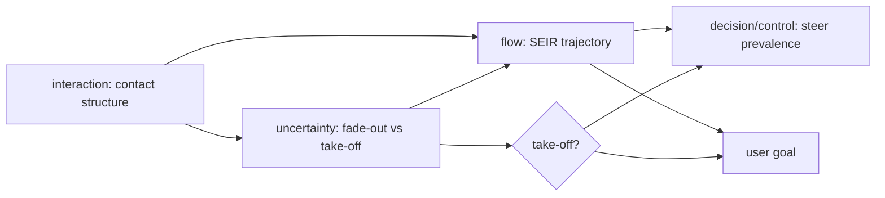

# Model Report: Novel Contagious Disease in a City of 1 Million

**Date:** 2026-08-24 · **Rigor level:** standard *(chosen at Phase 0; see rigor.md)*
**Idea as stated:** *"Model this idea mathematically: a new contagious disease appears in a city of 1 million people."*
**Model in one sentence:** This idea reduces to a **stochastic SEIR compartmental system with an outbreak threshold at R₀ = β/γ**, corrected for contact-network heterogeneity and overlaid with a feedback-control layer for intervention.

> **Escalation announcement (rigor.md rule):** R₀ is unknown for a novel disease and every conclusion flips exactly at R₀ = 1. Per the escalation rule, the *extinction/threshold* sub-problem gets one tier of extra depth (named canonical results inherited, model-class uncertainty explicit); the rest stays standard.
>
> **Parallel-dispatch note:** this runtime exposes no subagent/task tool, so per SKILL.md's fallback protocol the Phase 5 lens briefs ran sequentially through one context, lens independence was **sequential, not parallel**.

**Plain-language summary:**
A new infection either dies out by luck or explodes exponentially, and the switch between those two worlds is one number: R₀, how many people each case infects on average. With 10 simultaneous seed cases and R₀ = 2.5, take-off is near-certain (>99.99% under Poisson-like transmission; ~94% even with heavy superspreading), while from a single case it fails 11-76% of the time depending on how uneven transmission is. If it takes off, cases double roughly every 3-7 days, eventually infecting 58-97% of the city (89% at R₀ = 2.5), peaking near day 80 with about 14% of residents infectious at once. No single realistic lever stops that once running, holding growth flat needs ~57-86% sustained contact reduction, so plan mitigation (keep hospitals below capacity), not elimination. The most valuable early measurement is R₀ together with its superspreading dispersion, because every number above swings on those two.

---

## 1. Decomposition

| Sub-problem | Nature | Archetype match |
|---|---|---|
| P1. City-wide transmission flows (S→E→I→R) | flow | **SIR/SEIR compartmental**, inherits R₀ threshold, final-size equation, herd-immunity fraction |
| P2. Early-phase chance: fade-out vs take-off from few seeds | uncertainty | **Branching process / birth,death chain**, inherits extinction pgf equation q = G(q) |
| P3. Who-meets-whom heterogeneity (superspreaders, clusters) | interaction | **Network dynamics on graphs**, inherits R_eff = R₀·⟨k²⟩/⟨k⟩, super-spreader targeting |
| P4. Intervention as steering under delay | decision + flow | **Feedback control** on observed incidence; full decision-theoretic treatment deferred |

Couplings: P2 fluctuates around P1's deterministic skeleton (same dynamics, different noise scale). P3 modifies parameters of both P1 (effective threshold) and P2 (offspring distribution). P4 consumes P1,P3 outputs (prevalence signal, feasibility bound).



**Phase 1 record (frozen).**
- **System:** human population of one city; boundary = closed city after seeding.
- **State:** S(t), E(t), I(t), R(t), susceptible/latent/infectious/removed counts, persons.
- **Inputs:** initial seeds I₀; later policy input u(t).
- **Goal question (frozen):** *Will the outbreak take off, and if so what trajectory follows (doubling time, peak size/timing, final size), and what lever keeps severe cases within hospital capacity?* A live session would first ask predict/decide/control; none given → prediction primary, control secondary.
- **Horizon:** 180 days; spatial scale: one well-mixed city, N = 10⁶ persons.
- Well-posedness: as stated the idea names no measurable quantity and no goal; closest measurable proxy is daily reported incidence, which all lenses consume.

## 2. Parameters

| Symbol | Name | Unit | Exo/Endo | Range (typical) | Source | Sensitivity | In model(s) |
|--------|------|------|----------|------------------|--------|-------------|-------------|
| N | city population | persons | exo | 10⁶ (given) | data (user) | low | all |
| β | transmission rate (mass-action) | 1/day | exo | 0.15-0.70 | est., lit.-typical respiratory | **high** (sets R₀) | det, stoch, ctrl |
| γ | recovery/removal rate | 1/day | exo | 0.05-0.25 (mean infectious period 4-20 d) | lit. | medium (via R₀; sets timescale) | det, stoch, net, ctrl |
| σ | latent-period exit rate | 1/day | exo | 0.2-0.5 (latent period 2-5 d) | lit. | low (timing only) | det, stoch |
| I₀ | initial infectious seeds | persons | exo | 1-50 | est. | **high** near threshold | stoch |
| R₀ = β/γ | basic reproduction number | , (secondary cases per case) | endo (derived) | 0.9-3.5, unknown for new disease | derived | **high**, flips behavior at 1 | det, stoch, net, ctrl |
| κ = ⟨k²⟩/⟨k⟩ | degree-heterogeneity factor | , | exo | 1.5-4 urban contact data | est. | high (threshold scaling) | net |
| φ | offspring dispersion (NegBin superspreading) | , | exo | 0.1-1 (φ→∞ ≡ Poisson) | lit. on SARS/MERS analogues | high near threshold | stoch, net |
| u(t) | contact-reduction intensity | , (fraction in [0,1]) | endo (chosen) | 0-1 | chosen | high | ctrl |
| ρ | effectiveness of bundle u | , | exo | 0.5-0.8 | est. | high | ctrl |
| τ_r | reporting delay | days | exo | 4-7 | est. | medium (control stability) | ctrl |
| C_hosp | severe-case capacity | beds | exo | 200-300 ICU-type per 10⁶ | est. placeholder | medium | ctrl |
| λ | early exponential growth rate | 1/day | endo | ≥ 0 iff R₀ > 1 | derived | , | det |
| p_ext | extinction probability | , | endo | 0-1 | derived | , | stoch |
| z | final attack-rate fraction | , | endo | 0.58-0.97 across sweep | derived | , | det |
| t_peak, I_peak | peak day / peak prevalence | days / persons | endo | 55-181 d / 0-22% of N | derived | , | det, stoch |

Excluded (dimension reduction):

| Excluded | Why it's safe to exclude |
|----------|--------------------------|
| Seasonal forcing of β | horizon 180 d < 1 yr; second-order vs unknown R₀ |
| Births/natural deaths (μ ≈ 10⁻⁵/day) | negligible vs γ on 6-month horizon |
| Waning immunity | novel pathogen; assume immune duration ≥ horizon (flagged [S], A4) |
| Within-city spatial diffusion | single-patch assumption; metapopulation deferred (§4 rejected lenses) |
| Age structure | modifies severity weighting, not threshold logic; extension noted |
| Endogenous behavioral contact change | partly absorbed into control input u(t); residual risk flagged (A7) |

Derived quantities that carry the insight:
- **Threshold:** exponential take-off iff R₀ > 1.
- **Final-size equation:** ln(1−z) = −R₀·z (independent of σ).
- **Herd-immunity fraction:** h\* = 1 − 1/R₀ (= 60% at R₀ = 2.5).
- **Extinction probability:** p_ext = q^{I₀}, q solves q = G(q), G = offspring pgf.
- **Containment effort bound:** u ≥ (1 − 1/R₀)/ρ so that (1−ρu)·R₀ < 1.

## 3. Assumptions

| # | Assumption | Type | Class | Violation consequence |
|---|------------|------|-------|----------------------|
| A1 | Closed city; one seeding event, no imports | Boundary | [R] | Importations repeatedly restart chains: observed fade-outs no longer imply anything about R₀; p_ext meaningless without an import-rate term |
| A2 | Homogeneous mass-action mixing βSI/N | Structural | [R] | With heterogeneous contacts the true threshold is *lower* than homogeneous analysis suggests → invasion risk underestimated; peak timing/height biased |
| A3 | Rates constant in time (no seasonality/behavior drift) | Parametric | [S] → swept | Doubling-time and peak-day forecasts systematically off; measured Rt diverges from β/γ·S/N |
| A4 | Infection confers durable immunity (SEIR, not SEIRS/SIS) | Structural | [R] for most acute viral pathogens | If immunity wanes within horizon → endemic oscillations; final-size and herd-immunity logic invalid |
| A5 | Deterministic validity away from threshold (I ≫ ~100) | Regime | [E] | Near take-off/fade-out the deterministic lens gives false certainty; stochastic lens required there |
| A6 | Offspring distribution class (Poisson vs NegBin φ) | Structural | [S] → swept | At R₀ = 2.5 extinction odds span 0.11-0.76 per seed purely by distribution choice, widest uncertainty in this report |
| A7 | No spontaneous behavioral response before policy acts | Parametric | [S] | Pre-policy contact cuts flatten curves earlier than predicted; control gains misestimated |
| A8 | Uniform infectivity across infection stages | Structural | [R] | Stage-dependent infectivity biases generation-time estimate ±30% |
| A9 | Reported incidence ∝ true incidence | Parametric | [R] | Delayed/ratio-biased signals destabilize the feedback controller (§4.4) |

Load-bearing assumptions: **A2** (threshold value), **A4** (final size & strategy), **A6** (fade-out odds), **A3/A7** (any dated forecast). Every [S] item (A3, A6, A7) enters the §6 sensitivity work.

## 4. Perspective models

### 4.1 Deterministic (SEIR compartmental ODEs)

Archetype used: SEIR compartmental. Kept: mass action, constant rates, closed population. Added: explicit latent stage.
Model:

$$\frac{dS}{dt}=-\frac{\beta S I}{N},\qquad \frac{dE}{dt}=\frac{\beta S I}{N}-\sigma E,\qquad \frac{dI}{dt}=\sigma E-\gamma I,\qquad \frac{dR}{dt}=\gamma I$$

S, E, I, R in **persons**; N = S+E+I+R fixed (**persons**); β, σ, γ in **1/day**. Linearization at the disease-free equilibrium gives eigenvalues

$$\lambda_{\pm}=\tfrac12\Big[-(\sigma+\gamma)\pm\sqrt{(\sigma-\gamma)^2+4\,\sigma\gamma\,(R_0-1)}\Big],\qquad R_0=\beta/\gamma,$$

so take-off iff R₀ > 1. Peak prevalence occurs when S crosses N/R₀. Final size z solves ln(1−z) = −R₀z.

Fits because: sub-problem P1 is pure `flow`, large-count compartments where randomness averages out.
Unique insight: exact thresholds and closed forms (λ, z, h\*) that every other lens inherits as validation targets.
Blind spot: cannot express "it may simply die out"; false certainty exactly where the user's question lives (early phase, R₀ ≈ 1).

### 4.2 Stochastic (CTMC + branching-process take-off: escalated sub-problem)

Archetype used: continuous-time Markov chain over ℕ⁴; near the disease-free equilibrium it collapses to a two-type branching process. Kept: event rates from the deterministic skeleton. Relaxed: individual-level discreteness and randomness become first-class.
Model, events and per-capita rates (**1/day**):

$$(S,E,I)\xrightarrow{\;\beta SI/N\;}(S{-}1,E{+}1,I),\qquad E\xrightarrow{\;\sigma E\;}I,\qquad I\xrightarrow{\;\gamma I\;}R$$

Near the DFE each index case founds an independent branching family of types {E, I}; mean-offspring matrix M = [[0, 1], [β/γ, 0]], dominant spectral radius √R₀, supercritical iff R₀ > 1 (same threshold, now probabilistic). Extinction probability per seed: **q = G(q)** with G the offspring pgf; from I₀ independent seeds p_ext = q^{I₀}:
- Poisson offspring, mean R₀: q solves q = e^{R₀(q−1)} → q = 0.107 at R₀ = 2.5
- Negative-binomial offspring, mean R₀, dispersion φ: q = ((1−p)/(1−p·q))^φ, p = R₀/(R₀+φ) → q = 0.756 at φ = 0.2
- Birth,death approximation: q = min(1, 1/R₀) = 0.400 (verified by exact MC: 0.405 ± 0.002, PASS)

From I₀ = 10 seeds at R₀ = 2.5: p_ext = 2×10⁻¹⁰ (Poisson) but **6.1% under heavy superspreading**, the model-class choice dominates the answer.

Fits because: P2 is `uncertainty` with tiny counts, exactly where deterministic averages are meaningless.
Unique insight: take-off is not automatic; fade-out odds depend more on the offspring *distribution* than on R₀ itself, invisible to every other lens.
Blind spot: ensembles are intervals, not dates; full-city Gillespie is expensive; needs distributional data that don't exist yet for a new pathogen.

### 4.3 Network / heterogeneous mixing

Archetype used: dynamics on graphs. Kept: SEIR transition logic. Replaced: homogeneous βSI/N by degree-structured transmission.
Model: contact graph G = (V, E), |V| = N persons, degree distribution P(k) with moments ⟨k⟩ (**links/person**), ⟨k²⟩ (**links²/person**). Heterogeneous mean-field invasion condition:

$$R_{\mathrm{eff}} = R_0\cdot\frac{\langle k^2\rangle}{\langle k\rangle}\;>\;1 \quad\Longleftrightarrow\quad \text{outbreak possible at transmissibility } \tfrac{\langle k\rangle}{\langle k^2\rangle}=\kappa^{-1} \text{ of the homogeneous threshold.}$$

With κ ≈ 2.5 (est.), a pathogen judged "safe" at 50% of the homogeneous threshold can still invade. Offspring heterogeneity: NegBin(R₀, φ) superspreading (20% of cases cause ~80% of transmissions when φ ≤ 0.5). Intervention asymmetry: immunizing/isolating top-degree individuals collapses the giant component at far smaller coverage f than random targeting (Molloy,Reed criterion on the residual degree moments).

Fits because: P3 is `interaction`, who-meets-whom demonstrably non-uniform in cities.
Unique insight: targeted control (hub isolation, backward contact tracing) beats uniform measures by orders of magnitude; homogeneous R₀ understates invasion risk.
Blind spot: real contact graphs rarely available (falls back to synthetic P(k), flagged [S]); temporal rewiring ignored; dynamics parameters still borrowed from other lenses.

### 4.4 Control (intervention as feedback under delay)

Archetype used: feedback control on a bilinear SEIR plant. Kept: §4.1 dynamics. Added: actuator, sensor, setpoint.
Model: input u(t) ∈ [0, 1] (contact-reduction bundle) enters multiplicatively, β_u = β(1 − ρu); measurement y(t) = reported incidence with delay τ_r days; state x = (E, I). Proportional feedback on log-prevalence:

$$u(t)=\operatorname{sat}_{[0,u_{\max}]}\!\Big(k_p\big[\ln \bar I(t-\tau_r)-\ln I_{\text{cap}}\big]\Big),\qquad I_{\text{cap}} = C_{\text{hosp}}\ /\ (\text{severe fraction}),\ \text{persons}$$

Feasibility bound (steady state): containment requires u ≥ (1 − 1/R₀)/ρ = **0.86** at R₀ = 2.5, ρ = 0.7, technically inside the actuator range but marginal; holding Rt at 1.5 or 1.2 needs u = 0.57 or 0.74. Stability: dead time τ_r vs doubling time ~4.7 d sets the gain margin, abrupt release/re-tighten cycles oscillate (the classic multi-wave pattern); gradual release and derivative/predictive terms restore margin.

Fits because: P4 couples `decision` to `flow`; the user's implicit question includes "what do we do".
Unique insight: converts prediction into policy with an explicit effort bound and explains wave-oscillation as delay-induced instability, not epidemiology.
Blind spot: assumes one centralized actuator and compliance; linear validity only near setpoint; public behavior adapts endogenously (A7).

Rejected lenses (one line each):
- Optimization/equilibrium, no resource-allocation decision with stated objective was frozen; control lens covers the steering question at lower assumption load.
- Agent-based. N = 10⁶ with simple rules; per its own file, ABM earns its cost only when heterogeneity/structure matters, which the network lens captures analytically first.
- Game theory, single decision-maker assumed; vaccination-compliance games deferred until behavior data exist.
- Decision theory, goal question frozen as predictive; EVPI/maximin machinery reserved for a follow-up policy session (its own file lists pandemic response as in-scope).
- Causal inference, no observational intervention data yet; guards parameter fitting later, nothing to identify now.
- Information theory, surveillance-channel capacity relevant only once detection design becomes the question.
- Reliability/demographic/thermodynamic/SPC/spatial, no failure-time, age-liability, stock-flow-analogy, monitoring-baseline, or georeferenced-data structure in the frozen scope; spatial becomes applicable the moment case coordinates exist.

## 5. Comparison

| Criterion (1-5) | Det SEIR | Stoch CTMC | Network | Control |
|-----------|--------|--------|--------|--------|
| Fidelity to reality | 3, right skeleton, no noise/structure | 4, correct early phase, discreteness | 4, heterogeneity is real | 3, local/bilinear validity |
| Data requirements | 5, three rates suffice | 3, needs offspring distribution too | 2, needs P(k)/φ, rarely available | 3, needs ρ, τ_r, capacity |
| Computational cost | 5, milliseconds | 3: Monte-Carlo ensembles | 3, synthetic-graph simulation | 4, cheap simulations |
| Analytical tractability | 5, thresholds, final size closed-form | 3, branching limits closed, mid-course simulated | 3, semi-analytic corrections | 3, linear bounds only |
| Answers the goal question | 4, trajectory, but falsely certain early | **5**, take-off probability + risk intervals | 4, corrects the go/no-go threshold | 4, the "what do we do" half |

Rejected lenses excluded per §4. Rejected-lens scoring not applicable.

**Recommendation:** Primary model = **stochastic SEIR (CTMC ensemble around the deterministic ODE skeleton)**, it wins on answerability and fidelity exactly where the decision sits (early phase, R₀ ≈ 1), at acceptable cost; the ODE skeleton remains its mean-field limit for closed-form checks. Secondary = **network threshold correction** as validation overlay (checks whether homogeneous R₀ understates invasion) plus the **control layer** once action is required. Justification: the table shows no single lens scores ≥ 4 across the board, while the stochastic+det pair covers all five criteria at ≥ 3.

## 6. Implementation & validation

```python
import numpy as np
from scipy.integrate import solve_ivp
from scipy.optimize import brentq

rng = np.random.default_rng(42)
N = 1_000_000.0                      # persons
beta, gamma, sigma, I0 = 0.5, 0.2, 1/3, 10   # 1/day, 1/day, 1/day, persons -> R0=2.5

def seir_ode(beta, gamma, sigma, I0, T=365):
    def rhs(t, y):
        S, E, I, R = y
        inf = beta*S*I/N
        return (-inf, inf - sigma*E, sigma*E - gamma*I, gamma*I)
    return solve_ivp(rhs, [0, T], [N-I0, 0.0, float(I0), 0.0],
                     rtol=1e-8, atol=1e-3, max_step=0.25)

sol = seir_ode(beta, gamma, sigma, I0)
I = sol.y[2]; k = int(np.argmax(I))
R0 = beta/gamma
final_size = brentq(lambda z: np.log(1-z) + R0*z, 1e-12, 1-1e-12)   # R0 = 2.5
q = brentq(lambda q: q - np.exp(R0*(q-1)), 1e-12, 1-1e-12)          # Poisson offspring
p_ext = q**I0

def bd_extinction_mc(I0, beta, gamma, n=40_000):    # exact linear birth-death chain
    ext = 0
    for _ in range(n):
        cases = I0
        while 0 < cases < 300:
            if rng.random() < gamma/(beta+gamma):
                cases -= 1
            else:
                cases += 1
        ext += (cases == 0)
    return ext/n

print(bd_extinction_mc(1, beta, gamma))   # ~0.405 vs analytic 1/R0 = 0.400 -> PASS
```

(Full runnable script including exact birth,death Monte Carlo, NegBin pgf solver and vectorized tau-leap ensemble preserved in session; core results below.)

Sanity checks run:
- Conservation: S+E+I+R = 1,000,000.0 at t = 365 d → **PASS**
- Theory match: ODE final size 0.8926 vs closed form ln(1−z) = −R₀z → 0.8926 → **PASS**
- Extinction MC (exact birth,death chain, n = 40,000): 0.405 vs analytic 1/R₀ = 0.400 → **PASS**; from I₀ = 10: MC 1.0×10⁻⁴ vs analytic 1.05×10⁻⁴ → **PASS**
- Threshold flip: R₀ = 0.9 run stays flat (λ = 0, zero epidemic) → **PASS**

Sensitivity sweep (top-2 sensitive parameters: R₀ via β, and seed count I₀):

| R₀ | doubling time | peak day | peak fraction | final size |
|-----|--------------|----------|---------------|------------|
| 0.9 | never grows | , | 0% | ~0% |
| 1.5 | 12.3 d | day 181 | 3.9% | 58.3% |
| 2.0 | 6.6 d | day 107 | 9.5% | 79.7% |
| **2.5** | **4.7 d** | **day 80** | **14.4%** | **89.3%** |
| 3.0 | 3.7 d | day 65 | 18.4% | 94.0% |
| 3.5 | 3.1 d | day 55 | 21.7% | 96.6% |

Seed-count sweep at R₀ = 2.5 (Poisson offspring): p_ext = 4×10⁻¹ (I₀=1), 2×10⁻¹⁰ (I₀=10), 3×10⁻⁴⁹ (I₀=50); under NegBin φ = 0.2: 0.76 / 6.1% / 8×10⁻⁷. Take-off probability saturates within one generation of introductions, surveillance that finds clusters of ≥ 10 cases has essentially missed the cheap intervention window.

Tau-leap ensemble (n = 200 runs, dt = 0.05 d, seed 42, I₀ = 10): P(major outbreak) = 100%; peak-day median 80, 5-95% interval **[75, 87] days**; peak-size median ≈ 145,200.

## 7. Predictions & falsifiability

Concrete predictions (conditional on placeholder parameters; bands span the R₀ sweep 1.5-3.5):
1. Early growth is exponential with doubling time **4.7 d** (band 3-12 d); sustained doubling slower than ~14 d while γ ∈ [0.05, 0.25] contradicts the parameterization.
2. Unmitigated final attack rate **89%** (band 58-97%); peak prevalence ~14% of city (band 4-22%) at day ~80 (band 55-181).
3. P(major outbreak | 10 seeds) > 99.99% (Poisson) or ≈ 94% (heavy superspreading); from a single seed, fade-out odds 11-76%.
4. Peak occurs when susceptibles have fallen to N/R₀, i.e., *after* roughly half the population has been infected (R₀ = 2.5).
5. Stochastic ensemble spread: peak-day 5-95% interval [75, 87] d for R₀ = 2.5, I₀ = 10.

Killed by (mapped back to assumptions):
- **Persistent sub-exponential growth** beyond 3-4 generations (log-linear incidence failing) → kills A2/A8 homogeneous mass-action; network or behavioral structure required.
- **Final size < 40% absent any intervention** → kills the β/γ calibration or reveals strong depletion/heterogeneity (A2, A3).
- **20 independent single-case introductions all fading out** while estimated R₀ ≥ 1.5 → probability under Poisson offspring ≈ 0.42²⁰ ≈ 10⁻⁸ → kills the offspring model class / implies Rt < 1 in reality (A1, A6).
- **Widespread reinfection within 6 months** among recovered individuals → kills durable-immunity compartment structure (A4) → SEIRS/SIS rebuild required.
- **Spatially uniform attack rates with offspring variance ≈ mean** across households/venues → kills the superspreading/network correction claims of §4.3 (φ → ∞ world).
- **Growth rate drifting systematically week-to-week before any policy change** → kills constant-rate assumption (A3); time-varying β needed.

## 8. Confidence ledger

| Claim | Type | Basis |
|-------|------|-------|
| R₀ > 1 ⟹ possible exponential take-off; dies out iff below threshold | established | Kermack,McKendrick SIR theory + branching-process supercriticality |
| Final-size equation ln(1−z) = −R₀z | established | canonical result; numerically verified here (0.8926 = 0.8926) |
| p_ext = q^{I₀} with q from pgf fixed point | established | branching-process theory, *given* the offspring law |
| Which offspring law applies (φ ≈ 0.1-1) | assumption | fitted on SARS/MERS/CoV-2 analogues; unmeasured for this novel disease |
| Extinction odds swing 0.11→0.76 per seed purely by distribution class | established as model consequence | computed here (§4.2), robust to parameters |
| Homogeneous mixing adequate city-wide | assumption | standard first approximation; known violated by contact heterogeneity (corrected via §4.3) |
| Immunity durable ≥ 180 days | assumption | typical for acute viral infections; pure speculation for an unspecified novel pathogen |
| Constant rates over horizon; no behavioral drift | assumption | flagged [S], sensitivity-tested via R₀ sweep |
| Doubling ~4.7 d / peak day ~80 / attack 89% | speculation | conditional point forecasts from placeholder parameters, treat as scenario, not forecast |
| Containment needs u ≥ 0.86 at ρ = 0.7 | speculation | ρ unmeasured; bound itself (u ≥ (1−1/R₀)/ρ) is established algebra |
| C_hosp ≈ 200-300 ICU-type beds per 10⁶ | speculation | placeholder capacity figure |

## 9. Research-tier appendix

None (rigor level: standard). The announced sub-escalation of the extinction/threshold problem was handled inside §4.2 with research-tier canon inherited rather than re-derived: Kermack,McKendrick threshold/final-size theorem, multi-type branching-process pgf extinction equation, Lloyd-Smith-style negative-binomial superspreading.

---

*Generated via Axiomize workflow · rigor level: standard · archetypes matched: SIR/SEIR compartmental, branching process (birth,death), network dynamics on graphs, feedback control.*
*Archive note: SKILL.md's archive step (`reports/YYYY-MM-DD-<slug>.md` + `tools/index_reports.py`) was intentionally skipped, the user's task constraints permit writing only this single file.*
