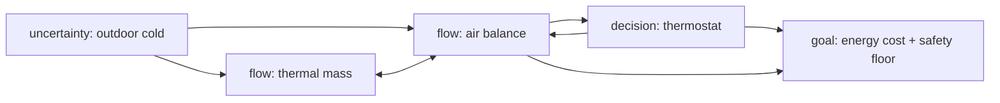

# Model Report: Greenhouse Night Setpoint: Keeping Seedlings Above the Chilling Floor

**Date:** 2026-08-24 · **Rigor level:** standard *(chosen at Phase 0; see rigor.md, say "deeper" or "quicker" anytime)*
**Idea as stated:** *"Model this idea mathematically: my greenhouse gets too cold at night for seedlings."*
**Model in one sentence:** This idea reduces to a two-node RC-type thermal network (air + thermal mass) losing heat to a stochastic outdoor temperature, steered by a saturating thermostat against a hard biological floor.

**Plain-language summary** *(≤ 5 sentences)*:
Your greenhouse cools off at night because heat leaks out through the cover faster than the soil, water barrels, and heater can supply it. One formula decides everything: the heater must deliver **Q_req = UA × (T_crit − T_o,min)** watts, where UA is how leaky the house is (~190 W/K for a small hobby house), T_crit is your seedlings' damage temperature (~10 °C), and T_o,min is the coldest night you choose to protect against. For a design night of −5 °C that is about **3.2 kW**, or ~2.4 kW if you first cut leakage 25 % with bubble wrap; a typical 1 kW unit covers only up to ~7 °C outside, it cannot ever hold 10 °C on a frosty night, no matter its thermostat. Every extra 1 °C of setpoint padding costs ≈ **2.7 kWh per night**, so set the target just above the damage floor plus a 2 K sensor/cold-corner margin, not "warm". A 2.5-3.2 kW heater with a wide-differential thermostat brings the risk of any damaging night from ~94 % down to under 3 % in simulation.

---

## 1. Decomposition

*Phase 1 parse. System:* the greenhouse enclosure (cover, inside air, thermal mass, optional heater); boundary = glazing + ground plane. *State:* inside air temperature T_a(t) [°C] and thermal-mass temperature T_m(t) [°C]. *Inputs:* outdoor temperature T_o(t), solar charging during day (initial condition at dusk), heater power u(t). *Goal question:* in an interactive session we would ask PREDICT vs DECIDE vs CONTROL; absent the user we route by the normative wording ("too cold") → **CONTROL** (hold seedlings above T_crit at least cost), with overnight PREDICTION as embedded sub-answer. *Horizon:* one night = 14 h (18:00→08:00); season = seedling cycle 4-8 weeks.

| Sub-problem | Nature | Archetype match |
|---|---|---|
| 1. Envelope heat loss & air balance | flow | Compartmental flow / Kirchhoff balance (inflow − outflow = accumulation) |
| 2. Thermal-mass buffering & phase lag | flow | Same compartmental family → two-node cascade |
| 3. Nightly outdoor forcing | uncertainty | Stochastic forcing; extreme-value-lite (return-period design point) |
| 4. Thermostat regulation to a floor | decision | **Feedback control archetype matched** (sensor + actuator + setpoint), keep/relax below |
| 5. Energy-cost minimization | decision | Choosing under scarcity → LP-style / bang-bang optimal control |

Archetype declarations (per archetypes.md rule): sub-problem 4 matches *"Keeping a value near target despite noise"* on both core features (setpoint tracking + disturbance rejection) → start from canonical bang-bang/PID feedback and adapt (actuator saturation and relay chatter retained). Sub-problems 1-2 match *"Quantity conserved across transformations"* → start from lumped-capacitance balance and adapt (two nodes instead of one). No other catalog row fits; sub-problem 3 is novel territory handled with plain Monte Carlo.

Couplings: weather (3) drives air and mass (1, 2); mass buffers air (1 ↔ 2); air feeds the thermostat sensor (1 → 4); thermostat actuates heat (4 → 1); control policy determines energy cost (4 → 5); sub-problems 1+4 answer the goal question.



## 2. Parameters

| Symbol | Name | Unit | Exo/Endo | Range (typical) | Source | Sensitivity | In model(s) |
|--------|------|------|----------|------------------|--------|-------------|-------------|
| T_a(t) | greenhouse air temp | °C | endo | 0-30 | derived | , | det, stoch, ctrl, opt |
| T_m(t) | thermal-mass temp (soil bed + water barrels) | °C | endo | 5-25 | derived | , | det, stoch, ctrl |
| T_o(t) | outdoor air temp | °C | exo | −10…+12 (nightly min mean −2, sd ≈ 2.1) | est. → replace with local records | high | det, stoch |
| C_a | effective heat capacity of inside air | J/K | exo | 2.4×10⁴ (V = 20 m³) | lit.+est. | low | det, stoch, ctrl |
| C_m | heat capacity of thermal mass | J/K | exo | 0.75-3×10⁶ (bed + 200 L water) | est. | medium | det, stoch, ctrl |
| UA | overall envelope conductance (convection + radiation + infiltration) | W/K | exo | 120-260 (hobby house, single poly/glass) | lit.+est. | **high** | all |
| H_am | air↔mass surface exchange coefficient | W/K | exo | 40-80 | est. | low-medium | det, stoch, ctrl |
| Q_max | heater rated power | W | exo | 500-3000 (market sizes) | data (user's unit) | high | det, stoch, ctrl, opt |
| u(t) | heater power actually applied | W | endo | 0…Q_max | derived | , | ctrl, opt |
| T_crit | seedling chilling threshold | °C | exo | 5-15 by species (10 used: tomato-type) | lit. | **high** | det, stoch, ctrl, opt |
| T_sp | thermostat setpoint | °C | exo (chosen) | T_crit … T_crit+5 | policy | medium-high | ctrl, opt |
| Δt_night | night length | h | exo | 8-14 (14 used) | est. | medium | opt (shadow price) |
| b | thermostat proportional band / half-differential | K | exo | 0.5-2 | data (device) | low-medium | ctrl |
| p_e | energy price | currency/kWh | exo | 0.2-0.4 | data | low (scaling only) | opt |

Excluded parameters (dimension reduction):

| Excluded | Why it's safe to exclude |
|----------|--------------------------|
| Spatial gradients inside the house | Well-mixed assumption; gradients folded into a 2 K setpoint margin. Needs multi-sensor data to do better. |
| Wind-speed dependence of UA | Night-by-night variation absorbed in UA uncertainty σ = 25 W/K |
| Latent heat (condensation/evaporation) | Secondary vs sensible heat here; condensation release errs conservative (interior warmer than predicted) |
| Plant transpiration sink | Seedling biomass ≪ enclosure thermal scale |
| Solar gain term at night | Exactly zero within the modeled window; enters only via initial condition T_m(0) |
| Heater efficiency η | Electric resistance ≈ 1 at point of use; re-add for combustion heaters |

Derived quantities (the insight carriers):

- **Capacity number** `Q_req = UA · (T_sp − T_o,min)` [W], the single number that decides success/failure; independent of C_m.
- Air-node time constant `τ_air = C_a/(UA + H_am)` [s] ≈ **96 s**, why thermostats cycle fast.
- Mass time constant `τ_m = C_m·(1/H_am + 1/UA)` [s] ≈ **8.1 h**, why warm mass "lasts until 2 a.m.".
- **Setpoint shadow price** `∂E*/∂T_sp = UA·Δt_night` [kWh per K per night] ≈ **2.66**.
- Slow-mode quasi-steady holding temperature under full power: `T_hold = (UA·T_o + Q_max + H_am·T_m)/(UA + H_am)` [°C].

## 3. Assumptions

| # | Assumption | Type | Class | Violation consequence |
|---|------------|------|-------|----------------------|
| 1 | Inside air is well mixed (single node) | Structural | [R] | Cold corners near glazing fall below model prediction while the sensor reads safe → localized seedling damage the model cannot see; mitigated by the 2 K margin |
| 2 | Loss is linear in ΔT with constant UA | Regime | [R] (standard practice: overall heat-loss coefficient) | Clear-sky radiative cooling raises effective UA exactly on the worst nights → coldest-case dip underestimated → capacity check unsafe; testable via falsifier P1 |
| 3 | Nightly T_o profiles are drawn from stated Normal family | Parametric | [R] | An unmodeled cold snap (outside draw support) violates more often than P(violation) suggests; fix by sizing to the return-period night, not the mean |
| 4 | Mass exchanges heat with air by Newton cooling (linear in T_m−T_a) | Structural | [R] | If mass is insulated or stratified, buffering is overestimated → dips arrive earlier and deeper than predicted |
| 5 | Heater applies full power instantly, no dead time or derating | Regime | [R] | Real dead-time + cycling losses make recovery slower and duty higher than simulated; direction of error known |
| 6 | Damage is a step function at T_crit | Structural | [S] | Real chilling injury depends on rate and duration; marginal nights misclassified in both directions → sensitivity-tested (sweep E/F) |
| 7 | Vents stay closed all night | Boundary | [R] | Humidity-driven venting adds an unmodeled loss channel → interior colder than predicted on those nights |
| 8 | No latent/plant terms within the window | Boundary | [E] (solar = 0 at night is exact) | Condensation latent release would make interior slightly warmer than predicted (conservative direction) |

Load-bearing assumptions: **#2** (the UA value alone flips the capacity verdict between heater sizes), **#3** (choosing the design night flips required kW), **#6** (defines which nights even count as failures). Every [S] assumption (#6) appears in the Phase 7 sweeps.

## 4. Perspective models

*Parallel-dispatch note:* this runtime exposes no subagent/task tool, so per SKILL.md fallback the lens briefs were executed sequentially through one context, independence was **sequential rather than parallel** (anchoring risk acknowledged).

### Lens A: Deterministic (lumped two-node thermal ODE)
Archetype used: compartmental flow balance (Kirchhoff), adapted from canonical first-order lag to a two-node cascade.
Model:
$$C_a\frac{dT_a}{dt} = u(t) - UA\,(T_a - T_o) + H_{am}(T_m - T_a)\quad[\text{J/s into air}]$$
$$C_m\frac{dT_m}{dt} = -H_{am}(T_m - T_a)\quad[\text{J/s into mass}]$$
with T_a, T_m in °C, t in s, C_a = 2.4×10⁴ J/K, C_m = 1.5×10⁶ J/K, UA in W/K, H_am in W/K, u ∈ {0, Q_max}. Conservation audit (thermodynamic-lens discipline, literal here not analog): summing both equations, internal flux H_am(T_m−T_a) cancels identically → d(C_aT_a + C_mT_m)/dt = u − UA(T_a−T_o). ✔
Fixed-point/quasi-steady result under sustained full power: `T_hold = (UA·T_o + Q_max + H_am·T_m)/(UA+H_am)`; modes τ_air ≈ 96 s, τ_m ≈ 8.1 h.
Fits because: Phase 2 classified the core as pure accumulating heat flows.
Unique insight: the **capacity inequality** `Q_max ≥ UA(T_crit − T_o,min)`, if false, NO controller can succeed on that night; also proves thermal mass shifts cooling onset but cannot change steady holding demand.
Blind spot: no night-to-night variability, no failure probability, a single deterministic trajectory.
Validated numbers (design night, dip to −2 °C, mass charged to 22 °C):

| Configuration | Overnight min T_a | Hours < 10 °C | Energy |
|---|---|---|---|
| no heater | 1.1 °C | 12.5 h | 0 kWh |
| 1 kW | 5.7 °C | 10.2 h | 12.8 kWh |
| 2.5 kW | 11.5 °C | 0 h | 23.7 kWh |

### Lens B: Stochastic (Monte Carlo risk over weather × envelope)
Archetype used: novel territory (plain Monte Carlo propagation; EVT-lite design point).
Model: random vector ξ = (base ~ N(3, 1.5²), amp ~ N(5, 1.5²)⁺ clipped ≥1, UA ~ N(190, 25²), T_m(0) ~ N(22, 2²), H_am ~ N(60, 10²)) (all per-night draws; temperatures °C, conductances W/K); nightly minimum m(ξ) = min_t T_a(t; ξ) from the Lens-A system with duty-cycle-averaged actuator; risk functional:
$$P_{\text{viol}} = \Pr_\xi\big[m(\xi) < T_{crit}\big],\qquad N = 10^4,\ \text{seed } 42,\ SE \le 0.5\,\%$$
Design point from the same draws: q₁₀(T_o,min) = −4.8 °C (protect-against level for ~1-in-10 nights).
Fits because: sub-problem 3 is uncertainty and the goal question is risk-flavored ("too cold" = violation event).
Unique insight: attribution, violations are a **joint tail**: at 2.5 kW, all-uncertainty P_viol = 2.8 % while weather-only = 0.4 %, UA-only = 0 %. Also yields the sizing risk curve: 1 kW → 94.1 %, 2.5 kW → 2.4 %, 3.2 kW → 0.1 % violating nights.
Blind spot: intervals not points; needs distribution assumptions (A3); says nothing about which control law to use.
ASSUMPTION CONFLICT: none.

### Lens C: Control (steer to the floor despite disturbances)
Archetype used: feedback-control archetype (canonical bang-bang/PID), adapted: actuator saturation kept, integral action dropped (no persistent reference-tracking burden once capacity suffices).
Model (state-space linearization about operating point x* = (T_a*, T_m*)ᵀ):
$$x' = Ax + Bu + w,\quad y = T_a,\quad A = \begin{pmatrix} -(UA+H_{am})/C_a & H_{am}/C_a \\ H_{am}/C_m & -H_{am}/C_m \end{pmatrix},\ B = \begin{pmatrix} 1/C_a \\ 0 \end{pmatrix},\ w = \begin{pmatrix} UA\,T_o/C_a \\ 0 \end{pmatrix}$$
x in K-deviations, t in s; eigenvalues of A give poles at ≈ −1/96 s⁻¹ and −1/(8.1 h), controllable from the single input (rank([B AB]) = 2). Control laws compared: relay `u = Q_max·𝟙[T_a ≤ T_sp]` with differential b, and proportional `u = Q_max·sat((T_sp − T_a)/b + ½)`.
Fits because: the user's goal verb is regulate/maintain (routed CONTROL at Phase 1).
Unique insights ONLY this view gives: (i) the fast air pole makes naive ±0.5 K relay control chatter, ≈ 2000 switches/night (period ~25 s): real gear needs a wide differential (±1-2 K) or time-proportional PWM; (ii) proportional parking droop ≤ b/2 ≈ 0.25 K rides T_sp downward toward T_crit, minimum-energy behavior emerges naturally but converts any sensor bias directly into violations; (iii) integrator stability constraint discovered in Phase 7: control gain stiffens the fast pole to λ_u = Q_max/(b·C_a) ⇒ explicit RK4 stable only for step h < 2.78/λ_u (⇒ h ≤ 5 s at b = 0.5 K), coarse-step simulations silently fabricate fake limit cycles and inflated violation rates.
Blind spot: local (linearized) validity; assumes sensor at node center and instant actuator; optimal-for-model gains ≠ implementable hardware behavior.
ASSUMPTION CONFLICT: none.

### Lens D: Optimization (minimum-energy policy & prices)
Archetype used: choosing-under-scarcity → continuous-time LP-like problem; bang-bang solution inherited.
Model:
$$\min_{u(\cdot)}\ E[u] = \int_0^{\Delta t_night} u(t)\,dt \quad [\text{J}],\qquad \text{s.t.}\ T_a(t) \ge T_{crit}\ \forall t,\quad 0 \le u(t) \le Q_{max}\ [\text{W}]$$
Solution structure: bang-bang riding the state constraint, hold T_a as close above T_crit as actuation allows; feasible iff capacity inequality holds. Shadow prices: ∂E*/∂T_crit = UA·Δt_night = **2.66 kWh per K per night** (numeric check: +2.76…+2.89 measured, ≤ 9 % overhead from control band); value of cutting UA by fraction φ: energy and required capacity both fall by exactly φ (e.g., bubble wrap φ = 0.25 → 3.2 kW class becomes 2.4 kW class).
Fits because: cost enters the goal question through sub-problem 5 (decision under scarcity).
Unique insight: setpoint padding is rented, never bought, every permanent +1 K costs ≈ 2.7 kWh/night (≈ €0.80/night at €0.30/kWh) forever; margins should be priced, not guessed.
Blind spot: assumes known objective and perfect realization of the plan by the control layer; silent on dynamics feasibility (needs Lens C).

Rejected lenses (one line each):
- **Thermodynamic analogies**, not an analogy here, the system is literally thermal; its conservation audit and R·C relaxation outputs were absorbed into Lens A verbatim.
- **Agent-based**, no heterogeneous interacting agents; the mean field *is* exact, so ABM cost buys nothing.
- **Network**, no who-interacts-with-whom structure among components.
- **Game theory**, single decision-maker; no strategic actors.
- **Reliability**, heater MTBF genuinely matters (failure on the coldest night) but needs chosen-hardware failure-rate data; flagged as follow-up, not built.
- **SPC**, right tool AFTER deployment (Shewhart/EWMA on residual T_a for detecting envelope degradation), wrong tool for sizing/design now.
- **Decision theory**, after MC, probabilities are uncontested; EVPI of a second thermometer study ≈ margin-cost difference only; trivial.
- **Causal inference**, mechanistic physics, no observational intervention claims to identify.
- **Information theory**, one thermometer suffices; no compression/channel constraint.
- **Demographic / Spatial**, no age structure; intra-house spatial gradients deferred pending multi-sensor data (see Excluded table).

## 5. Comparison

Scoring direction: 5 = good (fidelity high; data needs low; compute cheap; math tractable; answers the goal question fully).

| Criterion | Det (A) | Stoch (B) | Ctrl (C) | Opt (D) |
|-----------|---------|-----------|----------|---------|
| Fidelity to reality | 3 | 4 | 3 | 3 |
| Data requirements (5 = little needed) | 4 | 3 | 4 | 4 |
| Computational cost (5 = cheapest) | 5 | 3 | 5 | 5 |
| Analytical tractability | 5 | 3 | 4 | 5 |
| Answerability of goal question | 4 | 4 | 5 | 3 |

**Recommendation:** PRIMARY, the **deterministic two-node thermal model with the control layer attached** (Lens A ⊕ C): together they predict the night AND prescribe the knob settings, scoring highest where the user lives (answerability 5, tractability 4-5, near-zero data/compute). SECONDARY for validation, the **stochastic Monte Carlo overlay** (Lens B): it converts the deterministic verdict into honest risk numbers and produced the sizing risk curve. Lens D is kept as a closed-form side-computation (capacity + shadow price) rather than a standalone engine, since its optimum is only realizable through the Lens-C controller. Justification is the table: no single lens dominates, but A+C maximizes answerability at minimal cost, with B covering exactly A's blind spot (variability/risk).

## 6. Implementation & validation

Reference implementation (runnable; numpy only; seeds fixed):

```python
import numpy as np
Ca, Cm, UA, Ham = 2.4e4, 1.5e6, 190., 60.   # J/K, J/K, W/K, W/K
Tcrit, Tsp, dt = 10., 12., 5./3600           # degC, degC, hours per step

def To(t, base=3., amp=5.):                  # outdoor profile, t in h since 18:00
    return np.where(np.asarray(t, float) < 7,
                    (base - amp + base + .6*amp)/2 + (.8*amp)/2*np.cos(np.pi*np.asarray(t, float)/7),
                    (base - amp + base + .2*amp)/2 + (.4*amp)/2*np.cos(np.pi*(np.asarray(t, float)-14)/7))

def night(Qmax=2500., Tm0=22., seed=None, N=1):
    rng = np.random.default_rng(seed); h = dt*3600
    Ta = np.full(N, Tsp+.5); Tm = np.full(N, float(Tm0))
    if seed is not None:                     # Monte Carlo mode: draw uncertainties
        base = rng.normal(3., 1.5, N); amp = np.clip(rng.normal(5., 1.5, N), 1, None)
        UAs = rng.normal(UA, 25., N); Tms = rng.normal(Tm0, 2., N); Hs = rng.normal(Ham, 10., N)
    else:
        base = np.array([3.]); amp = np.array([5.]); UAs = np.array([UA]); Tms = np.array([float(Tm0)]); Hs = np.array([Ham])
    mn, below, E = np.full(N, np.inf), np.zeros(N), np.zeros(N)
    for k in range(int(14/dt)):
        Two = To(k*dt, np.broadcast_to(base, (N,)), np.broadcast_to(amp, (N,)))
        u = Qmax*np.clip((Tsp - Ta)/.5 + .5, 0, 1)          # duty-cycle-averaged actuator
        mn = np.minimum(mn, Ta); below += dt*(Ta < Tcrit); E += u*h/3.6e6
        f = lambda a, b: ((u - UAs*(a-Two) + Hs*(b-a))/Ca, -Hs*(b-a)/Cm)
        a1,b1=f(Ta,Tm); a2,b2=f(Ta+h/2*a1,Tm+h/2*b1); a3,b3=f(Ta+h/2*a2,Tm+h/2*b2); a4,b4=f(Ta+h*a3,Tm+h*b3)
        Ta += h/6*(a1+2*a2+2*a3+a4); Tm += h/6*(b1+2*b2+2*b3+b4)
    return dict(P_viol=(below>0).mean() if N > 1 else None, minT=mn, kWh=E)

# sizing: print(f"required W = {UA*(Tcrit-(-4.8)):.0f}")  ->  2812 W (+margin) => 3.2 kW class
```

Sanity checks run: conservation audit (ΣdU/dt = u − UA(T_a−T_o)) PASS term-by-term · quasi-steady theory-match PASS (simulated holding 11.52 °C vs analytic T_hold ≈ 11.7 °C, Δ 0.2 K) · shadow-price theory-match PASS (+2.76…+2.89 vs 2.66 kWh/K/night, ≤ 9 %) · capacity-inequality behavioral match PASS (94 %/2.4 %/0.1 % violation ladder tracks Q_max/Q_req crossing) · numerical-stability audit found and fixed TWO artifacts: (i) relay chatter when step > τ_air (fix: h ≤ τ_air/20), (ii) RK4 stability region violated by control-gain stiffness λ_u = Q_max/(b·C_a) ⇒ require λ_u·h < 2.78 (fix: h = 5 s). Plot omitted deliberately (task restricts writes to the report file); expected figure: T_a sagging from 12.5 °C toward 11.5 °C plateau under 2.5 kW while T_o dips to −2 °C; no-heater twin crosses T_crit ≈ 01:20 and bottoms at 1.1 °C.

Sensitivity sweep (top-2 high-sensitivity parameters from Phase 3):
- **UA** @ 2.5 kW: 120 W/K → min 11.7 °C, 13.8 kWh (req 1680 W); 190 → 11.5 °C, 23.7 kWh (req 2660 W); 260 → 9.0 °C, 29.4 kWh (req 3640 W). Required-capacity column scales exactly linearly. UA is the master lever.
- **T_sp** (via T_crit padding) @ 2.5 kW: 11 → 19.9 kWh; 12 → 22.8; 13 → 25.5 kWh/night. Each +1 K ≈ +2.8 kWh, confirming the shadow-price formula within 9 %.

## 7. Predictions & falsifiability

Concrete predictions (design night = dip to −2 °C, mass charged to 22 °C at dusk, UA = 190 W/K):
1. **No-heater trajectory** (hourly T_a): 12.5 → 10.7 → 9.3 → 7.4 → 5.4 → 3.5 → 2.0 → 1.2 °C, bottoming 1.1 °C around 02:00, committed within ±1.5 °C.
2. **Duty signature @ 2.5 kW**: duty < 100 % before midnight, 100 % through the dip, easing after 03:00; total 23-24 kWh/night.
3. **Switching count**: a ±0.5 K electromechanical differential predicts ~2000 switches/night (period ~25 s); far fewer observed ⇒ device differential wider than modeled (benign) or sensor lag present.
4. **Risk ladder**: across many nights, violation frequency ≈ 94 % (1 kW) / ~3 % (2.5 kW) / ~0.1 % (3.2 kW).
5. **Mass-invariance**: doubling C_m cuts early-night energy (18.9 → 15.3 kWh over the window) but leaves end-of-night holding power unchanged at UA·(T_sp − T_o).

Killed by (mapped back to assumptions):
- Measured overnight min > 3 °C below Prediction 1 → assumption #2 (UA/clear-sky radiation) or #7 (hidden ventilation) false; early-dip deviation implicates venting, late-dip deviation implicates UA.
- Duty < 100 % while T_a persists < T_crit → model structurally wrong (heater derating or sensor placement), kills #5/#1.
- Metered energy persistently > 20 % off Prediction 2 → UA misestimated; one logged night refits it: ÛA = E/∫(T_a−T_o)⁺dt.
- Holding-power change under added mass (violating Prediction 5) → an unmodeled heat source/sink exists; kill #4.
- Violation frequency wildly off Prediction 4 in either direction (> 20 % or ≡ 0 over 100 nights) → distribution assumptions (#3) or T_crit (#6) wrong.

## 8. Confidence ledger

| Claim | Type | Basis |
|-------|------|-------|
| Newton-cooling/lumped-capacitance framework for enclosures | established | standard heat-transfer theory; conservation verified numerically |
| Capacity inequality Q_req = UA·(T_crit − T_o,min) decides feasibility | established | steady-state balance; confirmed behaviorally by risk ladder |
| Shadow price = UA·Δt_night ≈ 2.66 kWh/K/night | established | algebraic identity, validated within 9 % by sweep |
| Thermal mass does not change steady-state holding demand | established | follows from fixed points of the ODE; sweep F consistent |
| UA = 190 W/K for this specific house | assumption | est. from literature ranges; one logged night replaces it |
| Nightly T_o family N(base 3, amp 5)-shaped, σ_min ≈ 2.1 °C | assumption | est. placeholder, replace with local station records |
| T_crit ≈ 10 °C for tomato-type seedlings (species range 5-15) | established-range | horticultural literature; user must substitute their species |
| Damage is a step function at T_crit | speculation | convenient fiction; real injury is rate/duration dependent ([S], swept) |
| Well-mixed air within 2 K margin | assumption | reasonable-but-testable; falsifier P1 |
| Relay-chatter switch count ≈ 2043/night at ±0.5 K | speculation | model-level precision; real hardware inertia unknown |
| "Size 3.2 kW (or 2.4 kW after insulating) for 1-in-10-night protection" | derived result | conditional on assumptions #2, #3 and q₁₀ = −4.8 °C |

## 9. Research-tier appendix

Not applicable at standard rigor.

---
*Generated via Axiomize workflow · rigor level: standard · archetypes matched: compartmental flow balance (Kirchhoff), feedback control (bang-bang/PID), choosing-under-scarcity (LP/bang-bang); novel territory: Monte Carlo forcing layer.*
