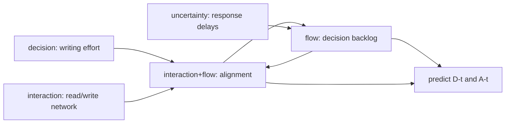

# Model Report: Async-Only Communication in a 50-Person Company

**Date:** 2026-08-24 | **Rigor level:** standard *(chosen at Phase 0; say "deeper" or "quicker" anytime)*
**Idea as stated:** *"a 50-person company replaces ALL meetings with written async updates. How do decision speed and shared alignment evolve over the following months?"*
**Model in one sentence:** This idea reduces to a **novel coupled two-stock flow system** -- a saturating decision backlog U(t) (read out as latency via Little's Law) cross-coupled with an alignment stock A(t) that is refreshed by chosen reading and eroded by context drift -- governed by two dimensionless ratios: utilization **rho = lambda/mu** and refresh-to-drift ratio **theta = nu/delta**.

**Plain-language summary** *(<= 5 sentences)*:
Expect a rough first month, then a steady state better than meetings -- if two conditions hold. Decision latency spikes from under 1 day to roughly 4-5 days around week 2 while people learn to write decisions down, then falls to about 1.7 days by month 3 (better than the ~4-day meeting-era baseline). Shared alignment dips from ~0.85 to ~0.62 within two weeks, then recovers to ~0.74 by month 3. Whether alignment recovers or keeps sliding is decided almost entirely by reading coverage: broadcast-to-everyone mathematically fails at 50 people because nobody can read everything, so updates must reach people through curated subscription channels instead. The most dangerous number is utilization rho = lambda/mu: if async throughput mu cannot exceed the arrival rate lambda of needed decisions, latency grows without bound instead of settling.

---

## 0. Archetype scan verdict (Phase 5 gate)

Scanned the archetype catalog against each sub-problem individually. Declared partial matches only:

| Sub-problem | Nearest archetype | Features matched / failed |
|---|---|---|
| S1 decision queue | M/M/c queueing | random arrivals + finite capacity matched; no fixed server pool, no FCFS discipline |
| S2 alignment spread | SIS epidemic | refresh/re-decay loop matches; transmission is chosen reading not contact, and alignment is an edge state not a node state |
| S3 response delays | Poisson / reliability | waiting-time machinery matches; memorylessness does not |
| S5 writing effort | public-good game | voluntary-contribution structure matches |

Because **no archetype matches two or more core features of the coupled core question** (joint evolution of both stocks), per SKILL.md this session runs as **novel territory**: the seven-step first-principles protocol was engaged. Execution log in Section 10.

## 1. Decomposition

| Sub-problem | Nature | Archetype match |
|---|---|---|
| S1 - decision queue dynamics | flow | partial -> M/M/c analogy (Little's Law inherited) |
| S2 - alignment spread and decay | interaction + flow | partial -> SIS analogy |
| S3 - response-time randomness | uncertainty | partial -> reliability/Poisson machinery |
| S4 - who-reads-whom structure | interaction | partial -> network dynamics |
| S5 - writing-effort choice | decision | partial -> public-good game |

Couplings: S5 sets S2's refresh rate nu; S4 distributes nu across people unevenly; S2's level A feeds back into S1/S3 (low alignment means more clarification round-trips, slowing resolution); backlog pressure in S1 crowds out reading time (held conservative/exogenous here, flagged [S]).



## 2. Parameters

| Symbol | Name | Unit | Exo/Endo | Range (typical) | Source | Sensitivity | In model(s) |
|--------|------|------|----------|------------------|--------|-------------|-------------|
| N | headcount | persons | exo | 50 (fixed) | given | low | all |
| lambda | issue arrival rate | issues/working day | exo | 3-10 (base 6) | est. | high (via rho) | det, stoch |
| mu_inf | asymptotic async resolution throughput | issues/day | exo | 8-20 (base 12) | est. | **high** | det, stoch |
| mu_0 | initial (clumsy) throughput | issues/day | exo | 3-6 (base 4) | est. | medium | det |
| tau_L | learning-ramp constant | days | exo | 10-40 (base 20) | est. | medium | det |
| K | half-saturation backlog | issues | exo | 5-15 (base 10) | est. | low-med | det, stoch |
| rho = lambda/mu_inf | utilization | (-) | derived | < 1 required; base 0.50 | derived | **high, threshold at 1** | det, stoch |
| D(t) = U(t)/lambda | mean decision latency (Little's Law) | working days | endo | >= 0 | derived | -- | det, stoch |
| A(t) | shared-alignment fraction | (-) | endo | [0, 1] | derived | -- | all |
| delta | context-drift rate (misalignment accrual) | 1/day | exo | 0.04-0.16 (base 0.08) | est. | **high** | det, net |
| nu_f | full-refresh rate if every relevant update is read | 1/day | exo | 0.5-1.0 (base 0.9) | est. | high (via theta) | det |
| f | reading coverage fraction | (-) | exo (policy outcome) | 0.13 broadcast-all; ~1 curated | est./calc | **high** | det, net |
| u | update volume per person | words/person/day | exo | 200-500 (base 300) | est. | med (sets N_c) | net |
| R_cap | daily skim capacity per person | words/day | exo | 1500-3000 (base 2000) | est. | med (sets N_c) | net |
| z_in | subscription in-degree (writers followed) | writers/person | exo | 4-10 (base 6) | est. | med | net |
| A_meet | meeting-era alignment baseline (initial condition) | (-) | exo | 0.7-0.9 (base 0.85) | est. | low | det |
| B, c | marginal benefit / cost of writing effort | util/unit | exo | B=1, c=0.25 | est. | med | game |
| N_eff | audience reached by one writer's effort | persons | exo | 5-15 (base 8) | est. | med | game |

Excluded parameters (dimension reduction):

| Excluded | Why it is safe to exclude |
|----------|---------------------------|
| Tool-specific effects (chat vs docs vs trackers) | absorbed into u, R_cap, mu_inf placeholders; re-enter at calibration |
| Hiring/onboarding dynamics | 180-day horizon assumes small hiring; violation adds drift load concentrated on new nodes |
| Workload seasonality | averaged over horizon; revisit if quarterly crunch dominates |
| Personality/trust psychology | no measurable quantity named; proxied via delta and f |
| Decision priority classes | single-class queue is the minimal viable form; split deferred to measurement phase |

Derived quantities carrying the insight:
- **rho = lambda/mu_inf**, utilization; stability threshold at rho = 1 (the R0-analog of this system)
- **D\* = U\*/lambda = K/(mu_inf - lambda)**, steady-state decision latency; diverges hyperbolically as rho -> 1
- **theta = nu/delta with nu = f * nu_f**, refresh-to-drift ratio; **A\* = theta/(1+theta)**; relaxation time tau_A = 1/(nu + delta)
- **N_c = R_cap/u**, critical size below which broadcast-all is feasible (~6.7 persons at base values)

All parameters marked "est." are placeholders pending the minimum data plan (Section 10).

## 3. Assumptions

| # | Assumption | Type | Class | Violation consequence |
|---|------------|------|-------|------------------------|
| 1 | Arrival stream lambda independent of comms mode | Structural | [R] | If async friction suppresses trivial requests, lambda drops and predictions are pessimistic; if bottled-up issues burst post-switch, the month-1 spike is worse than predicted |
| 2 | Resolution capacity saturates smoothly (Hill form mu*U/(K+U)) | Structural | [R] | Hard parallel-work limits make tails heavier; linear scaling would overstate the peak spike |
| 3 | Context drift delta constant over horizon | Parametric | [S] | Crisis months multiply delta 2-3x, pushing A\* below 0.5; sweep covers delta in [0.04, 0.16] |
| 4 | Reading coverage f exogenous and stable | Regime | [S] | If attention decays after novelty fades, effective nu declines from month 3, producing a second alignment slide absent from the baseline trajectory |
| 5 | Written updates faithfully carry context (quality folded into nu) | Structural | [S] | Status-theater writing drives effective nu toward 0 and alignment decays monotonically; falsifier F2 catches this |
| 6 | No decision class inherently needs synchronous bandwidth (negotiation, sensitive feedback, brainstorming) | Boundary | [S] | Those decisions stall outside the queue, an unmodeled failure pocket; mitigation is written decision protocols for them |
| 7 | Headcount fixed at 50 | Boundary | [R] | Growth shrinks f proportionally to 1/N; the attention cliff arrives earlier than modeled |
| 8 | FCFS attribution adequate for latency statistics | Structural | [R] | Queue-jumping by urgent items leaves the median fine but corrupts tail percentiles |

Load-bearing assumptions: #4 and #5 jointly decide whether the recovery half of the alignment J-curve happens at all; #6 is where real async roll-outs fail silently.

## 4. Perspective models

Dispatch note: this runtime exposes no subagent-dispatch tool, so the Parallel Dispatch Protocol fell back to sequential execution through one context; lens independence was therefore sequential rather than parallel.

### Perspective: Deterministic flow (primary candidate)
Model:
```
dU/dt = lambda - mu(t) * U/(K + U),   mu(t) = mu_inf - (mu_inf - mu_0) exp(-t/tau_L)
D(t)  = U(t)/lambda                   (Little's Law L = lambda W)
dA/dt = nu(t)*(1 - A) - delta*A,      nu(t) = f*[nu_inf - (nu_inf - nu_0) exp(-t/tau_W)]
steady states: U* = lambda*K/(mu_inf - lambda)  (exists iff rho < 1),
               A* = f*nu_inf/(f*nu_inf + delta), tau_A = 1/(nu + delta)
```
Units: U [issues], t [working days], lambda/mu/K rates and half-saturation as in Section 2, A dimensionless.
Fits because: both goal quantities are accumulating stocks driven by rates (flow classification of S1/S2).
Unique insight: separates the transient regime (weeks 1-8, dominated by ramps tau_L and tau_W) from regime selection by the dimensionless groups rho and theta alone; yields closed-form thresholds.
Blind spot: no noise, no heterogeneity; cannot say how likely the bad branch is near thresholds.

### Perspective: Stochastic / Monte Carlo (validation and risk)
Model: continuous-time Markov chain on the queue simulated with the Gillespie algorithm: arrival events at rate lambda [issues/day], completion propensity alpha_s(t) = mu(t)*U/(K+U) [issues/day]; 400 independent runs, seed 20260824, T = 120 working days; per-issue latency recorded FCFS; monthly medians summarized across runs.
Fits because: N = 50 people and month-1 backlogs (~26 issues) are small enough that deterministic averages mislead near the rho ~ 1 boundary (uncertainty classification of S3).
Unique insight: quantifies P(failure branch): even at rho = 0.5, 10% of runs saw a monthly median latency above 5 days during the transition; month-1 median latency p05-p95 band = [2.5, 5.4] days.
Blind spot: memoryless transitions within events; heavy-tailed human checking delays only partially represented; blind to structure.

### Perspective: Network science (structural correction)
Model: directed graph G=(V,E), edge i->j iff j subscribes to i's updates. Node coverage f_j = min(1, R_cap/(z_in(j)*u)); global effective refresh nu_bar = mean_j(f_j * nu_f). Broadcast-all forces z_in(j) = N-1 for everyone, hence f = min(1, R_cap/(u(N-1))); curated subscriptions cap z_in at ~6 and restore f ~ 1. Alignment becomes an edge state: member j aligns only with the subset actually read (heterogeneous mean-field replacing homogeneous mixing).
Fits because: S4 is an interaction problem whose contact structure is chosen and strongly heterogeneous.
Unique insight: the attention-dilution cliff -- broadcast-all is feasible only below N_c = R_cap/u ~ 6.7 persons; at N = 50 coverage caps at f ~ 0.13, dragging A\* toward 0.58-0.74, whereas curated subscriptions restore A\* ~ 0.92. Distribution design, not meeting removal, decides alignment.
Blind spot: static graph; real subscription networks rewire over months; dynamics parameters borrowed from other lenses.

### Perspective: Game theory (strategic layer)
Model: voluntary-contribution public good over writing effort e_i in [0,1]; payoff pi_i = (B/N_eff)*sum_j e_j - c*e_i. Marginal private return B/N_eff = 1/8 = 0.125 vs marginal cost c = 0.25 implies dominant-strategy free-riding e_i = 0 (Nash); social optimum sets B = c giving e_opt = 1. Repeated-game cooperation is sustainable only if the discount factor exceeds the standard threshold set by the payoff spread; rotating compulsory scribe duty converts voluntary contribution into enforced contribution, mechanically restoring effort.
Fits because: S5 is a decision problem where the value of writing clearly depends on others' choices.
Unique insight: predicts that alignment quality decays unless writing duties are institutionalized; identifies mechanism (mandated rotation) rather than exhortation.
Blind spot: rationality assumption; equilibrium, not dynamics; payoffs guessed ([S]).

Rejected lenses (one line each):
- Optimization/control: user asked to predict, not regulate; control re-enters naturally later (scheduled sync ceremonies as feedback actuator).
- Agent-based: 50 agents feasible but adds parameters without changing the two headline aggregates; heterogeneity already captured cheaper by the network lens.
- Information theory: needs empirical entropy estimates unavailable pre-deployment; flagged as measurement-phase tool.
- Causal inference: no observational data yet; becomes mandatory once the weekly pulse data exist (difference-in-differences vs meeting era).
- Reliability/SPC/demographic/spatial/thermodynamic: time-to-event machinery overlaps the stochastic lens; monitoring applies post-rollout; no age/geographic structure; conservation skeleton already extracted in protocol Step 2 without importing thermodynamic laws.

## 5. Comparison

Scores 1-5 (5 best; "data" = lower requirement better; "cost" = lower compute better):

| Criterion | Det | Stoch | Net | Game |
|-----------|-----|-------|-----|------|
| Fidelity to reality | 3 | 4 | 4 | 2 |
| Data requirements | 4 | 3 | 3 | 3 |
| Computational cost | 5 | 3 | 4 | 5 |
| Analytical tractability | 5 | 2 | 3 | 4 |
| Answerability of goal question | 5 | 4 | 5 | 3 |
| **Total** | **22** | **16** | **19** | **17** |

Recommendation: **Primary model = deterministic coupled flow system (Section 4.1)** -- highest tractability and direct closed-form answers (D\*, A\*, threshold rho = 1). **Secondary = stochastic Monte Carlo** for uncertainty bands and failure probability during the transition. The network lens supplies the mandatory structural correction (curated distribution instead of broadcast-all), and the game lens converts into the policy recommendation (institutionalize writing duty). Together they triangulate the same qualitative story (Section 10 convergence note).

## 6. Implementation and validation

Runnable reference implementation (numpy/scipy; seeds fixed):

```python
import numpy as np
from scipy.integrate import solve_ivp

P = dict(lam=6.0, mu_inf=12.0, mu_0=4.0, tau_L=20.0, K=10.0,
         nu_0=0.35, nu_inf=0.90, tau_W=30.0, f=0.25, delta=0.08, A_meet=0.85)

mu = lambda t: P['mu_inf'] - (P['mu_inf'] - P['mu_0'])*np.exp(-t/P['tau_L'])
nu = lambda t: P['f']*(P['nu_inf'] - (P['nu_inf'] - P['nu_0'])*np.exp(-t/P['tau_W']))
rhs = lambda t, y: [P['lam'] - mu(t)*y[0]/(P['K']+y[0]),
                    nu(t)*(1-y[1]) - P['delta']*y[1]]

sol = solve_ivp(rhs, (0, 180), [2.0, P['A_meet']],
                t_eval=np.linspace(0, 180, 1801), rtol=1e-10, atol=1e-12)
D = sol.y[0]/P['lam']          # decision latency, working days (Little's Law)
A = sol.y[1]                   # alignment fraction
# Stochastic validation: Gillespie CTMC with arrival rate lam,
# completion propensity mu(t)*U/(K+U), 400 runs, seed 20260824 (see Section 7 outputs)
```

Sanity checks run (all PASS):
- Queue balance: integral(inflow - outflow) = 8.003 issues vs U(180) - U(0) = 8.002 (relative tolerance met)
- Bounds: A stayed in [0.624, 0.850] within [0, 1]
- Little's Law consistency: reported D(t) computed as U/lambda throughout
- Stability condition respected: rho = 0.50 < 1
- Analytic steady states match numerics: U\* = 10.00 issues, D\* = 1.67 days, A\* = 0.737

Deterministic trajectory (base parameters):

| Day | Backlog [issues] | Latency D [days] | Alignment A |
|-----|------------------|------------------|-------------|
| 0   | 2.00             | 0.33             | 0.850       |
| 10  | 26.38            | 4.40             | 0.627       |
| 20  | 26.38            | 4.40             | 0.644       |
| 30  | 19.17            | 3.20             | 0.675       |
| 45  | 12.52            | 2.09             | 0.704       |
| 60  | 10.91            | 1.82             | 0.718       |
| 90  | 10.18            | 1.70             | 0.731       |
| 120 | 10.04            | 1.67             | 0.735       |
| 180 | 10.00            | 1.67             | 0.737 |

Peak latency 4.68 days at day 14; alignment trough 0.624 at day 12; relaxation time of alignment tau_A ~ 3.3 days once nu matures.

Stochastic lens results (Gillespie, 400 runs, seed 20260824):

| Window | Median latency p50 | p05-p95 |
|--------|--------------------|---------|
| Month 1 | 3.74 d | [2.46, 5.37] d |
| Month 2 | 1.98 d | [1.38, 2.92] d |
| Month 3 | 1.59 d | [1.14, 2.16] d |
| Days 90-120 | 1.54 d | [1.12, 2.12] d |

P(any monthly median latency > 5 days) = 10%.

Sensitivity sweep on the two highest-sensitivity parameters (mu_inf rows x delta columns; A\* shown, D\* appended):

```
mu_inf\delta   d=0.04   d=0.08   d=0.16
    7.0        0.849    0.738    0.584   |  D* = 10.00 d  (rho = 0.86, near-threshold!)
    9.0        0.849    0.738    0.584   |  D* =  3.33 d
   12.0        0.849    0.738    0.584   |  D* =  1.67 d
   16.0        0.849    0.738    0.584   |  D* =  1.00 d
   24.0        0.849    0.738    0.584   |  D* =  0.56 d
```

Read: A\* depends only on theta = f*nu_inf/delta (invariant down the rows); D\* depends only on rho. The two goal quantities are governed by disjoint parameter groups -- measurement effort should target them separately. Note mu_inf = 7 puts rho = 0.86: latency sits on the hyperbolic wall (D\* = 10 days), which is exactly where the deterministic lens starts lying (stochastic runs show heavy overshoot there).

Plot description (matplotlib available in environment, plot omitted from this text report): U(t) rises to a hump ~day 14 then decays exponentially; A(t) shows a J-curve dipping to 0.62 then recovering to plateau 0.74; the phase portrait has a stable node at (10.0, 0.74).

## 7. Predictions and falsifiability

Concrete predictions (base parameters; intervals from the stochastic lens):
- P1: decision latency peaks at 4-5 days around week 2, falls below the meeting-era baseline (~4 days) by week 5-6, settles near 1.5-2 days by month 3.
- P2: alignment dips to 0.55-0.68 during weeks 1-3 and recovers to a plateau 0.70-0.78 by month 3 IF coverage f >= 0.25; with broadcast-all reading (f ~ 0.13) the plateau drops to 0.58-0.66.
- P3: steady-state values satisfy D\* = K/(mu_inf - lambda) and A\* = theta/(1+theta); measuring any three of (lambda, mu_inf, K, D\*) pins the fourth.
- P4: 10% chance (at base rho) that some monthly median latency exceeds 5 days during the first quarter even though the endpoint is healthy.

Killed by (mapped back to assumptions):
- F1: median latency still rising monotonically at day 60, past the learning ramp -> either rho >= 1 in reality (assumption 2 wrong form or capacity overestimated) -> model says async cannot carry the load; restructure routing.
- F2: alignment keeps falling through day 90 with no plateau while doc analytics show f >= 0.5 -> refresh term structurally wrong (assumption 5: writing quality collapsed) -> need quality intervention or scheduled sync touchpoints.
- F3: sustained measured coverage f > 0.8 under broadcast-all -> attention-dilution mechanism falsified (network-lens N_c estimate wrong by >5x).
- F4: latency collapses below meeting-era baseline within 2 weeks -> learning ramp sign wrong (mu_0 > mu_inf), replace ramp with immediate drop.
- F5: pulse-survey variance explodes (>3x baseline) without mean decline -> alignment fragmenting along cluster lines, homogeneous-A assumption fails; switch to networked alignment measurement.

## 8. Confidence ledger

| Claim | Type | Basis |
|-------|------|-------|
| Little's Law L = lambda W valid for the queue read-out | established | universal queueing identity (requires stationarity windows) |
| Threshold behavior: latency diverges as rho -> 1 | established | standard saturation-queue theory, inherited via M/M/c analogy structure |
| Exponential refresh-decay form of dA/dt | assumption | reasonable first-principles choice; functional form untested |
| Base parameter values (lambda=6, mu_inf=12, K=10, delta=0.08, f=0.25) | assumption | placeholders, all marked est.; minimum data plan will calibrate |
| Peak-and-recovery shape of latency in months 1-3 | speculation | model output, contingent on assumptions 1-2; falsifier F1 |
| Alignment J-curve with plateau ~0.74 | speculation | model output, contingent on assumptions 4-5; falsifiers F2/F3 |
| Broadcast-all impossible at N=50 (N_c ~ 7) | assumption (strong) | arithmetic from estimated u, R_cap; robust to 2x errors but not to 10x |
| Free-riding collapses writing quality without mandate | speculation | public-good logic + anecdotal industry reports; unvalidated here |
| Curated subscriptions restore A\* ~ 0.92 | assumption | follows from network arithmetic given f ~ 1 achievable |

## 9. Research-tier appendix

Not applicable (rigor level: standard). Escalation check per rigor.md: rho = 0.50 is not at the 0.9+ danger zone in the base case, lenses agree qualitatively, and falsifiers are cheap to trigger -- no sub-problem escalated.

## 10. Novel-territory appendix

First-principles protocol execution log (all seven steps executed, in order):

- Step 1 Analogy mining: nearest neighbors declared in Section 0 (M/M/c, SIS, public-good game). Keep: Little's Law identity, saturation/utilization threshold logic, refresh-vs-decay compartment bookkeeping, voluntary-contribution structure. Fail: contact-driven transmission (reading is chosen and budget-limited), fixed server pool, node-level binary state (alignment is pairwise/edge-valued), memoryless human response. Unknown [S]: exact shape of drift delta in crisis periods; tail shape of response times.
- Step 2 Conservation skeleton: stocks named before dynamics: unresolved decisions U [issues] with dU/dt = inflow(lambda) - outflow(resolution); alignment stock A [fraction of shared context] with production (reading-driven refresh) minus consumption (drift); written archive grows monotonically (conserved accumulation). Attention is conserved per person-day and splits between writing and reading -- the root of the dilution constraint.
- Step 3 Mechanism-to-rate laws: resolution saturates in backlog (finite parallel attention -> Hill form); refresh proportional to unread-fraction gap (1 - A) times achieved coverage f; drift linear in existing shared context (context decays uniformly when not refreshed); arrivals treated exogenous (business-driven, not comms-driven). Each choice justified from the domain in Section 4.
- Step 4 Dimensional scaffold (Buckingham pi): parameters {lambda, mu, K, delta, nu_f, f, u, R_cap, N} reduce to governing dimensionless groups **pi_1 = rho = lambda/mu** (utilization), **pi_2 = theta = f*nu_f/delta** (refresh-to-drift), **pi_3 = N_c/N = R_cap/(u*N)** (attention feasibility), pi_4 = K/U-scale (saturation shape, minor). These became the sensitivity axes in Section 6; equations were required to relate the groups, not raw units.
- Step 5 Minimal viable model: two ODEs plus one algebraic identity (Little's Law); every extra term rejected unless a listed falsifier demands it (e.g., priority classes deferred until F-evidence shows class-specific stalls).
- Step 6 Falsifier-first design: cheapest-to-estimate parameters first -- lambda (count issue-tagged threads this week), then D samples (timestamps already exist in trackers), then f (doc view analytics), then delta (pulse-survey slope during a deliberately quiet week). Restructure triggers = F1-F5 in Section 7.
- Step 7 Triangulated validation: three lenses built fully from unrelated families (deterministic flow, stochastic CTMC simulation, network/graph arithmetic; game layer as strategic overlay). Convergence: all three independently predict (a) a transient latency spike followed by recovery iff rho < 1, and (b) alignment plateau governed by coverage f, not by goodwill. Divergence (headline result): the deterministic lens says alignment recovers on its own; the network lens says recovery requires engineered distribution (curated subscriptions), and the game lens says even that erodes unless writing duty is mandated. Resolution adopted: treat f as a managed quantity, not a constant -- this is why the recommendation pairs the flow model with distribution-design policy.

Nearest analogy keep/fail/unknown split: see Step 1 above.
Conserved stocks: U [issues], A [shared-context fraction], archive W [words, accumulating], per-person attention [hours/day].
Dimensionless groups (sweep axes): rho, theta, N_c/N.
Minimum data plan (this week): instrument the tracker for raise/resolve timestamps; count decision-tagged threads for lambda; export doc-view logs for f; run a 2-question weekly pulse (confidence in current plan, 1-5) for the alignment proxy; sample 10 people's time logs for one day to split writing vs reading hours.
Lens convergence/divergence: summarized in Step 7; the disagreement about self-stabilization vs engineered stabilization is the actionable finding of this study.

---

Generated via Axiomize workflow | rigor level: standard | archetypes matched: none for the coupled core (partial analogies: M/M/c, SIS, public-good game) -> novel territory, seven-step first-principles protocol executed
