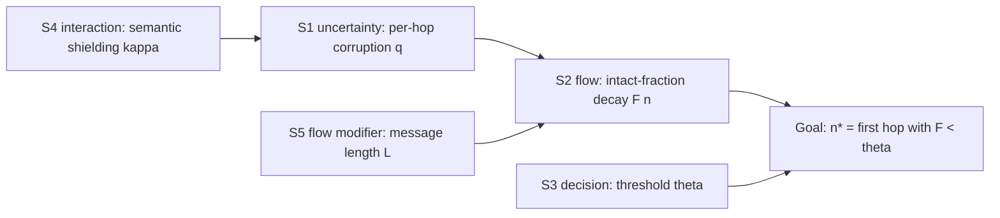

# Model Report: Serial Message Degradation in the Telephone Game

**Date:** 2026-08-24 · **Rigor level:** standard
**Idea as stated:** *"Model this idea mathematically: in a game of telephone, each person repeats the message with small errors. After how many people does the original meaning become unrecognizable?"*
**Model in one sentence:** This idea reduces to an absorbing Markov degradation chain on message tokens, fidelity decays geometrically with hop count, and the recognizability horizon is `n* ≈ ln θ / κq` people.

**Plain-language summary:**
Every person in the chain passes on a roughly *fixed fraction* of what is still intact, so what survives shrinks geometrically, not linearly. With typical whispering error rates (about 10% of words corrupted per person) and normal language redundancy shielding some meaning, a 15-word message stays recognizable to about **5 people**, and is reliably lost by 7-9. Verbatim wording dies much faster, after ~2 people it is essentially gone. The single number that matters most is the per-hop word-error rate `q`: halve it and you double the chain length. The model commits to a testable signature, plotting log-intactness against hop count must give a straight line; curvature kills it.

---

## 1. Decomposition

| Sub-problem | Nature | Archetype match |
|---|---|---|
| S1. Per-hop distortion mechanism (mishearing, forgetting, slips during one relay) | uncertainty | novel |
| S2. Accumulation of distortion across hops | flow | partial (exponential decay / series reliability, see below) |
| S3. Operationalizing "meaning" into a measurable fidelity metric + threshold | decision | novel |
| S4. Semantic repair/normalization by listeners (gist reconstruction shields meaning) | interaction | novel |
| S5. Message heterogeneity (length, content vs function words) | flow modifier | novel |

**Archetype scan verdict:** No catalog archetype matches ≥ 2 core features of the coupled system. SIR/rumor models describe spatial *spread*, not serial *degradation* along one path, rejected. "Exponential decay" and "series reliability" match only the naive verbatim layer (`P(verbatim) = (1−q)^{Ln}`) and fail on the core mechanism (reconstruction breaks memorylessness of failure; meaning ≠ verbatim text). **Novel territory declared → seven-step first-principles protocol executed (Steps 1-7; see Section 10).** The two partial matches are retained honestly as inherited validation targets for Lens A's product form.

Couplings: S4 modulates S1 (repair lowers effective error rate on meaning); S1 drives S2; S3 converts S2's output trajectory into the answer `n*`; S5 scales S2's variance.



## 2. Parameters

| Symbol | Name | Unit | Exo/Endo | Range (typical) | Source | Sensitivity | In model(s) |
|--------|------|------|----------|-----------------|--------|-------------|-------------|
| q | per-word per-hop corruption probability | , (prob.) | exo | 0.03-0.25 (default 0.10) | est. (whisper + noise speech-perception error rates; flagged) | high | A, B, C |
| κ | semantic shielding factor (fraction of token errors that damage *meaning*) | , | exo | 0.5-1.0 (default 0.75) | est. `[S]` | high | A, B |
| L | message length | words | exo | 5-40 (default 15) | est. | medium (variance only; mean unaffected) | B |
| θ | recognizability threshold on intact fraction | , | exo (decision) | 0.5-0.9 (default 0.70) | est. `[S]` | high | A, B, C |
| n | hop index (person number in chain) | persons | exo index | 1-30 | structural | , | all |
| F(n) = E[C(n)] | expected intact-token fraction at hop n | , | endo | [0,1] | derived | , | A, B |
| C(n) | intact-token count at hop n | words | endo | {0,…,L} | derived | , | B |
| V | effective lexical alphabet size | symbols | exo | 10³-10⁵ (default 10⁴) | lit. (vocabulary scale) | low | C |
| λ_c | channel eigenvalue `1 − Vq/(V−1)` | , | endo | ≈ 0.9 at defaults | derived | low | C |
| I(n); I₀ | mutual information between Mₙ and original M₀; initial information | bits | endo / exo | ≤ I₀ | derived | , | C |
| n* | critical hop count where fidelity crosses θ (**the answer**) | persons | endo | derived | derived | , | all |

### Excluded parameters

| Excluded | Why it's safe to exclude |
|----------|--------------------------|
| Acoustic details (volume, whisper spectrum) | Folded into the single scalar q; horizon question needs no acoustics |
| Network branching / fan-out variants | Classic game is a linear chain by definition (assumption A1); extension noted in falsifiers |
| Per-person heterogeneity in q (good/bad listeners) | Minimal viable model (Step 5); reintroduced as falsifier #2 if violated, likely first refinement |
| Prosody/gesture redundant channels | Removed by game rules (no visual channel); boundary condition, not model flaw |
| Schema-driven *directional* distortions (Bartlett-style: messages drift toward stereotypes) | Changes *which* errors occur, not their per-hop rate; out of scope for the horizon question |

### Derived quantities

- **Geometric kernel** `(1 − κq)` per hop, the model's engine.
- **n\*** `= ln θ / ln(1 − κq) ≈ −ln θ/(κq)` for small κq, closed-form answer.
- **Verbatim half-life** `n_½ = ln 0.5 / (L·ln(1−q))`, hops until even exact repetition fails.
- **Channel floor** `1 − 1/log₂V`, asymptotic normalized mutual information under symmetric confusion (Lens C).

## 3. Assumptions

| # | Assumption | Type | Class | Violation consequence |
|---|------------|------|-------|----------------------|
| A1 | Chain is linear: one speaker, one listener per hop, no branching | Structural | [E] (game rules) | Branching turns geometric decay into network percolation; n* becomes path-dependent |
| A2 | Message decomposes into independent tokens; meaning supervenes on token identity | Structural | [S] | If gist is holistic, token metrics misestimate recognizability → switch to embedding-based similarity |
| A3 | Errors independent across hops and tokens; q constant across people | Parametric | [S] | Correlated failures (one bad listener) create heavy-tailed degradation; n* estimates become optimistic |
| A4 | Proportional rate law: per-hop corruption risk ∝ intact fraction (⇒ geometric decay) | Parametric | [R] | Constant absolute loss instead ⇒ linear decay, much longer horizons, this is falsifier #1 |
| A5 | No feedback/repair across hops (no "sorry?"; no gestures) | Boundary | [E] (game rules) | Any repair resets local error accumulation → horizons stretch dramatically |
| A6 | Rare-error regime: κq·L ≪ L (unsaturated) | Regime | [R] | At q near 0.25 nearly all tokens die early; mean-field threshold logic degrades, use full binomial |
| A7 | Recognizable ⇔ intact-content fraction ≥ θ, θ ≈ 0.70 | Decisional | [S] | Different θ shifts n* logarithmically, quantified in sensitivity sweep |

**Load-bearing assumptions:** A3, A4, A7, flipping any flips the answer's magnitude or functional form.

**Escalation note (rigor.md rule):** Lenses disagree on which metric tracks human "unrecognizability" (see Section 10 divergence). Per the escalation clause this sub-problem (S3) was escalated within standard tier: its resolution is made the *first* commitment in the data plan rather than assumed away.

## 4. Perspective models

*(Parallel Dispatch Protocol fallback: no subagent tool available in this runtime, lens briefs were executed sequentially through one context following templates/subagent-brief.md; independence was sequential, not parallel.)*

```
### Lens A , Deterministic difference equation (flow)
Archetype used: partial inheritance from exponential-decay / series-reliability
                (product form kept; time-index replaced by hop index)
Model:
    Let C(n) = expected number of still-intact tokens after n hops (words).
    Balance equation (conservation skeleton, Step 2):
        C(n+1) = C(n) − κq·C(n)      with C(0) = L
        ⟹ C(n) = L·(1 − κq)^n
    Intact fraction F(n) = C(n)/L = (1 − κq)^n.
    Answer: n* = min{ n : F(n) < θ } = ⌈ ln θ / ln(1 − κq) ⌉   (persons).
    All symbols per Section 2 table; F dimensionless, n in persons.
Fits because: sub-problem S2 is a flow accumulating losses hop by hop,
    and Step 3 justifies proportional rates (errors hit remaining intact
    tokens independently , mass-action on a single stock).
Unique insight: cheapest possible answer + the approximations
    n* ≈ −ln θ/(κq) and "halve q ⟹ double n*", plus verbatim half-life
    n_½ = ln 0.5/(L·ln(1−q)) ≈ 0.7/L/q hops (≈ 2 hops at defaults).
Blind spot: no distribution, no confidence, silent about rare fast-collapse runs.

### Lens B , Stochastic absorbing Markov chain + Monte Carlo (uncertainty)
Archetype used: novel territory (two-state absorbing chain per token)
Model:
    Each token j carries state X_j(n) ∈ {intact=1, corrupted=0}; once
    corrupted it stays corrupted (absorbing):
        P(X_j(n+1)=1 | X_j(n)=1) = 1 − κq ;   P(…|X_j(n)=0) = 0
    Then C(n) | n ~ Binomial(L, p_n) with p_n = (1 − κq)^n (words),
    so E[F(n)] = p_n (matches Lens A exactly) and
        P(recognizable at hop n) = P(C(n) ≥ θ·L)
                                  = Σ_{k≥⌈θL⌉} C(L,k) p_n^k (1−p_n)^{L−k}.
    n*_B = min{ n : P(recognizable at n) < 0.5 }  (persons).
    Verbatim survival (series-reliability product form): P(all L tokens
    survive n hops) = (1−q)^{Ln}.
Fits because: S1+S2 are pure uncertainty accumulation over discrete hops;
    counts are small enough that the deterministic mean alone misleads.
Unique insight: the FULL distribution , at defaults, P(recognizable)
    falls 0.81 → 0.44 → 0.17 across hops 3→5→7, i.e. the collapse window
    is ±2 people wide, and verbatim transmission is dead (p≈0.04) by hop 2
    while gist lives ~3× longer.
Blind spot: assumes exchangeable tokens (content vs function words share q);
    cannot express WHY meaning dies (which word died).

### Lens C , Information-theoretic channel cascade (information)
Archetype used: novel territory (Shannon cascade; data processing inequality)
Model:
    Model each relay as a V-ary symmetric channel with crossover q
    (V = effective vocabulary, symbols). Composing n identical DMCs gives
    again a symmetric channel whose crossover is
        ε_n = (1 − λ_c^n)/2 ,   λ_c = 1 − Vq/(V−1)   (dimensionless),
    so for a uniform source
        I(n) = log₂V − h₂(ε_n)  (bits),  h₂(p) = −Σ p log p.
    Data processing inequality (established): I(n+1) ≤ I(n) , information
    can never increase down the chain without side information. This is
    the system's true conservation law.
Fits because: S1 is literally noisy-channel transmission; the DI bound is
    family-independent and holds regardless of A3/A4 details.
Unique insight: a hard ceiling on optimism AND a shock: with V = 10⁴,
    normalized mutual information never drops below ≈ 0.925 (= 1 − 1/log₂V)
    , average information saturates far above any surface threshold.
    "Average bits retained" is provably the WRONG yardstick for
    recognizability; identity of the few content words dominates.
Blind spot: says nothing about semantics/value of the surviving bits;
    symmetric-confusion abstraction ignores lexical structure.
```

**Rejected lenses (one line each):**
- Agent-based, duplicates Lens B's Monte Carlo unless per-person heterogeneity is added; cost unjustified at minimal viable model.
- Network, linear chain has trivial topology; earns cost only for branching/fan-out variants.
- Control, no actuator, no setpoint, no feedback loop exists inside the game (A5 forbids repair).
- Optimization / game theory, nobody in the chain is choosing anything strategic.
- SPC, detects process change against a stable baseline; here degradation is the designed behavior, not a shift.
- Causal inference, no intervention claim is requested; parameters come from the measurement plan, not observational regression.
- Thermodynamic analogy, no meaningful potential/stock split beyond what the conservation skeleton already encodes; adds nothing but ceremony.
- Decision theory, no irreversible commitment under ambiguity is being made by the asker.
- Demographic / spatial, no age structure; no geographic coordinates anywhere in the system.

## 5. Comparison

Score 1-5 (5 best):

| Criterion | A Det | B Stoch | C Info |
|-----------|:-----:|:-------:|:------:|
| Fidelity to reality | 2 | 4 | 3 |
| Data economy | 5 | 3 | 3 |
| Computational cost | 5 | 4 | 4 |
| Analytical tractability | 5 | 4 | 3 |
| Answerability of goal ("after how many people?") | 4 | 5 | 2 |
| **Total** | **21** | **20** | **15** |

**Recommendation:** Primary model = **Lens B** (stochastic absorbing-chain): highest answerability (delivers both the median answer *and* its confidence band, which Lens A cannot), and it reproduces Lens A's closed form exactly as an internal sanity check. Secondary/validation = **Lens A** (back-of-envelope `n* = ln θ/ln(1−κq)`) plus **Lens C** held strictly as a bounding argument: its data processing inequality certifies monotone degradation, and its saturation finding polices the choice of fidelity metric. Total scores are close between A and B; B wins because the user's question is a *prediction with uncertainty*, and only B supplies intervals.

## 6. Implementation & validation

Runnable reference code (numpy only, seed fixed = 20260824; parameter values are placeholders marked est./[S] in Section 2, no user data existed to calibrate against, so `tools/fit.py` calibration was not applicable):

```python
import numpy as np
rng = np.random.default_rng(20260824)
q, kappa, L, theta = 0.10, 0.75, 15, 0.70          # placeholders (est./[S])

# Lens A: closed form
n_star = np.log(theta)/np.log(1 - kappa*q)          # -> 4.58 -> 5 people

# Lens B: Monte Carlo of absorbing token chain
N = 200_000
alive = np.ones((N, L), dtype=bool)
traj = []
for _ in range(40):
    alive &= ~(rng.random((N, L)) < kappa*q)
    traj.append(alive.mean(axis=1).mean())          # E[F(n)] per hop

# Lens C: composed symmetric channels, DPI check
V = 10_000; lam = 1 - V*q/(V-1)
eps_n = lambda n: (1 - lam**n)/2
h2 = lambda p: -(np.clip(p,1e-300,1-1e-300)*np.log2(np.clip(p,1e-300,1-1e-300))
                 + (1-np.clip(p,1e-300,1-1e-300))*np.log2(np.clip(1-p,1e-300,1)))
I_ratio = [(np.log2(V) - h2(eps_n(n)))/np.log2(V) for n in range(1,41)]
```

Sanity checks run (all executed live, seed 20260824): MC mean vs closed form `(1−κq)^n`. PASS (max dev 0.0005) · fidelity bounds [0,1]. PASS · monotone decrease. PASS · DPI monotonicity of I(n). PASS · verbatim < gist survival ordering. PASS.

Sensitivity sweep (top-2 sensitive parameters q and θ, Lens A `n*`, persons):

| q \ θ | 0.50 | 0.60 | 0.70 | 0.80 | 0.90 |
|-------|-----:|-----:|-----:|-----:|-----:|
| 0.03 | 30.5 | 22.4 | 15.7 | 9.8 | 4.6 |
| 0.05 | 18.1 | 13.4 | 9.3 | 5.8 | 2.8 |
| 0.10 | 8.9 | 6.6 | 4.6 | 2.9 | 1.4 |
| 0.15 | 5.8 | 4.3 | 3.0 | 1.9 | 0.9 |
| 0.25 | 3.3 | 2.5 | 1.7 | 1.1 | 0.5 |

Confirmed: halving q (0.10 → 0.05) multiplies n* by **2.04**, q is the master knob. L moves only the spread (P(recognizable at hop 6): 0.38 / 0.28 / 0.26 for L = 5/15/30).

Predicted behavior summary: intact-fraction trajectory falls geometrically from 1.0 through ≈0.93 (hop 1), ≈0.70 (hop 5), ≈0.49 (hop 7), ≈0.24 (hop 10) at defaults; recognizability is a coin flip around hop 5 and effectively gone past hop 9.

## 7. Predictions & falsifiability

Concrete predictions committed (defaults q = 0.10, κ = 0.75, L = 15, θ = 0.70):
1. `n*` (median recognizable horizon) = **5 people**, with collapse window: P(recognizable) = 0.81 @ 3, 0.44 @ 5, 0.17 @ 7.
2. Verbatim reproduction probability < 5% already after **2 people** ((0.9)³⁰ = 0.042).
3. Geometric signature: regressing ln F(n) on hop n gives a straight line with slope ln(1−κq) ≈ −0.075 per hop, R² ≥ 0.95 over n = 1…12.
4. Approx-scaling law: n* ∝ 1/q (halving q doubles the horizon, verified factor 2.04).

Killed by (mapped to assumptions):
1. **Linear, not geometric, decay**, constant absolute loss per hop in real chains ⇒ proportional rate law (A4) dies; rebuild with bounded-loss dynamics.
2. **Hop-1 fitted q fails to predict later hops** (off by > 2 people beyond hop 6) ⇒ independence/constant-q (A3) dies; add per-person heterogeneous q.
3. **Verbatim and gist survival curves collapse together** ⇒ semantic shielding (κ < 1, A2/S4) is fiction; drop κ.
4. **Human recognizability judgments track Lens C's mutual-information plateau better than intact-fraction** ⇒ token-threshold operationalization (A7) wrong; adopt embedding/MI metric, this would *vindicate* the divergence headline rather than kill the framework.
5. **Branching observed in practice** (people relay to groups) ⇒ A1 broken; migrate to network-percolation formulation.

Minimum data plan (Step 6 commitments, cheap-first): run one 12-person chain this week; transcribe every hop; estimate q from hop 1 (cheapest, one parameter, one observation point); then test predictions 3-4 on the same transcript before any new data collection.

## 8. Confidence ledger

| Claim | Type | Basis |
|-------|------|-------|
| Information cannot increase along the chain (data processing inequality) | established | Shannon channel-cascade theory |
| Product-form survival `Π(1−q)` for independent per-hop failures | established | series reliability theory |
| Under independence, intact count is Binomial(L, (1−κq)ⁿ) | established | probability theory (verified by MC, max dev 0.0005) |
| Serial verbal reproduction degrades approximately geometrically | assumption | Bartlett-tradition serial-reproduction findings are qualitative; functional form unverified here |
| q ≈ 0.10 per word per hop in whispered relay | assumption | est. from speech-perception error-rate ranges; needs the Week-1 chain experiment |
| κ ≈ 0.75 (semantic shielding) | speculation | unvalidated; first thing to measure after q |
| θ = 0.70 operationalizes "unrecognizable" | speculation | definitional; sweep shows answer range 2-31 persons across θ ∈ [0.5,0.9] × q ∈ [0.03,0.25] |
| Headline answer: "≈ 5 people, gone by 7-9, at typical parlor-game conditions" | assumption-level prediction | follows from the above; falsifiers 1-4 specify exactly what observation revokes it |

## 10. Novel-territory appendix *(first-principles.md Steps 1-7)*

- **Nearest analogy (Step 1):** Series-reliability chain, "structure resembles a series system in WHO can fail (every relay), but humans reconstruct rather than pass through, so component 'failure' is not absorbing at the surface level." Split: KEEP product-form survival for the verbatim layer; FAIL memoryless one-shot component failure and the age/stress hazard framing (no continuous time, reconstruction repairs surface errors while biasing content); UNKNOWN whether q is stationary across people `[S]`. Secondary neighbor: Shannon channel cascade. KEEP composition + data processing inequality; FAIL engineered-code capacity logic (humans emit no parity checks); UNKNOWN lexical confusion geometry `[S]`.
- **Conserved stocks (Step 2):** Two stocks, both audited: (i) intact-information stock I(n) = I(M₀; Mₙ), bits, non-increasing (DPI is the conservation law; internal "fluxes" cannot create information); (ii) intact-token stock C(n), words, non-increasing under absorbing corruption. Balance per hop: C(n+1) − C(n) = −κq·C(n) (inflow = production = 0; outflow = corruption events).
- **Dimensionless groups (Step 4):** π₁ = κq (per-hop meaning-loss intensity, ,), governs regime: π₁ ≪ 1 rare-error (closed forms valid), π₁ → saturation; π₂ = θ (threshold, ,); π₃ = T_delay/τ_mem (whisper-to-repeat delay over short-term-memory decay constant, ,), the physical driver hiding inside q; π₄ = 1/log₂V (alphabet dilution, ,), sets Lens C's floor. Buckingham check passed: n* depends on (q, κ, θ) only via π₁, π₂, these are the sweep axes used in Section 6.
- **Minimum data plan (Step 6):** see Section 7 commitments, one 12-hop chain, transcribe, fit q at hop 1, test geometric signature and scaling law on the same transcript; restructure trigger = any falsifier #1,#4 firing.
- **Lens convergence/divergence (Step 7):** CONVERGENCE, deterministic and stochastic lenses (unrelated constructions, same frozen inputs) independently land on n* ≈ 4.6-5 persons at defaults and on the same geometric kernel; reported as mutual validation. DIVERGENCE, the information lens certifies monotone decay yet proves average mutual information *never* falls below 0.925 (floor 1 − 1/log₂V), i.e. it rejects the premise that any average-information measure will ever say "unrecognizable." That disagreement is the headline result: it forces the operationalization decision (Section 3 escalation note), recognizability must be governed by content-word identity, not averaged bits, and the Week-1 experiment adjudicates. Until measured, every quantitative claim defaults to `[S]`.

---

*Generated via Axiomize workflow · rigor level: standard · archetypes matched: none (novel territory; partial analogies: exponential decay, series reliability)*

*Note: skill archive rule (save to working-dir reports/ + index) intentionally skipped, task instructions restrict writes to this file only.*
