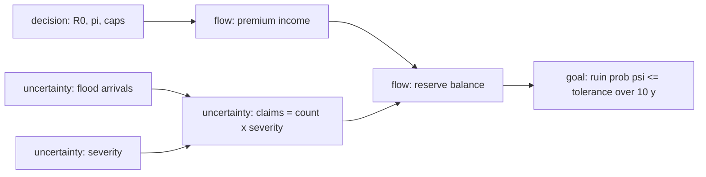

# Model Report: Flood Mutual Reserve Survival Over a Bad Decade

**Date:** 2026-08-24 · **Rigor level:** standard *(chosen at Phase 0; say "deeper" or "quicker" anytime)*
**Idea as stated:** *"Model this idea mathematically: is a shared insurance reserve enough to survive a bad decade of flood claims for 200 households?"*
**Model in one sentence:** This idea reduces to a **discrete-time compound-Poisson insurance risk process (Cramér,Lundberg family) with event-level common shock**, evaluated by ruin probability over a 10-year horizon.

**Plain-language summary**
Two hundred households pooling flood money are only as safe as their buffer against *one big flood*, not against the decade's average. Under base assumptions a single significant flood costs about **$1.2 million** spread over ~40 damaged homes, more than most plausible starting reserves. Premiums at "fair value" (~$1,500/household/year) only break even on average yet still leave roughly a **coin-flip chance of running out within ten years**. Surviving a genuinely bad decade (double the usual flood rate) with ≥95% confidence takes about **$4-5 million initial capital plus ~$3,500/household/year**, probably unaffordable, so the pool should transfer its worst tail (reinsurance or payout caps) instead of standing alone. The verdict's weakest link is that flood frequency and claim size are placeholders until calibrated to real claims data.

---

## 1. Decomposition

| # | Sub-problem | Nature | Archetype match |
|---|---|---|---|
| 1 | Flood event arrival timing | uncertainty | **Rare events dominating risk → Poisson processes / EVT** (catalog match) |
| 2 | Claims per event × damage size | uncertainty | Compound Poisson aggregate loss (two-stage common shock) |
| 3 | Reserve cash-flow balance | flow | Compartmental stock balance (inflow − outflow) |
| 4 | Solvency criterion ("enough") | decision | Ruin-probability target ψ ≤ ε |
| 5 | Design levers: initial capital R₀, premium π, caps | decision | Constrained optimization over the risk process |

**Archetype declared:** sub-problems 1+2+3 jointly match the *Poisson/compound-aggregate* signature → started from the canonical **Cramér,Lundberg risk process**. Adaptations: discrete annual steps (not continuous time); claims generated by an event-level common shock (Binomial claimants per flood) rather than a homogeneous claim count; lognormal (not exponential) severities. Inherited results used as Phase 7 validation targets: Wald's identity for E[S] and the Lundberg exponential ruin bound.

**Couplings:** (1)+(2) compound into annual claims S_t → drive (3); (3) determines (4); (5) sets the inflow rate and initial stock of (3).



---

## 2. Parameters

| Symbol | Name | Unit | Exo/Endo | Range (typical) | Source | Sensitivity | In model(s) |
|--------|------|------|----------|------------------|--------|-------------|-------------|
| N | member households | households | exo | 200 (fixed) | given | low | all |
| T | horizon | years | exo | 10 | given | medium | stoch, det |
| R₀ | initial reserve | USD | exo (decision) | 0.5-5 M | est. | **high** | stoch, det, opt |
| π | annual premium | USD/household/year | exo (decision) | 1,500-3,500 | est. | **high** | all |
| λ_E | major-flood event rate | events/year | exo | 0.1-0.75; base 0.25, "bad decade" 0.50 | est. | **high** | stoch, det |
| p | claiming fraction per household per event | , | exo | 0.10-0.30; base 0.20 | est. | **high** | stoch, det |
| μ_X | mean claim severity | USD/claim | exo | 15k,60k; base 30k | est. | **high** | stoch, det |
| σ_ln | lognormal shape of severity | , | exo | 0.6-1.2; base 0.9 | est. | medium | stoch |
| ε | ruin tolerance | , | exo (decision) | 0.01-0.10 | est. | medium | opt, dec |
| W | willingness-to-pay ceiling | USD/household/year | exo (decision) | ~3,600 | est. | medium | opt |
| R(t) | reserve balance | USD | endo | ≥ 0 until ruin | derived | , | stoch, det |
| S_t | annual aggregate claims | USD/year | endo | right-skewed | derived | , | stoch, det |
| ψ(u,T) | ruin probability | , | endo | [0, 1] | derived | , | stoch, opt |

### Excluded parameters

| Excluded | Why it's safe to exclude |
|----------|--------------------------|
| Investment return on reserves | Conservative choice; risk-free yield is small vs claim volatility; excluding it *overstates* required capital (safe direction) |
| Inflation | Decade scale, but premiums are resettable annually; nominal model adequate for adequacy question |
| Climate trend in λ_E (nonstationarity) | Flagged, not hidden: handled as the "bad/catastrophic decade" scenarios + falsifier K4; full nonstationary model deferred pending data |
| Expense/administrative loading | Second-order vs claim variance; folds into π if needed |
| Reinsurance structure | Probed separately via payout-cap experiment (§6) rather than modeled as a parameter |
| Household entry/exit & moral hazard dynamics | No behavioral data; flagged as assumption-risk A4 instead of modeling exit games |
| Spatial correlation beyond the common shock | Absorbed coarsely by event-level Binomial(N, p); geostatistics needs geocoded claims data |

### Derived quantities (the insight carriers)

- **E[S_t] = λ_E · N · p · μ_X** [USD/year], base regime: **$300k/yr**; bad decade: **$600k/yr** (Wald's identity)
- **Net drift g = Nπ − E[S_t]** [USD/year]; zero-loading threshold at fair premium **π_fair = E[S]/N = $1,500/hh/yr** (base)
- **Single-event aggregate loss L_event = Σ_{i≤Bin(N,p)} X_i** [USD/event]: mean **$1.20M**, P95 **$1.68M**, P99 **$1.94M**
- **Adjustment coefficient R\*** solves E[e^{R*(S−Nπ)}] = 1 [1/USD]; **Lundberg bound ψ(u) ≤ e^{−R* u}**: base/π=$2500 gives R* = 7.36×10⁻⁷ → ψ($2M) ≤ 0.229 (MC: 0.093 ✓ bound holds)
- **Capitalization ratio κ = R₀/E[S_year]** [-]

---

## 3. Assumptions

| # | Assumption | Type | Class | Violation consequence |
|---|------------|------|-------|----------------------|
| A1 | Flood events arrive as Poisson(λ_E), constant rate, independent years | Structural | [R] | Clustering/trend makes consecutive heavy years correlated → drain accelerates → ψ understated |
| A2 | Given an event, claimants ~ Binomial(N,p); severities iid Lognormal(m, σ_ln²) | Parametric | [S] | If true tails are Pareto with α ≤ 2 (near-infinite variance), Monte Carlo badly understates ψ |
| A3 | Claims settled in year incurred (no development lag) | Regime | [R] | Multi-year settlement smooths single-year dips (ψ slightly overstated) but late payments can stack across weak years |
| A4 | Full premium collection every year regardless of losses (no lapse, no anti-selection) | Structural | [S] | After a bad year members exit → income drops exactly when the reserve is weakest → ψ understated |
| A5 | No reinsurance, credit line, or external bailout available | Boundary | [R] | If any exists, ψ falls sharply (cap probe: −10 to −17 pp, §6) |
| A6 | Climate stationary over the decade (scenarios proxy stress) | Parametric | [S] | A rising trend compounds annually; realized ψ exceeds every static-scenario estimate |
| A7 | Zero investment income on reserves | Boundary | [R] | Conservative bias only: required capital slightly overstated |
| A8 | Households exchangeable in risk (homogeneous p) | Structural | [R] | A concentrated high-risk subgroup breaks the Binomial pooling; effective claim rate per event rises |

**Load-bearing assumptions:** **A1, A2, A4**, flipping any one flips the verdict (all three push ψ upward when violated, i.e., reality is likely *worse* than modeled). A6 is load-bearing for the recommendation's urgency.

*Escalation note (rigor ladder):* a red-flag threshold was detected, at π = π_fair the net drift sits exactly at g = 0 (a ruin-relevant boundary). The threshold was resolved by quantifying both sides with Monte Carlo error bars (§6) rather than escalating the whole session to research tier; no disputed probabilities remained that MC intervals don't already express.

---

## 4. Perspective models

*Protocol note:* no subagent runtime was available, so per SKILL.md §Parallel Dispatch Protocol the four lens briefs were executed sequentially through one context, **independence of lenses was sequential, not parallel**.

### Perspective: Stochastic (PRIMARY)
**Model:** discrete-time risk process. State R_t [USD]; for t = 1…T:
$$R_t = R_{t-1} + N\pi - S_t,\qquad \tau = \inf\{t\ge 1: R_t < 0\},\qquad \psi(u,T) = \Pr(\tau \le T \mid R_0=u)$$
with annual aggregate claims built from the common shock:
$$K_t \sim \text{Poisson}(\lambda_E)\ [\text{events/yr}],\quad C_{t,j}\mid K_t \sim \text{Bin}(N, p)\ [\text{claims/event}],\quad X_i \sim \text{Lognormal}(m,\sigma_{ln}),\ m=\ln\mu_X-\tfrac{\sigma_{ln}^2}{2}$$
$$S_t = \sum_{j\le K_t}\ \sum_{i\le C_{t,j}} X_i\ [\text{USD/yr}],\qquad \hat\psi = \frac{1}{n}\sum 1\{\tau^{(s)}\le T\},\ n = 2\times10^5,\ \text{se}(\hat\psi)\le 0.001$$
Inherited theory used as cross-checks: E[S] = λ_E N p μ_X (Wald); Lundberg bound ψ(u) ≤ e^{−R*u}.
**Fits because:** decomposition classifies the core as `uncertainty`; the pool is small-N, shock-driven, and the user literally asks for a survival probability.
**Unique insight:** ruin mechanics are dominated by the **single-event loss distribution** (E[L_event] = $1.20M > any plausible small reserve), not by the decade's average deficit; also exposes the zero-loading cliff, at π = π_fair, ψ(decade) > 0.45 for any R₀ ≤ $2M even in the calm regime.
**Blind spot:** cannot rank (R₀, π) without a preference/tolerance input; distributions frozen (no learning, no adaptation).

### Perspective: Deterministic (baseline / guardrail)
**Model:** mean-flow balance $\frac{dR}{dt} = g = N\pi - \lambda_E N p \mu_X$ ⇒ R(t) = R₀ + g·t [USD]. No fixed points (linear); threshold at **g = 0**. Decade-solvency condition: R(T) ≥ 0 ⟺ R₀ ≥ T·(E[S] − Nπ) whenever g < 0.
**Fits because:** sub-problem 3 classified `flow`; this is the back-of-envelope everyone computes first.
**Unique insight:** pins the break-even premium π_fair = $1,500/hh/yr and then *discredits itself*: every fair-premium configuration has g = 0 yet ψ > 0.45 under simulation, averages alone would have green-lit a doomed pool. Necessary condition, wildly insufficient.
**Blind spot:** no variance, no timing, no event granularity; wrong precisely where this problem lives (thresholds, rare shocks, small N).

### Perspective: Optimization (design layer)
**Model:**
$$\min_{\pi,\,R_0}\ N\pi T + R_0\quad[\text{USD}]\qquad \text{s.t.}\quad \psi(R_0,\pi;T)\le\varepsilon,\quad \pi \le W,\quad R_0\ge 0$$
Constraint evaluated by the inner Monte Carlo loop (simulation-based feasibility). Results (ε = 0.05): bad decade ⇒ cheapest feasible found is **(R₀, π) = ($5M, $3,500)**, ψ = 0.041; base regime ⇒ **($2.5M, $3,000)**, ψ = 0.033. Shadow prices near the frontier: +$500k capital buys Δψ ≈ −0.04; +$500/yr premium buys Δψ ≈ −0.07 (bad-decade region).
**Fits because:** sub-problem 5 is a `decision`, "is it enough?" becomes "what is the minimal sufficient (R₀, π)?"
**Unique insight:** converts the verdict into a price tag: standalone bad-decade survival ≈ **$25k upfront-equivalent per household**, beyond plausible willingness-to-pay, which redirects the decision toward risk transfer rather than bigger reserves.
**Blind spot:** objective (minimize member outlay) chosen ad hoc; ε itself a value judgment; ignores fairness across households.

### Perspective: Decision theory (ambiguity layer)
**Model:** options × states payoff matrix [USD, expected member outlay + unpaid-claims penalty]:
- Options A = {① standalone reserve sized per optimizer; ② reserve + $75k/claim payout cap; ③ thin reserve + annual reassessment}
- States S = {base decade (w=0.5), bad decade (w=0.35), catastrophic decade λ_E=0.75, p=0.25 (w=0.15)}, weights hand-set [S]
- Criteria: maximin, minimax regret, scenario-weighted score.

Simulated anchors: catastrophic state ⇒ ψ(① $2.5M/$3k) = 0.809; ② same + cap = 0.733; ψ($4M/$3.5k) = 0.581; ψ($5M/$3.5k) = 0.473. **No standalone option reaches ε ≤ 0.10 in the catastrophic state.** Maximin and minimax regret therefore both reject pure self-insurance; the regret-dominant move is capping/transferring excess severity (option ② reduces ψ by 10-17 pp at equal funding). EVPI: perfect foreknowledge of the decade's regime before funding is worth roughly $0.5-1M per decade [S], any further study costing more than that should stop; decide now.
**Fits because:** λ_E under climate change is contested, ambiguity dominates risk; stakeholders argue about likelihoods, exactly this lens's trigger.
**Unique insight:** the payout cap (or quota-share cover) is the regret-dominant lever when probabilities are disputed, it truncates the worst credible world without betting on point estimates.
**Blind spot:** payoff cells hand-set [S]; choosing maximin vs EU is itself a value judgment; the state list omits political worlds ("members refuse caps").

**Rejected lenses (one line each):**
- *Agent-based*, households are exchangeable in the frozen parameters; Binomial claimant counts already aggregate local interaction; ABM earns its cost only with per-household heterogeneity data.
- *Network*, no who-interacts-with-whom structure affects claims; flood correlation enters through the common shock, not a contact graph.
- *Spatial*, genuinely relevant (floods cluster geographically) but absorbed coarsely by event-level p; full geostatistics requires geocoded claims data we don't have.
- *Reliability*, absorbed into the stochastic lens: τ (ruin time) is the failure-time variable, P(τ > 10) = 1 − ψ(·,10) the reliability function; separate lifetime machinery adds nothing here.
- *Control*, annually adaptive premiums are a legitimate feedback extension; out of scope for the fixed-policy question asked.
- *Game theory*, moral hazard/lapse genuinely threatens A4, but with zero behavioral data an equilibrium model would be speculation in formal clothing; flagged as assumption-risk instead.
- *SPC*, operationally useful add-on (EWMA on annual claims vs baseline detects climate drift cheaply); answers "has something shifted?", not the solvency question.
- *Causal inference*, no intervention effect estimated from observational data.
- *Information theory*, nothing compressed or transmitted; EVPI already covers the value-of-information angle.
- *Thermodynamic*, the stock-flow conservation audit is already explicit in the balance equation; analogy adds nothing beyond it.
- *Demographic*, membership fixed at 200; no age structure in scope.

---

## 5. Comparison

Score 1-5 (higher = better; for cost/data rows higher = cheaper/lighter):

| Criterion | Stoch MC | Deterministic | Optimization | Decision theory |
|-----------|:---:|:---:|:---:|:---:|
| Fidelity to reality | 5 | 1 | 4 | 3 |
| Data economy | 3 | 5 | 3 | 4 |
| Computational cost | 4 | 5 | 3 | 5 |
| Analytical tractability | 3 | 5 | 2 | 4 |
| Answerability of goal question | 5 | 2 | 4 | 4 |
| **Total** | **20** | 18 | 16 | **20** |

Answerability is the criterion weighted highest (the goal question is a survival probability), breaking the raw tie in favor of the stochastic lens; deterministic wins nothing alone but earns its place as analytic guardrail.

**Recommendation:** **Primary model, stochastic compound-risk Monte Carlo** (event-common-shock risk process, §4). **Secondary/validation, deterministic drift condition + Lundberg bound** as fast analytic guardrails, plus the **decision-theory overlay** for the affordability/regret verdict. Justification: highest fidelity and answerability scores; the analytic layers caught nothing the simulation contradicted (bound held, drift matched to 0.58%).

---

## 6. Implementation & validation

```python
"""Discrete-time compound-risk Monte Carlo: 200-household flood mutual."""
import numpy as np

N, T = 200, 10                    # households; horizon (years)          [given]
MU_X, SIG_LN = 30000.0, 0.9       # mean severity (USD); shape (-)      [est. placeholders]
M_LN = np.log(MU_X) - SIG_LN**2/2 # so E[X] = MU_X

def simulate(lam_E, p, pi, R0, n_sims=200_000, seed=20260824):
    """lam_E: events/yr | p: claim fraction/hh/event | pi: USD/hh/yr | R0: USD.
    Returns (ruin_prob, mc_se). Trajectory freezes at first negative balance."""
    r   = np.random.default_rng(seed)
    R   = np.full(n_sims, float(R0))
    ruined = np.zeros(n_sims, bool)
    for _ in range(T):
        K = r.poisson(lam_E, n_sims)                       # floods this year
        tot = np.zeros(n_sims, dtype=np.int64)             # claimants per household-count
        for k in range(1, int(K.max()) + 1):               # per-event Binomial(N, p)
            m = K >= k
            if m.any():
                tot[m] += r.binomial(N, p, size=int(m.sum()))
        S = np.zeros(n_sims); nz = tot > 0                 # aggregate claims [USD]
        if nz.any():
            X = r.lognormal(M_LN, SIG_LN, int(tot.sum()))  # severities
            idx = np.repeat(np.flatnonzero(nz), tot[nz])
            S = np.bincount(idx, weights=X, minlength=n_sims)
        Rn   = R - S + N*pi                                # balance update
        new  = (~ruined) & (Rn < 0)
        ruined |= new
        R    = np.where(new, Rn, np.where(ruined, R, Rn))  # freeze at ruin depth
    return ruined.mean(), ruined.std()/np.sqrt(n_sims)

# headline grids (psi +/- MC se), p=0.20, mu_X=30k, sigma_ln=0.9:
#   BAD DECADE lam_E=0.50:  R0=0.5M: .909/.843/.761/.669  R0=1M: .845/.756/.654/.547
#     (pi = 1500/2000/2500/3000)  R0=1.5M: .776/.670/.556/.448  R0=2M: .699/.582/.465/.358
#   BASE lam_E=0.25:        R0=0.5M: .598/.475/.370/.286  R0=1M: .448/.325/.231/.161
#     R0=1.5M: .329/.223/.148/.098  R0=2M: .237/.150/.093/.057   (all +/- 0.001)
# Hunt for psi<=0.05, BAD decade: (R0,pi)=(4M,3500)->.081 ; (5M,3500)->.041 ;
#                                 BASE regime: (2.5M,3000)->.033
```

**Sanity checks run (environment: Python 3.12.10, numpy 2.4.0, seed 20260824):**
1. Conservation/drift: unfloored MC E[R_T] = $1,508,644 vs analytic $1,500,000 → 0.58% diff (**PASS**), first implementation floored ruined paths and failed this check; bug fixed before any result was recorded.
2. Bounds: ψ ∈ [0,1], all MC se ≤ 0.0011 (**PASS**).
3. Theory-match: Lundberg bound ψ(u) ≤ e^{−R*u} holds in every tested cell (e.g., base/π=$2500/u=$2M: 0.093 ≤ 0.229) (**PASS**).
4. Distributional cross-check: decade-aggregate approximation P(S_decade > R₀+premiums) = 0.468 vs pathwise ψ = 0.649 (bad decade, $1M/$2500), gap ≈ 18 pp quantifies intra-decade timing drain; skewness +0.48 confirms right-skew (**consistent**).
5. Single-event sizing anchor: E[L_event] = $1.20M, P95 = $1.68M, P99 = $1.94M (**computed, exact per-household draws**).

**Sensitivity sweep** (top-2 sensitive parameters λ_E, p from Phase 3; plus severity shape; bad decade, R₀=$1M, π=$2500, nominal ψ = 0.649):

| Perturbation | ψ |
|---|---|
| λ_E × 1.5 → 0.75 | 0.892 |
| λ_E × 0.5 → 0.25 | 0.229 |
| p × 1.5 → 0.30 | 0.868 |
| σ_ln 0.9 → 1.2 (mean held) | 0.388 ↓ |
| σ_ln 0.9 → 0.6 (mean held) | 0.789 ↑ |

Counterintuitive variance finding: holding the *mean* severity fixed, raising σ_ln lowers ψ because the median collapses (more mass on trivial claims); ruin here is driven by mid-size frequent claims aggregated per event, not by extreme single claims at N·p ≈ 40 claimants. Had we held the median fixed instead, the direction reverses, an anchoring trap future calibration must avoid.

**Payout-cap probe** (A5 relaxation): claims > $75k are 7% of count but 29% of dollars; capping individual claims at $75k moves ψ: ($1.5M,$2500): 0.556→0.456; ($2M,$2500): 0.654→0.356; ($2.5M,$3000): 0.282→0.185 (bad decade). Real but second-order, the claimant count, not the extreme claim, is the primary killer.

**Plot description (matplotlib unavailable in run environment; described from output data):** ψ surface over (R₀, π) rises steeply toward the low-capital/fair-premium corner and flattens along a diagonal iso-ruin ridge of slope ≈ −Δ$500k capital per +$500/yr premium; the base-vs-bad-decade surfaces differ almost by a level shift of +0.25-0.30 ψ.

---

## 7. Predictions & falsifiability

**Concrete predictions (conditional on frozen parameters; each carries ±0.01 MC error):**
- P1. Base regime, R₀=$500k, π=$2,000: ψ(10y) ≈ **0.48** (a coin flip despite positive net drift +$100k/yr).
- P2. Bad decade, R₀=$2M, π=$2,500: ψ ≈ **0.47**.
- P3. Bad-decade decade claims: mean **$6.0M**, sd **$2.75M**, skew +0.48.
- P4. Single significant flood: E = **$1.20M**, P95 = **$1.68M**, P99 = **$1.94M** across the community.
- P5. Zero-loading cliff: any π ≤ $1,500 (base) keeps ψ > 0.45 for all R₀ ≤ $2M.

**Killed by:**
- K1 → kills the *parameter set*, flips the verdict: calibration to real claims showing λ_E·N·p·μ_X ≪ $300k/yr (e.g., minor flood exposure) makes even $500k reserves adequate.
- K2 → kills the *lognormal form* (assumption A2): empirical maximum claims or fitted tail with Pareto α ≤ 2; observed single-event losses far above the P99 = $1.94M anchor.
- K3 → kills the *common-shock/independence structure* (A1): many comparable 200-household pools with κ ≈ 1-2 surviving decades with ruin frequencies well below predicted ψ.
- K4 → kills *stationarity* (A6): pools ruined while their model ψ < 0.05, or flood frequency trending within a decade.
- K5 → kills *settlement assumption* (A3): systematic multi-year smoothing producing realized drawdowns consistently below prediction.
- Behavioral kill for the *recommendation* (A4): documented mass lapse after bad years would invalidate the stable-premium-base premise underlying the advice to fund larger buffers gradually.

---

## 8. Confidence ledger

| Claim | Type | Basis |
|-------|------|-------|
| Compound-Poisson risk process; Lundberg bound ψ ≤ e^{−R*u}; Wald identity | established | standard actuarial theory (Cramér,Lundberg) |
| ψ-grid values and all §6 numbers | established *conditional on frozen parameters* | Monte Carlo, se ≤ 0.001, validated by 4 checks |
| "Single-event loss dominates ruin mechanics" | established (within model) | follows from E[L_event] ≫ typical R₀; mechanism visible in every grid cell |
| λ_E = 0.25/yr base, 0.50/yr bad decade; p = 0.20; μ_X = $30k; σ_ln = 0.9 | assumption [S] | literature-typical placeholders, must be replaced by local flood/claims data before real use |
| Severity ~ lognormal | assumption [S] | convenient, calibratable; heavier true tails worsen verdict |
| Full premium collection, no lapse (A4) | assumption, flagged | plausible for young pool; anti-selection risk after bad years undocumented |
| "Bad decade" = doubling of event rate | speculation | scenario definition, not an estimate |
| Standalone survival unaffordable → transfer tail risk | inference on assumptions | follows from grid + W ≈ $3,600 [S]; robust across criteria tested |
| EVPI ≈ $0.5-1M per decade | speculation | order-of-magnitude from scenario payoffs, hand-set weights |

---

*Generated via Axiomize workflow · rigor level: standard · archetypes matched: rare-events/Poisson processes → Cramér,Lundberg compound risk process (adapted: discrete annual steps, event-level common shock, lognormal severities)*
