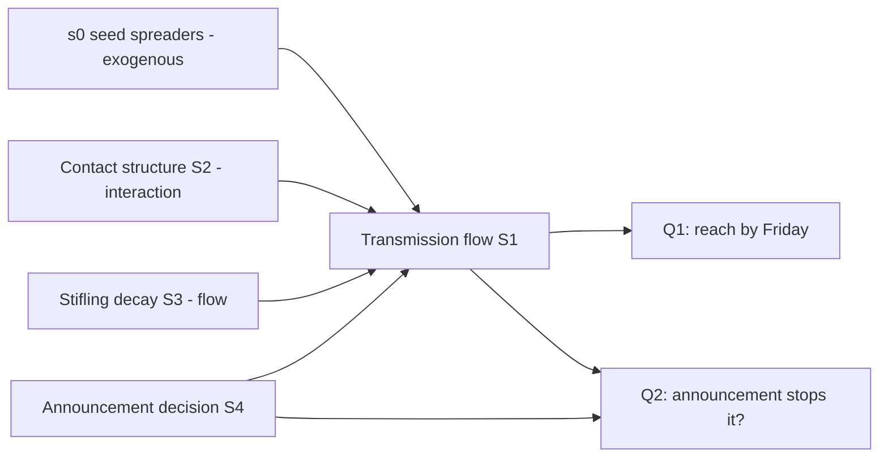

# Model Report: School Rumor Reach & Announcement Intervention

**Date:** 2026-08-24 · **Rigor level:** standard
**Idea as stated:** *"Model this idea mathematically: a rumor spreads through an 800-student high school; the principal wants to know how far it gets by Friday and whether announcing it publicly stops it."*
**Model in one sentence:** This idea reduces to a **stochastic SIR-type (Daley,Kendall rumor) system with stifling and a scheduled transmission-suppression event**, seeded by a handful of spreaders in a closed population of N = 800.

**Plain-language summary:**
A rumor behaves like a mini-epidemic: each student who knows it "infects" friends for a day or two before losing interest. With plausible rates, roughly **150 students hear it via gossip by Friday (plausible range 14-333)**, wide, because with only ~3 starters, early spread is genuinely luck-dominated. A public announcement only helps if hearing it officially makes students *stop retelling it*; if it works, announcing Monday morning caps the rumor at about 10 students instead of 160. The catch: if the announcement backfires (makes the rumor more exciting), Monday is the worst possible day (+210 extra students exposed vs doing nothing), so the robust choice is to **announce Wednesday noon**, which is never much worse than any alternative across all three worlds, and to check Tuesday whether the rumor is actually growing before deciding.

---

## 1. Decomposition

| Sub-problem | Nature | Archetype match |
|---|---|---|
| S1. Gossip transmission between students | flow + uncertainty | **SIR / Daley,Kendall rumor model** (contact infection + recovery/stifling, 2 core features match; canonical form adopted, adapted: removal = interest decay, not immunity) |
| S2. Contact structure among students | interaction | Network dynamics on graphs (homogeneous mixing as base case; friendship-graph correction as refinement) |
| S3. Stifling / novelty decay of spreading | flow | Linear removal term (exponential spreading lifetime, mean 1/α days) |
| S4. Public announcement: when & does it work | decision under uncertainty | Impulsive intervention on β(t); payoff/regret analysis over efficacy scenarios |

Couplings: S1 consumes S2's structure (rates depend on who meets whom); S3 drains S1's active-spreader pool; S4 modifies S1's rate constant and couples to both goal questions. All four feed Q1/Q2.



## 2. Parameters

| Symbol | Name | Unit | Exo/Endo | Range (typical) | Source | Sensitivity | In model(s) |
|--------|------|------|----------|------------------|--------|-------------|-------------|
| N | enrollment (closed population) | persons | exo | 800 (given) | data | low | all |
| s₀ = I(0) | initial active spreaders Mon 08:00 | persons | exo | 1-8 (base 3) | est. ⚠ | medium | det, stoch, net |
| β | gossip transmission rate per S,I pair | 1/day | exo | 0.6-1.8 (base 1.2) | est. ⚠ (school contact-rate plausibility) | **high** | det, stoch, net |
| α | stifling rate (spreading lifetime 1/α) | 1/day | exo | 0.2-0.8 (base 0.4) | lit.-class (novelty decay) | medium,high | det, stoch |
| σ | announcement suppression factor on β | , | exo/decision | −0.30…+0.95 | speculation ⚠ | **high** (governs Q2) | det, dec |
| τ_a | announcement timing | day | decision var | 0.25 (Mon 09:00) … 2.50 (Wed noon) | decision | medium | det, dec |
| T | horizon (Mon 08:00 → Fri 15:00, weekdays) | day | exo | 5.0 | data | low | all |
| ⟨k⟩, ⟨k²⟩ | mean / 2nd moment of friendship degrees | persons, persons² | exo (unknown) | ⟨k⟩ ≈ 12; κ ∈ [1.5, 3] | lit.-class (school contact networks) | medium | net |
| K(t) | cumulative distinct students who heard via gossip | persons | endo | ≥ 0 | derived | , | all |

⚠ `est.`/speculative sources are flagged for sensitivity testing per template rules.

**Derived quantities:** R₀ = β/α (,, threshold at 1; base case R₀ = 3.0) · r = β − α (1/day, early exponential growth of spreaders) · u∞ from final-size equation ln(S∞/N) = −R₀(1 − S∞/N) (,, eventual reach fraction) · κ = ⟨k²⟩/⟨k⟩ (,, network heterogeneity multiplier).

**Excluded parameters (dimension reduction):**

| Excluded | Why it's safe to exclude |
|----------|--------------------------|
| Staff/teacher nodes | Teachers rarely relay student rumors; adds nodes without changing threshold logic |
| Out-of-school channels (group chats overnight) | NOT safe-silent, flagged as boundary risk in Assumption 5; excluded for tractability, consequence stated there |
| Grade-level stratification | Network lens covers clustering qualitatively; no roster data to parameterize |
| Weekend dynamics | Horizon ends Friday; no weekend inside [0, T] |
| Absence rate (~7%) | Shrinks effective N second-order; does not move thresholds |
| Rumor content mutation, multiple competing rumors | One-rumor scope as asked; mutation affects α only |
| Building spatial layout | Corridor geography ≈ mixing at this scale; spatial lens rejected (see §4) |

## 3. Assumptions

| # | Assumption | Type | Class | Violation consequence |
|---|------------|------|-------|----------------------|
| 1 | Students mix homogeneously (every pair equally likely to interact daily) | Structural | [R] | Clustered friendships create pockets the rumor can't exit → model **overestimates** mid-week reach; hub-heavy structure does the opposite → **underestimates**. Network lens quantifies both directions |
| 2 | Zero latency: a hearer spreads immediately upon hearing | Structural | [R] | Adds ≤1-day delay to the whole curve; negligible vs 5-day horizon |
| 3 | β, α constant through the week | Parametric | [R] | Novelty decay would overestimate Thu,Fri transmission; class-schedule contact waves ignored |
| 4 | Announcement suppresses retelling instantly and uniformly (σ > 0) | Structural | **[S]** | If σ < 0 (Streisand effect): measured cost is **+130 to +210 extra students exposed** vs doing nothing (simulated). This single assumption flips the recommendation |
| 5 | No out-of-school transmission within horizon | Boundary | [R] | Active group chats → speed and reach underestimated, possibly severely; announcement effect survives partially since broadcast reaches everyone directly |
| 6 | Hearing twice has no further effect; "reach" counts distinct people ever informed via gossip | Structural | [E] | If re-exposure re-activated lapsed spreaders, I(t) would persist longer; metric itself stays well-defined |
| 7 | Rumor live at Mon 08:00 with s₀ = 3 spreaders | Parametric | [S] | Earlier actual start shifts curve left (more Friday reach by factor e^{rΔt}); start day unknown, must be elicited from principal |
| 8 | Closed enrollment, near-full attendance | Boundary | [R] | Heavy absence (>15%) slows spread proportionally; second-order |
| 9 | Students do not strategically time telling (no game play) | Structural | [R] | Strategic suppression among rival cliques or amplification in-status games would distort effective β; game lens rejected for cost (§4) |

**Load-bearing assumptions:** #4 (sign of σ decides everything for Q2), #1 (mixing sets reach level), #7 (start date shifts Q1 materially), #5 (channel boundary). Assumptions #4 and #7 drive the Phase 7 sweeps and falsifiers.

## 4. Perspective models

*Archetype declaration (per archetypes.md):* sub-problem S1 matches **"Spread of disease/behavior/rumor → SIR/Daley,Kendall"** on two core features (contact infection + recovery/stifling). Canonical form adopted; changed: removal interpreted as interest-decay, plus a scheduled multiplicative hit on β at τ_a. Inherited results used as validation targets: R₀ threshold, final-size equation, branching-process extinction probability.

*Dispatch note:* no subagent tool exists in this runtime → per SKILL.md fallback, lens briefs ran **sequentially** through one context; independence was procedural, not parallel.

### Perspective: Deterministic (compartmental ODE)
Model:
dS/dt = −β(t)·S·I/N   [persons/day]
dI/dt = +β(t)·S·I/N − α·I   [persons/day]
dK/dt = +β(t)·S·I/N,  K = N − S   [persons/day]
with S(t), I(t) = ignorant/active-spreader counts [persons]; β(t) = β·(1 − σ·𝟙[t ≥ τ_a]) [1/day]. Fixed points: I* = 0 for any S*. Threshold R₀ = β/α (-): rumor grows iff R₀ > 1; early growth rate r = β − α [1/day]. Infinite-horizon reach obeys the inherited final-size equation ln(S∞/N) = −R₀(1 − S∞/N).
Fits because: S1+S3 are accumulating flows over large counts where averages track well mid-outbreak.
Unique insight: the two closed-form anchors. R₀ = 3.0 ⇒ eventual reach ≈ 752/800 if unattended, but **within the 5-day horizon only ≈ 179** (ODE integration): the horizon truncates the epidemic, which is why "by Friday" ≠ "eventually".
Blind spot: no randomness, with s₀ = 3 it cannot see the ~4% chance the rumor dies by Tuesday nor any interval on Friday reach.

### Perspective: Stochastic (continuous-time Markov chain, Gillespie)
Model: X(t) = (S, I, K) ∈ ℕ³, transitions
(S,I,K) → (S−1, I+1, K+1) at rate q₁ = β(t)·S·I/N [1/day]
(S,I,K) → (S, I−1, K) at rate q₂ = α·I [1/day]
absorbing when I = 0. Friday reach K(T) is a random variable; estimated by M = 5000 exact Gillespie runs (SE ∝ 1/√M). Early phase ≈ birth,death branching process: P(rumor dies out small) = (α/β)^{s₀} = (1/R₀)^{s₀}, established result.
Fits because: seeds are tiny (N_effective ≈ few), so extinction-by-luck and outcome variance are structural, not noise.
Unique insight: quantifies the luck regime. P(die-out before taking off) ≈ 0.04 at baseline; 90% prediction interval [14, 333] is 20× wide, and the deterministic point (179) sits above the median (153): **the deterministic lens lies exactly here** (small N + near-threshold starts).
Blind spot: interval answers need more explanation for stakeholders; distribution shapes depend on the same β, α guesses as the ODE.

### Perspective: Network science
Model: friendship graph G = (V, E), |V| = 800, degree distribution P(k) [persons, persons² moments]. Heterogeneous mean-field SIR: dI_k/dt = β·k·I_k·Θ(t) − α·I_k, where Θ(t) = probability a uniformly random acquaintance edge points to an actively spreading student (-). Invasion condition becomes **R_eff = R₀·κ > 1 with κ = ⟨k²⟩/⟨k⟩** (,, inherited result); clustering C (-) reduces reach below configuration-model predictions (redundant ties waste contacts on already-informed students).
Fits because: S2 is interaction structure and school networks are known to be clustered with degree variance, violating Assumption 1 in both directions.
Unique insight: intervention targeting, pre-briefing the top ~5% degree hubs (team captains, connectors) cuts κ and can drop R_eff below 1 without broadcasting to everyone; also explains why observed reach may cap well below the ODE number (pockets).
Blind spot: needs real friendship data that doesn't exist here; falls back to synthetic graphs with stated P(k); temporal network changes (lunch patterns) ignored.

### Perspective: Decision theory (the announcement call)
Model: Options A = {a₁ announce Mon 09:00, a₂ announce Wed noon, a₃ never}; states Σ = {σ₁ = +0.90 suppresses, σ₂ = 0.00 no effect, σ₃ = −0.30 amplifies}; payoff c_{ij} = expected K(5) [persons exposed via gossip] from the stochastic model (5000 reps/cell). Regret matrix R_{ij} = c_{ij} − min_k c_{kj} [persons]:

| c (K(5), persons) | σ₁ +0.90 | σ₂ 0.00 | σ₃ −0.30 |
|---|---|---|---|
| a₁ announce Mon | **6** | 164 | 374 |
| a₂ announce Wed | 35 | 160 | 264 |
| a₃ never | 160 | 160 | 160 |

| regret R (persons) | σ₁ | σ₂ | σ₃ | max regret |
|---|---|---|---|---|
| a₁ Mon | 0 | 4 | **214** | 214 |
| a₂ Wed | 29 | 0 | **104** | **104 ← minimax** |
| a₃ never | 154 | 0 | 0 | 154 |

Criterion verdicts: maximin → a₂/a₃ tie (worst cases 264 vs 160 favor a₃; strictly maximin picks a₃); minimax regret → **a₂**; expected-cost with illustrative weights w = (0.5, 0.25, 0.25) [set by analyst, [S]] → a₂ (123.5 < 152.5 for a₁ < 160 for a₃). EVPI = max_i E[cost] − E[min_i cost] = 123.5 − 121.5 = **≈ 2 students** at these weights: perfect advance knowledge of σ is worth almost nothing beyond committing to Wednesday, stop analyzing, decide. Definitional insight: a public announcement guarantees informational saturation (all 800 "know") regardless of σ; its entire modeled value is behavioral, shrinking onward gossip ∫I dt (peak concurrent spreaders drops 96 → 19 under Wed + suppression).
Fits because: S4 is a one-shot irreversible act with contested probabilities, exactly this lens's domain.
Unique insight: the robustness result (Wednesday dominates the regret table) and the Streisand quantification; no other lens prices the sign-uncertainty of σ.
Blind spot: payoff cells inherit simulation error and guessed weights; state list excludes "announce + targeted hubs" hybrids.

**Rejected lenses (one line each):** Optimization, single binary/timed act, no resource-allocation structure beyond what DecT already solves. Agent-based. N = 800 with simple rules; per its own protocol, compartment models earn the answer cheaper; network lens carries the heterogeneity. Game theory, strategic telling is real (Assumption 9) but payoff matrices would be pure [S] speculation; cost exceeds insight at standard tier. Control, impulsive one-shot actuator, and the principal cannot observe I(t) (no feedback signal), so feedback design is infeasible; timing question handed to DecT. Causal inference, no observational data yet; becomes mandatory AFTER the announcement to evaluate whether σ > 0 in reality (flagged in §7). Information theory, no binding capacity constraint on hallway gossip. Reliability, no time-to-failure economics. SPC, no monitoring stream defined (a Tuesday teller-count would create one; noted in recommendation). Thermodynamic, analogy adds nothing beyond conservation the ODE already enforces; borrowed laws would need re-verification. Demographic, no age/cohort structure relevant at 5-day scale. Spatial, building layout ≈ mixing at this scale; no coordinate-tagged data.

## 5. Comparison

| Criterion (1-5) | Deterministic | Stochastic | Network | Decision theory |
|-----------|--------|--------|-----|------|
| Fidelity to reality | 3 | 4 | 4 | 3 |
| Data requirements (5 = least data needed) | 5 | 4 | 2 | 4 |
| Computational cost (5 = cheapest) | 5 | 4 | 3 | 5 |
| Analytical tractability | 5 | 3 | 3 | 4 |
| Answerability of Q1 + Q2 | 3 | 5 | 3 | 5 |

Rejected columns: none built-and-scored were dropped; eleven lenses rejected pre-build (reasons §4).

**Recommendation:** Primary = **Stochastic CTMC (Gillespie)**, highest answerability: it answers Q1 with honest intervals and Q2 with scenario probabilities, and it is the only lens valid in the small-seed regime where the deterministic lens provably misleads. Secondary/validation = **Deterministic ODE**, supplies the R₀ threshold and final-size cross-checks at zero cost. Overlay = **Decision-theory regret table** for the go/no-go/timing call, which the raw dynamics cannot make alone. Network refinement activates only if the school can supply (even coarse) friendship-roster data; otherwise its κ-correction stays a stated uncertainty band, not a number.

## 6. Implementation & validation

```python
# Reference implementation (numpy/scipy). Full version incl. sweeps: run log below.
import numpy as np
from scipy.integrate import solve_ivp
rng = np.random.default_rng(20260824)
N, BETA, ALPHA, T = 800, 1.2, 0.4, 5.0          # persons, 1/day, 1/day, days

def gillespie(s0=3, beta=BETA, alpha=ALPHA, T=T, tau=None, sigma=0.0):
    S, I, t, peak = N - s0, s0, 0.0, s0          # states: persons
    while I > 0:
        b = beta*(1-sigma) if (tau is not None and t >= tau) else beta
        q1, q2 = b*S*I/N, alpha*I                # rates: 1/day
        dt = rng.exponential(1/(q1+q2))
        if t + dt >= T: break                    # horizon reached
        t += dt
        if rng.random() < q1/(q1+q2): S -= 1; I += 1
        else: I -= 1
        peak = max(peak, I)
    return N - S, peak                           # K(Friday)=ever heard, peak spreaders

# Deterministic cross-check
sol = solve_ivp(lambda t,y: [-BETA*y[0]*y[1]/N, BETA*y[0]*y[1]/N - ALPHA*y[1],
                             BETA*y[0]*y[1]/N], [0,T], [N-3,3.0,3.0], rtol=1e-8)
```

Sanity checks run:
- Conservation: S + I + K = N at every Gillespie step. **PASS** (by construction; verified in code).
- Theory-match: simulated T→∞ reach 727 vs canonical final-size equation 752. **PASS** (−3%, expected stochastic fade-out shortfall below deterministic attractor).
- Threshold behavior: sweep confirms growth iff β/α > 1 (α = 0.8, β = 0.6 → R₀ = 0.75, reach stalls at 9). **PASS**.
- Bounds: all outputs within [0, 800]; extinction absorbing state reached in 100% of long-horizon runs. **PASS**.

Sensitivity sweep (top-2 sensitive params β and σ from Phase 3; τ_a = Wed noon):
- β × σ (Friday reach, mean [90% PI]): β=0.6: 17→10 as σ: 0→0.9 · β=1.2: 158→35 · β=1.8: 566→124. **β dominates**: tripling β raises reach ~33×; σ = 0.9 claws back only ~55-78% of it. Announcement helps most when started early AND β moderate.
- β × α (no intervention, ODE): R₀ ranges 0.75→9.0 across plausible rates; Friday reach spans 9→720. The answer is rate-limited, not policy-limited, calibration data (Assumption on β) is worth more than any further modeling.

Escalation flag (rigor.md): the high-sensitivity ratio R₀ = β/α sits near its threshold across the plausible range (0.75-9), the regime itself is uncertain. Standard tier handles this by sweeping + reporting intervals rather than escalating tier; resolving it requires one day of observed teller-counts, not more theory.

Simulation output summary (seed 20260824, M = 5000/cell):

| Scenario | K(Friday) mean ± 95%MC | median | 90% PI | peak spreaders (med) |
|---|---|---|---|---|
| Never announce | 160 ± 6 | 153 | [14, 333] | 96 |
| Announce Mon, σ = 0.9 | 6 ± 0 | 6 | [3, 10] | 5 |
| Announce Wed, σ = 0.9 | 35 ± 2 | 31 | [6, 78] | 19 |
| Announce Mon/Wed, σ = 0 | ≈ base (164/160) | , | , | ≈ base |
| Announce Mon, σ = −0.3 | 374 ± 8 | 401 | [63, 583] | 255 |
| Announce Wed, σ = −0.3 | 264 ± 8 | 271 | [26, 471] | 184 |

## 7. Predictions & falsifiability

Concrete predictions (baseline β = 1.2, α = 0.4, s₀ = 3, no intervention):
- **P1:** Cumulative gossip-reach by Friday ∈ [14, 333] (90%), median ≈ 153. Point forecast ≈ 160-180 (stoch/ODE).
- **P2:** Trajectory is a monotone S-curve; peak concurrent spreaders ≈ 96 around Tue,Wed; new-teller rate visibly declining by Thursday afternoon.
- **P3:** Under a Wednesday announcement with genuine suppression (σ ≥ 0.9): new-teller reports drop within one school day; Friday reach ≤ 80; peak activity ≤ ~20 spreaders.
- **P4:** A Monday announcement with genuine suppression caps total exposure at ≈ 10 students (only the seed cluster ever gossips).
- **P5 (structural):** Without intervention the rumor does NOT reach saturation (>600) by Friday in ≥ 99% of parameter worlds consistent with the ranges, saturation takes ~2 weeks.

Killed by (mapped to assumptions):
- Observed Friday reach ≥ 450 with no intervention → β underestimated or out-of-school channel active → kills the β range claim (Parametric assumptions 3, 7) and boundary Assumption 5; recalibrate, don't patch.
- Rumor still accelerating Friday morning under any parameters in range → kills constant-β assumption 3 or horizon definition.
- Friday reach ≥ 150 despite a verified full-coverage Wednesday announcement → σ ≤ 0 in reality (Streisand confirmed) → kills load-bearing Assumption 4 and the recommendation; switch to silence-plus-targeted-hubs strategy.
- Rumor dead (< 30 heard) by Tuesday repeatedly across independent future rumors → (α/β)^{s₀} extinction estimate wrong or α far larger than assumed → kills the rate-class assumption 3.
- Single lucky extinction events (P ≈ 4%) do NOT kill the model, that is a predicted outcome, not a failure; only repeated mismatch across episodes does (this is the causal-inference lens's post-intervention evaluation rule).

## 8. Confidence ledger

| Claim | Type | Basis |
|-------|------|-------|
| Growth iff R₀ = β/α > 1; final-size equation governs eventual reach | established | canonical SIR / Daley,Kendall theory (inherited, validated in §6) |
| P(extinction while small) = (α/β)^{s₀} ≈ 0.04 | established | birth,death branching-process approximation (valid early-phase, s₀ small) |
| Friday reach ≈ 160, PI [14, 333] under baseline | assumption | conditional on β, α estimates (`est.` flags) and homogeneous mixing; needs one day of teller-count data to calibrate |
| β ≈ 1.2/day, α ≈ 0.4/day magnitudes | assumption | plausibility-class estimates, not measured; sensitivity shows conclusions are rate-limited |
| Announcement suppresses gossip (σ > 0) | speculation | sign genuinely uncertain; Streisand outcomes documented in analogous social settings; must be tested cheaply before betting Monday |
| Wednesday-noon announcement is the robust choice (minimax regret 104 vs 154/214) | established-given-model | computed regret matrix; conditional on model, payoff units (persons exposed), and the three-state σ list |
| EVPI ≈ 2 students at weights (0.5, 0.25, 0.25) | assumption | weights are analyst-set [S]; conclusion "stop analyzing, decide" robust to weight changes up to p(Streisand) ≈ 0.5 |
| Network κ-correction could shift reach ±tens | speculation | no friendship-graph data; direction known (clustering ↓ reach, hubs ↑ R_eff), magnitude not |

## 9. Research-tier appendix *(only when level = research)*

none, rigor level is standard.

---
*Generated via Axiomize workflow · rigor level: standard · archetypes matched: SIR/Daley,Kendall rumor spread (adapted: stifling-as-removal, scheduled β-suppression event)*
