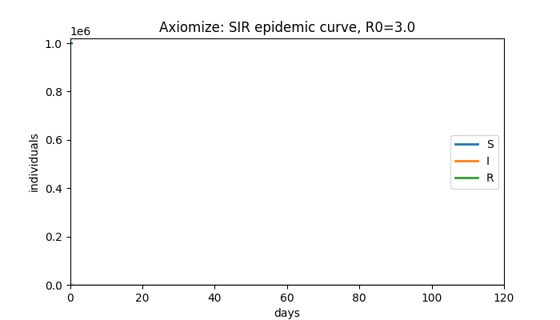

# Axiomize

**Turn any idea into a rigorous mathematical model** — an agent skill for Claude Code, opencode, and Cursor.

Fifteen mathematical lenses attack your idea from independent directions; the workflow compares them honestly and recommends one — with runnable validation code and falsifiability criteria.

- Install: copy `skills/axiomize/` into `~/.config/opencode/skills/` or `~/.claude/skills/`
- Ask: *"Model this idea mathematically: ..."*
- Full documentation lives in the [GitHub repository](https://github.com/Furox-Art/axiomize)

