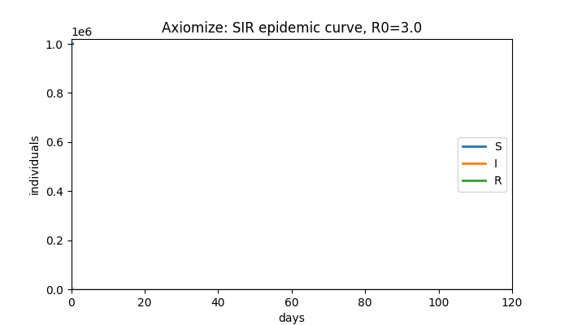

# Axiomize

**Turn any idea into a rigorous mathematical model** — an adaptive agent skill and scientific engine for Claude Code, opencode, Cursor and other compatible agents.

Axiomize now starts by clarifying missing mechanisms in plain language, recommends **weak / medium / strong** depth, builds multiple candidate models, compares when each model is appropriate, validates with scientific tools, reports uncertainty and falsifiers, and records reproducible runs.

Extra agents, full alternative-method reruns and extra paid/provider calls are **user-controlled** rather than silently spawned.

Axiomize is intended for **mathematical modeling**, **parameter estimation**,
**model calibration**, **sensitivity analysis**, **uncertainty quantification**,
**causal inference**, **Bayesian inference**, **finite-element modeling**, and
reproducible scientific workflows where assumptions and model-selection choices
need to remain inspectable.

- Install: copy `skills/axiomize/` into `~/.config/opencode/skills/` or `~/.claude/skills/`
- Ask: *"Model this idea mathematically: ..."*
- CLI intake: `axiomize intake "your idea"`
- Inspect policy: `axiomize policy`
- Full documentation lives in the [GitHub repository](https://github.com/Furox-Art/axiomize)

