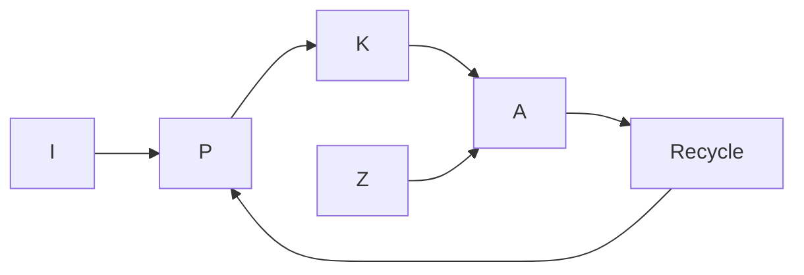

# Example: Lake Algae Bloom Tipping Point

Demonstrates Monod-coupled logistic + LV grazing + bistable switch.

## Phase 0 — Rigor Level

**Rigor: standard.** Plain summary: *Lake algae's carrying capacity follows dissolved P via Michaelis-Menten; lake tips when loading exceeds ~4–5 mg P m⁻² day⁻¹, and cutting fertilizer a little does not clear bloom due to hysteresis.*

## Phase 1 — Parse

- System: lake epilimnion + dissolved P + algae $A$ + zooplankton $Z$ + inflow/outflow
- State: $[P]$ [µg P/L], $A$ [mg Chl-a/m³], $Z$ [ind/L]
- Goal: critical loading $I_{crit}$, hysteresis width $\Delta I$, fractional reduction $u$ needed
- Horizon: weeks to one season, daily resolution

## Phase 2 — Decompose

| # | Sub-problem | Nature | Archetype |
|---|---|---|---|
| S1 | P mass balance | flow | Monod uptake → logistic $K(P)$ |
| S2 | Algal growth to capacity | flow | Logistic $r(P),K(P)$ |
| S3 | Zooplankton grazing | interaction | LV Type II $f(A)=gA/(1+ghA)$ |
| S4 | Bistable switch & hysteresis | flow (feedback) | Allee-like cubic |
| S5 | Patchiness | spatial | Moran's I, kernel density |
| S6 | Runoff policy | decision | control / optimization |



## Phase 3 — Parameters

| Symbol | Name | Unit | Range | Sensitivity |
|---|---|---|---|---|
| $I$ | external P loading | mg P m⁻² day⁻¹ | 1–8 | high |
| $s$ | flushing + sedimentation | 1/day | 0.02–0.15 | high |
| $\mu_{max}$ | max algal growth | 1/day | 0.4–1.2 | high |
| $K_p$ | half-saturation | µg P/L | 5–25 | high |
| $K_{max}$ | max capacity | mg Chl-a/m³ | 40–100 | med |
| $\rho$ | recycle fraction | – | 0.2–0.6 | high |
| $g$ | grazer clearance | L/(ind·day) | 0.01–0.1 | med |

Derived: $K(P)=K_{max}P/(K_p+P)$, $r(P)=\mu_{max}P/(K_p+P)-loss$, $R_{pot}=K(P)/A_{graze}$.

## Phase 4 — Assumptions

| # | Assumption | Type | Violation consequence |
|---|---|---|---|
| 1 | Epilimnion well-mixed | [R] | Shoreline blooms missed |
| 2 | QSSA for uptake | [R] | Full ES dynamics needed at low $P$ |
| 3 | $\mu_{max},K_p$ constant over season | [S] | Storm moves $I_{crit}$ ±40% |
| 4 | Grazers $Z$ constant | [S] | Hopf cycles appear |
| 6 | No internal P loading from sediments | [S] | $I_{eff}=I+I_{sed}$ sustains bloom |

Load-bearing: 3,5,6 flip $I_{crit}$.

## Phase 5 — Perspectives

### Deterministic (primary)

$$dP/dt= I - sP - u\mu(P)A + \rho mA$$
$$dA/dt= r(P)A(1-A/K(P))- gZA/(1+ghA)-mA$$

Saddle-node at $I_{crit}$ where $\det J=0$; bistable $I\in[I_{back},I_{forward}]$ (≈2.5–4.8).

**Unique insight:** closed-form $I_{crit}\approx s K_p K_{crit}/(K_{max}-K_{crit})$ and hysteresis width $\propto\rho K_{max}/s$.

### Stochastic (validation)

CTMC Gillespie + SDE Langevin, $N\ge10^4$ runs, $P_{tip}(I)$ sigmoidal, critical slowing down variance ↑3× before tip.

### Spatial

Patch system $dA_i/dt = ... + \sum D_{ij}(A_j-A_i)$, Moran's $I$ on Chl-a field, kriging for coves.

### Control / Optimization

State $x=[P,A]^T$, $u$ fractional runoff reduction, linearize at clear steady, LQR cost, feasibility $u\ge1- I_{back}/I_{current}$.

## Phase 6 — Comparison

| Criterion | Det | Stoch | Spatial | Ctrl |
|---|---|---:|---:|---:|---:|
| Fidelity | 5 | 5 near tip | 4 | 4 |
| Data needs | low | low | med | low |
| Answers goal | ✓ $I_{crit}$ | ✓ $P_{tip}$ | ✓ where | ✓ $u$ |

Recommendation: deterministic primary + stochastic mandatory near threshold + spatial hotspot audit.

## Phase 7 — Implementation

```python
import numpy as np
from scipy.integrate import solve_ivp
I_sweep=np.linspace(1,8,28); s,rho,m=0.06,0.35,0.05; mu_max,Kp,Kmax=0.8,12,60; g,h,Z=0.04,0.05,12; u=0.12
def K_of_P(P): return Kmax*P/(Kp+P)
def rhs(t,y,I):
    P,A=y; K=K_of_P(max(P,0)); r=mu_max*max(P,0)/(Kp+max(P,0))
    dP=I-s*P-u*r*A+rho*m*A
    dA=r*A*(1-A/max(K,1e-6))-g*Z*A/(1+g*h*A)-m*A if A>0 else 0
    return [dP,dA]
# bifurcation forward/backward sweep
```

Validation: dimensional, bounds $A\in[0,K(P)]$, steady residual <1e-6, forward/backward hysteresis gap $\Delta I\approx2.0$.

## Phase 8 — Falsifiability

Dies if:
- Bloom clears within days after small $I$ cut of ~10% (kills hysteresis)
- Variance not rising before tip (kills critical slowing)
- $r$ independent of $[P]$ up to >3$K_p$ (kills Monod)
- Bloom uniform across lake despite inlet source (kills spatial)

Confidence ledger: established (Monod, logistic, LV), assumption ($K_p$ placeholders), speculation (hysteresis width needs fit).

