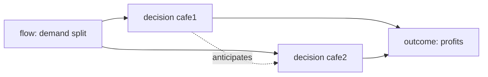

# Example: Idea → Mathematical Model (Two Cafés Pricing War)

Demonstrates the **game theory lens**, strategic interaction that single-actor optimization cannot see.

## Phase 1: Parse

**Idea**: "Two cafés face each other on the same street. One considers cutting prices 20%. Will it work, or start a war nobody wins?"

- System: duopoly market with shared customer pool. State: prices (p₁, p₂), shared demand split. Goal: decision + prediction of rival reaction. Horizon: quarters.

## Phase 2: Decompose

| Sub-problem | Nature | Archetype |
|---|---|---|
| Demand split given both prices | flow | share model (logit/linear) |
| Each café's price choice anticipating the other | decision ×2 | **Cournot/Bertrand game** |
| Possible tacit cooperation | repeated interaction | repeated game / trigger strategies |

Coupling: café 1's optimal price is a function of café 2's, the definition of a game.

## Phase 3: Parameters

| Symbol | Name | Unit | Exo/Endo | Range | Source | Sensitivity |
|--------|------|------|----------|-------|--------|-------------|
| a, b | linear demand intercept/slope | cups/day, cups/day per currency | exo | fit | data | high |
| c₁, c₂ | marginal costs per cup | currency | exo | data | medium |
| δ | discount factor (patience) | , | exo | 0.9-0.99 | est. | high |

Excluded: product differentiation beyond location (first pass), new entrants.

## Phase 4: Assumptions

| # | Assumption | Type | Violation consequence |
|---|-----------|------|----------------------|
| 1 | Linear symmetric demand `[R]` | Parametric | Asymmetric capacities change equilibrium structure |
| 2 | Both know cost structures `[S]` | Informational | Incomplete-info game; signaling dynamics appear |
| 3 | Prices are the only lever `[R]` | Boundary | Quality wars substitute for price wars |

## Phase 5: Perspectives

### Game theory (primary)
Bertrand duopoly with differentiated products: best-response curves p₁*(p₂), p₂*(p₁); Nash = intersection. One-shot insight: unilateral 20% cut triggers best-response undercut ⇒ both end at lower margin with nearly unchanged shares, **the classic prisoner's dilemma in prices**: equilibrium profits < cooperative (Cournot-style restraint) outcome.

### Game theory extended: repetition (primary, continued)
If interaction repeats and cafés are patient (δ ≥ δ* from payoff spread), grim-trigger sustains cooperative pricing. Insight: the war happens iff someone is impatient or exit-threatened, identify which café that is before acting. Blind spot: antitrust legality of tacit coordination, flag, not advise.

### Optimization (naive baseline, rejected as primary)
Café 1 maximizing profit holding p₂ fixed finds the cut attractive, exactly the error the game lens exposes: the optimization ignores p₂'s response term. Recorded rejection reason: environment not fixed.

### Stochastic / Network / Control / ABM / Causal (rejected)
Demand noise second-order vs strategic effect · two-node topology trivial · no regulation setpoint · N=2 makes ABM overkill · no observational causal claim requested.

## Phase 6: Comparison & Recommendation

| Criterion | Game(repeated) | Game(one-shot) | Opt(naive) |
|-----------|----------------|----------------|------------|
| Fidelity / answers goal | 5/✓ | 4/✓ partial | 2/✗ misleads |

**Recommendation:** repeated-game analysis first, compute δ* threshold and assess own patience vs rival's; one-shot Nash as floor scenario. Do NOT evaluate the cut with naive optimization.

## Phase 7: Implementation & Validation

Best-response curves plotted from fitted demand; check Nash stability (contraction condition on slopes). Sweep b ±30% → does unique interior equilibrium persist? Validate demand parameters via historical price variation (with causal-inference caveat: observational fit).

## Phase 8: Falsifiability & Ledger

Dies if: after a real cut, rival's response lags ≫ expected (they're not playing the same game), or shares move opposite to demand-model sign.
Ledger: Bertrand equilibrium logic = established · demand linearity = assumption · "rival rational" = speculation (test via revealed behavior).
