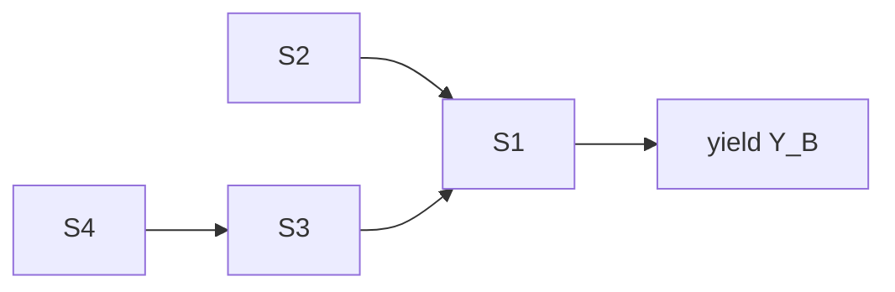

# Example: Batch Reactor Scale-Up — Kinetics vs Mixing vs Equilibrium

Demonstrates deterministic primary + spatial/transport + thermodynamic + control secondary on a scale-up diagnosis.

## Phase 0 — Rigor Level

**Rigor: standard.** Plain summary: *A desired reaction competes with higher-$E_a$ side reaction. Heating makes side reaction relatively faster and can hide true rate behind pellet diffusion. For $c_{A0}=1$M, $k_1\sim0.03$/s, $E_{a,1}=50$ vs $E_{a,2}=75$ kJ/mol, lab 92% selectivity at 320K should fall to ~77% at 340K and collapse to ~50% if Thiele $\phi>3$.*

## Phase 1 — Parse

- System: jacketed batch vessel + porous catalyst pellets ($R_p$ 0.5–3 mm) + liquid phase $A,B,C$ + jacket coolant.
- State: $c_A,c_B,c_C$ [mol·L⁻¹], $T$ [K], pellet profile $c_A(r)$ summarized by $\eta(\phi)$.
- Goal: diagnose 92%→74% drop, decide fix $T$ profile or $R_p$ or stir speed.
- Horizon: batch minutes–hours, pellet $10^{-3}$ m vs vessel $10^{-1}$ m.

## Phase 2 — Decompose

| # | Sub-problem | Nature | Archetype |
|---|---|---|---|
| S1 | Batch mole balances $dc/dt=\nu^T r$ | flow | A1 $r_j=k_j c_A^{n_j}$ |
| S2 | $k(T)$ temperature sensitivity | flow | A2 Arrhenius $E_{a,1}<E_{a,2}$ |
| S3 | Pellet internal diffusion $c(r)$ | flow + spatial | A4 Thiele $\phi$, $\eta(\phi)$ |
| S4 | External film bulk→surface | flow | A4 $k_c$, $Bi_m$ |
| S5 | Equilibrium ceiling $Y_{eq}(T)$ | flow | A3 $\Delta_r G^\circ$ |
| S6 | Coolant control | control | jacket loop |



## Phase 3 — Parameters

| Symbol | Name | Unit | Range | Sensitivity |
|---|---|---|---|---|
| $c_{A0}$ | initial feed | mol·L⁻¹ | 0.5–2.0 | med |
| $k_{1,ref},k_{2,ref}$ at 320K | ref rate consts | 1/s | $k_1$ 0.01–0.1; $k_2$ 0.001–0.05 | high |
| $E_{a,1},E_{a,2}$ | activation energies | J·mol⁻¹ | 45–55k / 70–80k | high |
| $D_{eff}$ | effective diffusivity | m²·s⁻¹ | 5e-10–5e-9 | high via $\phi$ |
| $R_p$ | pellet radius | m | 0.0005–0.003 | high |
| $\phi=L\sqrt{k_1/D_{eff}}$ | Thiele modulus | – | 0.3–10 | high |
| $\eta(\phi)$ | effectiveness | – | 0.2–1.0 | — |
| $Da_I=k_1\tau$ | Damköhler I | – | 0.5–20 | med |
| $Y_B=c_B/c_{A0}$ | yield | – | 0–1 | — |

## Phase 4 — Assumptions

| # | Assumption | Type | Violation consequence |
|---|---|---|---|
| 1 | Well-mixed bulk uniform $T$ | [R] | Segregation → yield distribution widens |
| 2 | First-order in $A$ for both paths | [S] | Log-log slope ≠1 → Thiele $\phi_n$ wrong |
| 3 | Arrhenius single-step | [S] | Curved $\ln k$ vs $1/T$ → $E_{app}$ drifts |
| 4 | Isothermal pellet | [R] | $\eta>1$ possible, hotspot |
| 5 | $\gamma_i=1$ | [R] | At $I>0.1$M, $K$ shifts 10–50% |

Load-bearing: 2,3,4,6 flip attribution between kinetics and diffusion.

## Phase 5 — Perspectives

### Deterministic (primary)

$$dc_A/dt=-k_1(T)c_A-k_2(T)c_A,\quad k_i(T)=A_i\exp(-E_{a,i}/RT)$$

Selectivity $S_{int}=k_1/(k_1+k_2)=\left[1+\frac{A_2}{A_1}e^{-(E_{a,2}-E_{a,1})/RT}\right]^{-1}$ falling with $T$ when $E_{a,2}>E_{a,1}$.

**Unique insight:** decomposition $Y_B$ = selectivity × conversion isolates $T$ trade.

### Spatial / Transport

$$k_{i,obs}=\eta_i(\phi_i)k_i,\quad \eta_{sphere}= \frac{3}{\phi^2}(\phi\coth\phi-1)$$

Weisz-Prater $C_{WP}=\eta\phi^2$, Mears $M=r_{obs}R_p n/(k_c c_{bulk})<0.15$.

**Unique insight:** At $D_{eff}=1e-9$, $R_p=2$mm → $\phi=3.1$, $\eta=0.65$ — observed $Y$ collapses 0.77→0.52.

### Thermodynamic

$$K_{eq}(T)=\exp(-\Delta_r G^\circ/RT),\quad X_{eq}=K/(1+K)$$

With $\Delta_r G_1^\circ=-12$kJ/mol → $K=91$, $X_{eq}=98.9\%$ not limiting.

### Control & Optimization

Batch $T$-optimization $\max Y_B(t_f,T(t))$ s.t. $T_{min}\le T\le T_{max}$, Pontryagin suggests low $T$ early for selectivity, high $T$ late for conversion.

## Phase 6 — Comparison

| Criterion | Deterministic | Spatial | Thermodynamic | Control/Opt |
|---|---:|---:|---:|---:|
| Fidelity | 4 | 5 | 3 | 4 |
| Data needs | low | med | low | med |
| Answers goal | ✓ divorced 8% | ✓ explains 92→52% | ✓ kills equil. | ✓ fix |

**Recommendation:** Spatial primary + deterministic null, thermodynamic ceiling first.

## Phase 7 — Implementation

```python
import numpy as np
from scipy.integrate import solve_ivp
R=8.314; A1,A2=5e6,1e10; Ea1,Ea2=50000,75000; c0=np.array([1.0,0.0,0.0]); tf=1800
def k_arrh(A,Ea,T): return A*np.exp(-Ea/(R*T))
def eta_sphere(phi): return 1.0 if phi<1e-9 else 3.0/phi**2*(phi/np.tanh(phi)-1.0)
def run(T,Rp):
    k1=k_arrh(A1,Ea1,T); L=Rp/3; phi=L*np.sqrt(k1/1e-9); eta=eta_sphere(phi)
    def odef(t,y): cA,cB,cC=y; r1=eta*k1*cA; r2=eta*k_arrh(A2,Ea2,T)*cA; return [-r1-r2, r1, r2]
    sol=solve_ivp(odef,[0,tf],c0,method='BDF',rtol=1e-9,atol=1e-11,t_eval=[tf])
    return sol.y[:,-1]
for label,T,Rp in [("lab",320,0.0005),("pilot",340,0.002)]:
    cA,cB,cC=run(T,Rp); print(label, f"yield={cB:.3f}")
```

Validation: mass $\sum c_i=c_{A0}$ within 1e-8; $Y_{obs}<Y_{eq}$.

## Phase 8 — Falsifiability

Dies if:
- Yield independent of $R_p$ and $k_L a$ while $C_{WP}<0.3$ (kills diffusion)
- $\ln k_{obs}$ vs $1/T$ linear $R^2>0.98$ (kills diffusion mask)
- $Y_{obs}>Y_{eq}(T)+2\sigma$ (kills mass balance)

Intervention ladder: 1) crush beads to <0.3mm 2) double stir 3) drop $T$ 340→320K

