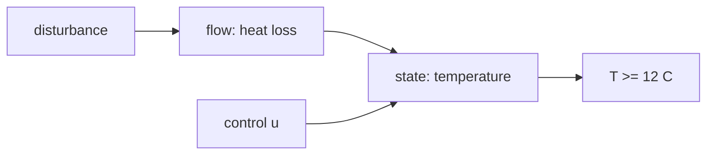

# Example: Idea → Mathematical Model (Greenhouse Night Temperature)

Demonstrates the **control lens as primary** — steering a system to a setpoint against disturbances.

## Phase 1 — Parse

**Idea**: "My greenhouse drops too cold at night; seedlings suffer below 12°C. How should the heater be run?"

- System: greenhouse air mass + heater + outdoor cold. State: indoor temperature T(t). Goal: **control** — keep T ≥ 12°C all night at minimum energy cost. Horizon: nightly, minutes resolution.

## Phase 2 — Decompose

| Sub-problem | Nature | Archetype |
|---|---|---|
| Heat loss to outside | flow | Newton-cooling decay |
| Heater action | decision (continuous actuator) | feedback regulation |
| Outdoor temperature swings, door openings | uncertainty | disturbances |

Coupling: heater input u(t) fights loss rate proportional to (T − T_out).

## Phase 3 — Parameters

| Symbol | Name | Unit | Exo/Endo | Range | Source | Sensitivity |
|--------|------|------|----------|-------|--------|-------------|
| k | thermal loss coefficient | 1/h | exo | 0.3–0.8 | est./data | high |
| η | heater power | °C/h at full | exo | 2–6 | data | medium |
| T_out(t) | outdoor profile | °C | exo | −5…8 | forecast | high |
| T_set | minimum safe temp | °C | exo | 12–14 | policy | low |
| u(t) | heater duty | 0–1 | endo | [0,1] | derived | — |

Excluded: soil thermal mass (second-order slow dynamics), humidity coupling.

## Phase 4 — Assumptions

| # | Assumption | Type | Violation consequence |
|---|-----------|------|----------------------|
| 1 | Air mixes perfectly (single lumped T) `[R]` | Structural | Cold corners harm plants despite "average" OK |
| 2 | k constant overnight `[S]` | Parametric | Wind gusts spike losses; margin needed |
| 3 | Thermostat sensor reads true mean `[R]` | Boundary | Bias shifts effective setpoint |

Assumption 2 `[S]` → sensitivity sweep.

## Phase 5 — Perspectives

### Control (primary)
Linear model: dT/dt = −k(T − T_out) + η·u. Setpoint tracking via hysteresis thermostat (u ∈ {0,1} with dead-band ±0.5°C) or proportional law u = clip((T_set + 1 − T)/Δ, 0, 1). Analysis: worst-case dip when T_out hits forecast min with u saturated at 1 ⇒ feasibility condition η ≥ k·(T_set + 1 − T_out,min). Insight: **feasibility, not tuning**, is the real question — if η < k·ΔT_worst no controller saves the seedlings. Blind spot: says nothing about energy price optimization.

### Stochastic (validation)
T_out as Ornstein-Uhlenbeck fluctuation around forecast; Monte Carlo of night → P(T dips below 12). Sets required safety margin Δ on setpoint. Blind spot: policy layering only.

### Optimization (secondary)
Minimize energy ∫u dt s.t. T ≥ 12, given time-varying electricity price → pre-warm before price peak / cold snap. Insight: cheapest nights pre-heat before the coldest hours rather than react.

### Agent-based / Network / Game theory (rejected)
No heterogeneous agents or strategic actors; no contact topology; single physical plant.

## Phase 6 — Comparison & Recommendation

| Criterion | Ctrl | Stoch | Opt |
|-----------|------|-------|-----|
| Fidelity / data / cost / answers goal | 5/low/tiny/✓ | 4/med/low/margin | 4/low/low/✓ cost |

**Recommendation:** hysteresis control with stochastic safety margin (+1.5°C from MC percentiles); optimization layer optional if prices vary.

## Phase 7 — Implementation & Validation

Simulate night with sinusoidal + random T_out; checks: T_min ≥ 12 in ≥95% of Monte Carlo nights; heater cycles bounded (< 30/h to protect relay). Sweep k ±50% (assumption 2).

## Phase 8 — Falsifiability & Ledger

Dies if: measured T consistently violates bound despite feasible η (mixing assumption wrong), or heater duty saturates earlier than model predicts.
Ledger: Newton-cooling form = established · k range = assumption · forecast accuracy = external speculation.
