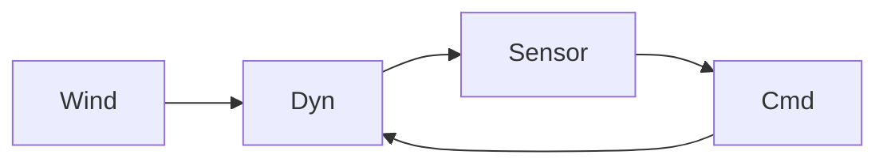

# Example: Drone Hover in Wind: Control

Demonstrates control primary + stochastic + optimization + SPC on literal engineering system.

## Phase 0: Rigor Level

**Rigor: standard.** Plain summary: *Quadrotor hover is double-integrator, without feedback any gust makes it drift. PID/LQR with ~45° phase margin and thrust margin >1.3× weight keeps altitude within ±0.2 m in 2 m/s RMS wind.*

## Phase 1: Parse

- System: quadrotor + 4 rotors + IMU/baro + wind field.
- State: altitude $z$ [m], velocity $v=\dot z$ [m/s], thrust $T$ [N]; wind $w$ [N].
- Goal: regulate $z\to z_{set}$ despite gusts; metrics $T_s$, overshoot $M_p$, $P(|z-z_{set}|>0.2)$.

## Phase 2: Decompose

| # | Sub-problem | Nature | Archetype |
|---|---|---|---|
| S1 | Open-loop altitude dynamics | flow | double integrator + motor lag |
| S2 | Feedback law | control | PID / LQR |
| S3 | Wind gust structure | uncertainty | OU process |
| S4 | Sensing & estimation | uncertainty | Kalman |
| S5 | Saturation & windup | decision | thrust limits |
| S6 | Motor wear | uncertainty | Weibull |



## Phase 3: Parameters

| Symbol | Name | Unit | Range | Sensitivity |
|---|---|---|---|---|
| $m$ | mass | kg | 0.8-2.5 (1.5 nom) | high |
| $\tau_m$ | motor lag | s | 0.05-0.15 | high |
| $T_{max}$ | max thrust | N | 18-30 | high |
| $b$ | aero drag | N·s/m | 0.1-0.6 | medium |
| $K_p,K_i,K_d$ | PID gains | N/m, N/(m·s), N·s/m | tuned | high |
| $\sigma_w$ | wind RMS | N | 1-4 | high |
| $\tau_w$ | wind correlation | s | 1-5 | high |

Derived: hover $T_{hov}=mg\approx14.7$ N; margin $M_T=T_{max}/T_{hov}$; closed-loop $A_{cl}$.

## Phase 4: Assumptions

| # | Assumption | Type | Violation consequence |
|---|---|---|---|
| 1 | Vertical decoupled from attitude | [R] | Tilt couples thrust |
| 2 | Linearized about hover | [R] | Large excursions detune gains |
| 3 | Motor first-order $\tau_m$ | [S] | Phase loss |
| 4 | Wind OU process | [S] | Heavy tails underestimate peak |
| 5 | Sensor white, no bias | [R] | Bias integrates via $K_i$ |
| 6 | No saturation | [S] | Windup + limit cycle |

Load-bearing: 3,4,6.

## Phase 5: Perspectives

### Control (primary)

$$\dot{\mathbf{x}} = A\mathbf{x} + Bu + Ew,\quad y = C\mathbf{x}+v$$

$$A=\begin{bmatrix}0&1&0\\0&-b/m&1/m\\0&0&-1/\tau_m\end{bmatrix},\ B=[0,0,1/\tau_m]^T$$

PID $u=K_p e+K_i\int e+K_d\dot e_{filt}$, LQR $K=R^{-1}B^TP$, $PM\ge45°$, $GM\ge6$dB.

**Unique insight:** feasibility (thrust margin) matters more than tuning.

### Stochastic

Wind OU $w_{k+1}=w_k e^{-dt/\tau_w}+\sigma_w\sqrt{1-e^{-2dt/\tau_w}}N(0,1)$, MC $N\ge1e4$, $P_{viol}\approx3.8\%$ nominal, $3.8\%\to14\%$ when $\sigma_w$ 2→3 N.

### Optimization

$$\min_J=\int(x^TQx+u^TRu)dt\ \text{s.t. } \Re\lambda_i(A_{cl})\le -\alpha,\ PM\ge45°, |u|\le T_{max}-mg$$

Pareto $J$ vs $P_{viol}$; shadow price $y^*_{T}\approx-0.18$.

### SPC / Reliability

EWMA $\lambda=0.20$ on residuals, Weibull $\beta\approx2.1$, $\eta\approx520$h, $A=0.996$ per motor.

## Phase 6: Comparison

| Criterion | PID | LQR | Stochastic | SPC |
|---|---|---:|---:|---:|---:|
| Fidelity | 5 | 5 | 4 | 3 |
| Data needs | low | low | med | med |
| Answers goal | ✓ stabilizes | ✓ + optimality | ✓ $P_{viol}$ | monitoring |

Recommendation: LQR/PID primary + stochastic MC validation + SPC EWMA.

## Phase 7: Implementation

```python
import numpy as np
from scipy.integrate import solve_ivp
from scipy.linalg import solve_continuous_are
m,g,tau_m=1.5,9.81,0.08; b=0.3; Tmax=22.0; umax=Tmax-m*g
A=np.array([[0,1,0],[0,-b/m,1/m],[0,0,-1/tau_m]]); B=np.array([[0],[0],[1/tau_m]])
Q=np.diag([15,2,0.05]); R=np.array([[0.12]])
P=solve_continuous_are(A,B,Q,R); K=(1/R[0,0])*B.T@P
# OU wind + closed-loop solve_ivp, MC N=1e4
```

Validation: $T_{hov}=mg$, $A_{cl}$ Hurwitz, $P_{viol}$ inside $3\sigma$ of closed-form OU variance.

## Phase 8: Falsifiability

Dies if:
- Step $M_p>30\%$ despite $PM\ge45°$ (kills delay-free)
- $P(|e|>0.2)>10\%$ at $\sigma_w=2$ vs predicted 3.8% (kills $b$ or $T_{max}$)
- Saturation >5% time with windup disabled (kills unsaturated design)
- EWMA signals persist after wind dies (kills white-noise sensor)
- Field $\hat\beta=1.0$ (kills wear-out justification)

