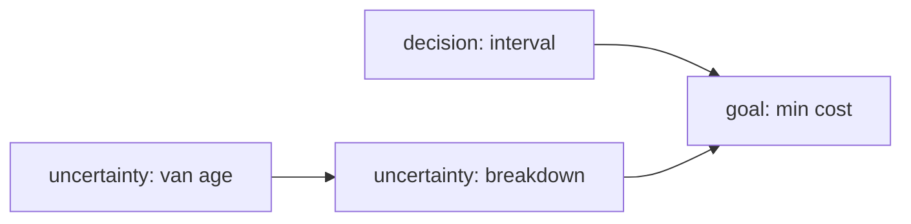

# Example: Idea → Mathematical Model (Delivery Fleet Preventive Maintenance)

Demonstrates the **reliability lens**, deciding policy over failure times.

## Phase 1: Parse

**Idea**: "A company runs 40 delivery vans; breakdowns are unpredictable and costly. Should they service vans on a fixed schedule or wait for failures?"

- System: fleet of 40 vans with aging components. State: van ages / health. Goal: **decision**, preventive schedule vs run-to-failure. Horizon: 3 years, monthly buckets.

## Phase 2: Decompose

| Sub-problem | Nature | Archetype |
|---|---|---|
| Breakdown timing per van | uncertainty | **Weibull lifetime** (wear-out) |
| Cost of prevention vs failure | decision | renewal, reward optimization |
| Fleet-level parts demand | flow | Poisson thinning → inventory |

## Phase 3: Parameters

| Symbol | Name | Unit | Exo/Endo | Range | Source | Sensitivity |
|--------|------|------|----------|-------|--------|-------------|
| β, η | Weibull shape/scale for time-to-breakdown | ,, months | exo | β 1.2-2.5, η 18-30 | lit./fit | high |
| c_p | preventive service cost | currency/van | exo | 150-300 | data | medium |
| c_f | corrective (breakdown) cost incl. tow + downtime | currency/van | exo | 600-1500 | data | high |
| N | fleet size | vans | exo | 40 | given | low |

Excluded: driver behavior differences (heterogeneity noted as future ABM), seasonal road stress.

## Phase 4: Assumptions

| # | Assumption | Type | Violation consequence |
|---|-----------|------|----------------------|
| 1 | Vans near-identical, independent failures `[R]` | Structural | One bad batch invalidates fleet-average policy |
| 2 | Weibull wear-out (β > 1) `[S]` | Parametric | If β ≤ 1, preventive servicing wastes money, policy flips to run-to-failure |
| 3 | Downtime cost constant per event `[R]` | Boundary | Peak-season failures cost multiples more |

Assumption 2 is the load-bearing one → swept.

## Phase 5: Perspectives

### Reliability/Stochastic (primary)
Weibull hazard h(t) = (β/η)(t/η)^(β−1); survival S(t) = exp(−(t/η)^β). Expected monthly cost under replace-at-age t_p:
L(t_p) = [c_p + c_f·F(t_p)] / ∫₀^tp S(t)dt.
Insight: optimal interval exists only when β > 1; as β → 1 the optimum slides to "never preventively service".

### Optimization (primary layer)
Minimize L(t_p) numerically over t_p ∈ [6, 36] months; sensitivity via parameter sweep. Shadow structure: c_f/c_p ratio sets how aggressive t_p* is.

### Monte Carlo validation
Simulate 10⁴ fleet-years with seeded RNG comparing policy cost distributions; check analytic L(t_p*) inside simulated ±2σ.

### Rejected lenses (one-line reasons)
Agent-based: van heterogeneity second-order at N=40 · Control: no continuous setpoint · Network: no interaction topology · Game/Causal/Info: no strategic actors, no intervention claim yet, no information bottleneck.

## Phase 6: Comparison & Recommendation

**Recommendation:** renewal, reward optimal interval from fitted Weibull, validated by Monte Carlo; revisit fit quarterly as failure data accumulates.

## Phase 7: Implementation & Validation

Pattern: `validate.py` sanity-check style, checks: L(t_p) convex near optimum; simulated fleet cost mean within 5% of analytic at t_p*; ruin-free budget note if c_f spikes. Sweep β ∈ [1.2, 2.5]: report how t_p* moves, if conclusion (service vs not) flips within range, escalate rigor tier.

## Phase 8: Falsifiability & Ledger

Dies if: observed failure ages reject Weibull fit (goodness-of-test), or β estimate lands ≤ 1 with tight CI (preventive policy unjustified).
Ledger: Weibull/renewal machinery = established · η, β values = assumption pending fleet data · downtime cost constancy = speculation.
