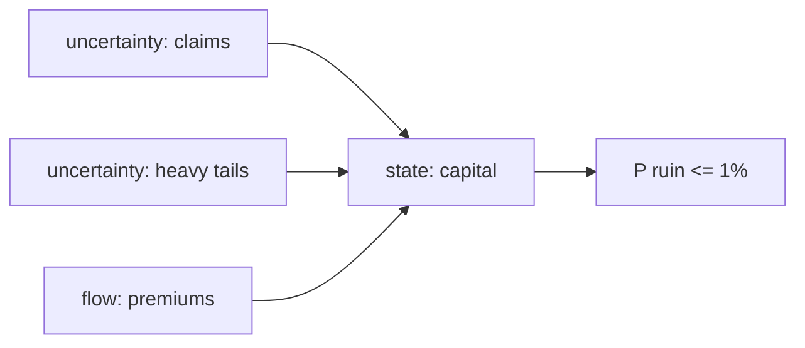

# Example: Idea → Mathematical Model (Insurance Ruin Risk)

Demonstrates **stochastic lens on rare events** — where deterministic thinking fails hardest.

## Phase 1 — Parse

**Idea**: "A small insurance pool covers 200 households against flood damage. Is its reserve enough to survive a bad decade?"

- System: reserve fund under random claims. State: capital C(t). Goal: risk assessment — P(ruin within 10 years) ≤ 1%. Horizon: decade, event-driven.

## Phase 2 — Decompose

| Sub-problem | Nature | Archetype |
|---|---|---|
| Claim arrivals | uncertainty | Poisson process |
| Claim sizes (flood = correlated!) | uncertainty, heavy-tailed | EVT / compound Poisson |
| Premium inflow | flow | drift term |

Coupling: ruin = drift negative + one tail draw beyond remaining buffer.

## Phase 3 — Parameters

| Symbol | Name | Unit | Exo/Endo | Range | Source | Sensitivity |
|--------|------|------|----------|-------|--------|-------------|
| λ | claim rate | claims/yr | exo | 4–12 | data | medium |
| μ, σ | log-claim size params | currency | exo | fit | data | high |
| ρ | correlation of simultaneous claims | – | exo | 0.3–0.8 (flood!) | est. | high |
| π | annual premium income | currency/yr | exo | fixed | policy | medium |
| C₀ | initial reserve | currency | exo | given | given | high |

Excluded: investment returns (conservative), reinsurance structure (future layer).

## Phase 4 — Assumptions

| # | Assumption | Type | Violation consequence |
|---|-----------|------|----------------------|
| 1 | Claims ~ log-normal iid `[S]` | Parametric | True flood tails heavier → ruin underestimated badly |
| 2 | Same-event claims arrive as one clustered batch `[R]` | Structural | Independence assumption would be fatal here |
| 3 | Premiums continue after bad years `[R]` | Boundary | Death-spiral dynamics missed |

Assumptions 1–2 both `[S]` → sweep + alternative Pareto tail.

## Phase 5 — Perspectives

### Stochastic (primary)
Compound Poisson ruin estimate via Monte Carlo (10⁵ decade paths, seeded): P(min C < 0). Analytic anchor: Cramér–Lundberg approximation for adjustment coefficient when applicable. Insight: **ruin probability is driven by the tail's shoulder, not the mean** — halving average claim barely helps; trimming 99.9th percentile halves ruin odds.

### Extreme value theory (validation)
Fit GPD to top claims above threshold; compare simulated tail vs EVT extrapolation. Insight: if MC and EVT disagree at 99.9%, neither has enough data — say so. Blind spot: needs many years of data that may not exist.

### Optimization (secondary)
Reserve target vs reinsurance premium trade-off: min total cost s.t. P(ruin) ≤ 1%. Shadow price = implied price of safety per currency unit of buffer. Blind spot: static year view.

### Deterministic (rejected)
"Average yearly loss < premiums therefore safe" — precisely the reasoning this idea punishes; recorded as rejected with reason: variance is the product.
Network/Control/Game/ABM/Causal/Info (rejected): no topology, no regulation setpoint, no strategic actors beyond contract terms taken as given, no intervention claim, no information bottleneck.

## Phase 6 — Comparison & Recommendation

**Recommendation:** Monte Carlo compound-Poisson with clustered flood batches (primary) + GPD tail cross-check + reinsurance optimization as decision layer. Report P(ruin) as interval across tail assumptions — never a single number for `[S]` assumptions.

## Phase 7 — Implementation & Validation

Pattern follows `validate.py --model gillespie` (seeded paths); checks: ruin monotone decreasing in C₀; mean shortfall consistent with analytic drift −λ·E[claim] + π; sweep ρ ∈ [0.3, 0.8] → ruin cliff table.

## Phase 8 — Falsifiability & Ledger

Dies if: empirical claim-size tail exceeds model's 99% quantile more often than 1% of the time (assumption 1), or clustering pattern contradicts batch structure.
Ledger: compound-Poisson machinery = established · lognormal choice = assumption · "no reinsurance market change in decade" = speculation.
