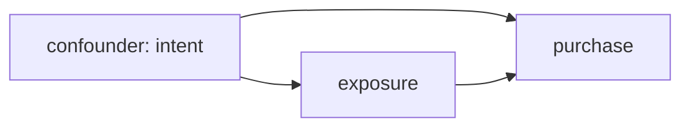

# Example: Idea → Mathematical Model (Marketing Attribution)

Demonstrates the **causal inference lens**, turning correlation into intervention logic.

## Phase 1: Parse

**Idea**: "Users who see our retargeting ads buy 3× more. Should we spend more on retargeting?"

- System: user population exposed to ad pipeline. State: exposure, purchase. Goal: **intervention claim**, causal effect of ad exposure on purchase. Horizon: campaign quarters.

## Phase 2: Decompose

| Sub-problem | Nature | Archetype |
|---|---|---|
| Exposure not random (targeting picks hot users) | uncertainty + selection | **backdoor confounding** |
| Purchase decision | decision | outcome model |
| Budget reallocation | decision | policy layer |

Coupling: the SAME trait (purchase intent) drives both exposure and purchase, classic confounder.

## Phase 3: Parameters

| Symbol | Name | Unit | Exo/Endo | Range | Source | Sensitivity |
|--------|------|------|----------|-------|--------|-------------|
| e_u | exposure indicator per user | , | exo | data | data | , |
| y_u | purchase within window | , | exo | data | data | , |
| X_u | intent proxies (prior visits, cart adds) | mixed | exo | data | data | high |
| τ | causal lift of exposure | percentage points | endo | ? | identified | high |

Excluded: long-term brand effects (window too short), multi-touch attribution ordering.

## Phase 4: Assumptions

| # | Assumption | Type | Violation consequence |
|---|-----------|------|----------------------|
| 1 | Unconfoundedness given X: no hidden driver of both `[S]` | Identification | Entire effect estimate collapses |
| 2 | Overlap: every X-stratum has exposed and unexposed users `[R]` | Identification | Cannot estimate for never-exposed profiles |
| 3 | No spillover between treated/untreated friends `[R]` | SUTVA | Contamination biases lift toward zero |

Assumption 1 is untestable → sensitivity analysis mandatory.

## Phase 5: Perspectives

### Causal inference (primary)
Draw the DAG; identify backdoor set X (prior engagement metrics); estimand: ATT = E[y₁ − y₀ | e=1]. Estimator: propensity-score matching or regression adjustment on X. Report lift with CI + **E-value**: how strong must an unmeasured confounder be to explain away 3×? If E-value ≈ 2, plausible; if ≈ 8, robust.

### Stochastic (validation)
Placebo test in pre-period: "effect" before any campaign should be ≈ 0; permutation distribution of lift under shuffled exposure as null reference. Blind spot: validates machinery, not assumption 1.

### Information theory (secondary)
Which covariate reduces uncertainty about assignment most? Rank I(X_i; e) to find the dominant targeting signal, and check whether ANY observable could capture intent (if max mutual information is tiny, hidden confounding is large). Blind spot: assumes distributions from finite samples.

### Deterministic / Optimization / others (rejected)
Naive 3× ratio IS the deterministic answer, recorded as rejected because it answers prediction ("who buys?") not intervention ("should we spend?"). No physical dynamics, no equilibrium game among users at this scope.

## Phase 6: Comparison & Recommendation

**Recommendation:** matched lift with sensitivity bound (primary) + placebo/permutation validation + information audit of covariates. Decision rule: increase budget only if lift CI excludes 0 AND E-value exceeds plausible confounding strength.

## Phase 7: Implementation & Validation

Pattern: logistic propensity model + stratified difference; checks: standardized mean differences < 0.1 post-matching; permutation p-value; report table across matching specs (robustness grid).

## Phase 8: Falsifiability & Ledger

Dies if: holdout experiment (geo split) shows ≈ 0 incremental sales while observational lift was 3×, proves assumption 1 violated.
Ledger: backdoor adjustment = established method · unconfoundedness = assumption (`[S]`, untestable) · "retargeting causes purchases" = speculation until experiment confirms.
