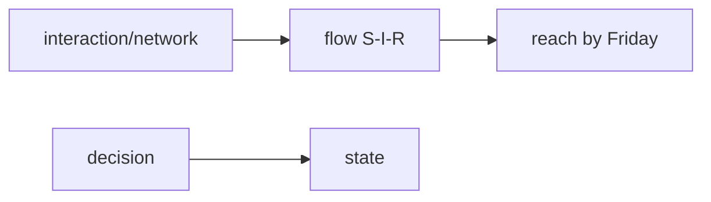

# Example: Idea → Mathematical Model (Rumor Spread in a School)

Demonstrates the **network lens as primary** — structure changes the answer.

## Phase 1 — Parse

**Idea**: "A rumor is spreading through a high school; the principal wants to know how far it gets by Friday and whether announcing it publicly stops it."

- System: 800 students, contact network; State: ignorant / spreader / stifled counts over days; Goal: prediction + intervention decision; Horizon: one school week.

## Phase 2 — Decompose

| Sub-problem | Nature | Archetype |
|---|---|---|
| Who talks to whom | interaction (structure) | **network dynamics** |
| Transmission when contacts meet | uncertainty → aggregated flow | SIR-type (rumor variant) |
| Public announcement = global broadcast | decision | intervention layer |

Coupling: announcement instantly moves fraction p of ignorants to stifled; transmission runs only along edges.

## Phase 3 — Parameters

| Symbol | Name | Unit | Exo/Endo | Range | Source | Sensitivity |
|--------|------|------|----------|-------|--------|-------------|
| β | transmission prob per contact-day | 1/day | exo | 0.02–0.1 | est. | high |
| k̄, ⟨k²⟩ | mean & second moment of degree | contacts/day | exo | survey | data | high |
| p | announcement coverage | – | exo | 0.3–0.9 | policy | medium |
| I(t), S(t) | spreaders, ignorants | students | endo | ≥0 | derived | — |

Excluded: teacher staff network (small), weekend gap (conservative).

## Phase 4 — Assumptions

| # | Assumption | Type | Violation consequence |
|---|-----------|------|----------------------|
| 1 | Rumor spreads only on real contact edges `[R]` | Structural | Homogeneous mixing overestimates reach if clustering dominates |
| 2 | Spreader tells each neighbor at most once `[R]` | Behavioral | Slower dynamics if re-telling happens |
| 3 | Announcement reaches uniform fraction of ignorants `[S]` | Parametric | Targeted groups (grade chats) missed |

## Phase 5 — Perspectives

### Network (primary)
Heterogeneous mean-field: effective reproduction number R_eff = R₀·⟨k²⟩/⟨k⟩ where R₀ = β·(contact duration). Insight: **hubs dominate** — top 3% connected students drive most of the reach; R_eff computed from survey degrees, not guesses. Blind spot: needs degree data.

### Deterministic (validation)
Standard homogeneous SIR with β·k̄ — gives baseline Friday-reach; compared against network estimate to quantify how much structure matters. Blind spot: hides hub effect entirely.

### Optimization (secondary)
Intervention choice: announce publicly (cost c₁, covers p) vs targeted hub briefing (cost c₂·m per m hubs). Minimize expected reach subject to budget. Insight: shadow price reveals when targeted beats broadcast (typically p < ⟨k²⟩ tail mass).

### Stochastic / Agent-based / Control (rejected)
Fade-out probability negligible at N=800 with R_eff ≫ 1 · ABM adds nothing beyond degree heterogeneity already captured · no continuous regulation problem.

## Phase 6 — Comparison & Recommendation

| Criterion | Net | Det | Opt |
|-----------|-----|-----|-----|
| Fidelity / data / cost / answers goal | 4/med/low/✓ | 2/tiny/tiny/partial | 4/low/low/✓ policy layer |

**Recommendation:** heterogeneous mean-field estimate of Friday reach + hub-targeted vs broadcast cost comparison from optimization layer.

## Phase 7 — Implementation & Validation

Degree data → compute ⟨k²⟩/⟨k⟩ directly; simulate rumor on the actual graph (30 runs, seeded) and check analytic reach within ±5%. Sensitivity sweep over β ∈ [0.02, 0.1].

## Phase 8 — Falsifiability & Ledger

Model dies if: observed reach ≪ analytic prediction at same β (assumption 1 broken), or spread jumps across non-contact pairs (bypassing edges).
Ledger: threshold form of R_eff = established · β range = assumption · "students relay honestly" = speculation.
