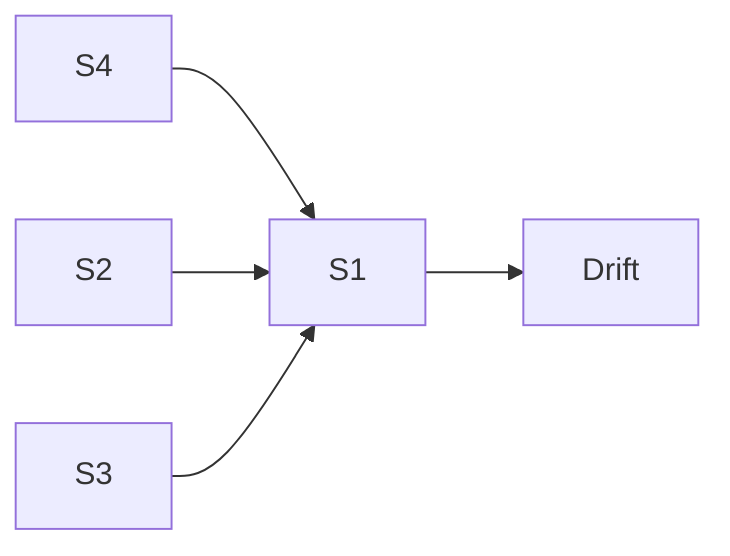

# Example: Damped Pendulum Clock: How Much Time Is Lost?

Demonstrates deterministic primary + stochastic + thermodynamic + control secondary on a literal physics system.

## Phase 0: Rigor Level

**Rigor: standard.** Plain summary: *A pendulum clock loses time because its swing slows when it swings wider, when its rod expands in heat, and when air drag steals energy. For a 1 m steel pendulum at ~2 s period, each costs 0.1-1 s/day.*

## Phase 1: Parse

**Idea:** "A damped pendulum clock loses time, how much and why?"
- System: bob + rod + air + escapement drive
- State: angle $\theta(t)$ [rad], velocity $\dot\theta$ [rad/s], length $L(T)$ [m], amplitude $\theta_0$ [rad]
- Goal: daily rate $\Delta t_{day}$ [s/day] + design fix

## Phase 2: Decompose

| # | Sub-problem | Nature | Archetype |
|---|---|---|---|
| S1 | Ideal swing period | flow | A1 $\omega_0=\sqrt{g/L}$ |
| S2 | Damping steals energy | flow | A1 $Q=\omega_0/(2\gamma)$ |
| S3 | Large-angle correction | flow | A1 $\theta_0^2/16$ |
| S4 | Rod expands with temperature | flow | A2d thermal expansion |
| S5 | Escapement sustains amplitude | control | `control.md` |
| S6 | Thermal/air jitter | uncertainty | A4 Langevin |



## Phase 3: Parameters

| Symbol | Name | Unit | Range | Sensitivity |
|---|---|---|---|---|
| $L_0$ | rod length | m | 0.5-1.5 | high |
| $g$ | gravity | m/s² | 9.81 | high |
| $\gamma$ | damping rate | 1/s | 0.001-0.02 | high |
| $\theta_0$ | peak amplitude | rad | 0.03-0.20 | high |
| $\alpha_L$ | expansion coeff. | 1/K | steel 12e-6, Invar 1.3e-6 | high |
| $Q$ | quality factor | , | 50-500 | , |

Excluded: buoyancy, suspension flexure, radiation.

Derived: $\delta= (T_d-T_0)/T_0$, $\Delta t_{day}=86400\delta$, $\delta_\gamma=1/(8Q^2)$, $\delta_\theta=\theta_0^2/16$, $\delta_L=0.5\alpha_L\Delta T$.

## Phase 4: Assumptions

| # | Assumption | Type | Violation consequence |
|---|---|---|---|
| 1 | Rigid rod, single $\theta$ | [R] | Bending modes add frequencies |
| 2 | Linear viscous damping $b\dot x$ | [S] | Ring-down not exponential |
| 3 | $\theta_0\lesssim0.2$ rad | [R] | Series underestimates $T$ >1% at >30° |
| 4 | $L(T)$ linear, $Bi<0.1$ | [R] | Gradient along rod |
| 5 | Fixed energy per cycle drive | [S] | Phase slip changes $\delta$ |
| 6 | $T$ varies slowly $\tau_{therm}\gg T_0$ | [E] | Parametric modulation |

## Phase 5: Perspectives

### Deterministic (primary)

$$\dot{\mathbf{x}} = [\dot\theta, -\omega_0^2\sin\theta -2\gamma\dot\theta + \tau_{drive}/(mL^2)]^T$$

Periods: $T_d=2\pi/\omega_d\approx T_0(1+1/(8Q^2))$, $T(\theta_0)\approx T_0(1+\theta_0^2/16)$, $T(L)\approx T_0(1+0.5\alpha_L\Delta T)$

$$\Delta t_{day}=86400(1/(8Q^2)+\theta_0^2/16+0.5\alpha_L\Delta T)$$

Numeric: $L_0=1$m→$T_0=2.006$s, $Q=120$, $\theta_0=0.05$→ $\delta_\gamma=8.7e-6$ (0.75 s/day), $\delta_\theta=1.56e-4$ (13.5 s/day), $\delta_L=1.8e-5$ (1.56 s/day). Total ~15.8 s/day; halving $\theta_0$→6.5 s/day.

### Thermodynamic

$$E_n=0.5 mL^2\omega_0^2\theta_0^2,\ \Delta E_{diss}=2\pi E_n/Q,\ \tau_{th}=C_{th}/G_{th}$$

Bottleneck is thermal $G_{th}$ (hours) not $b$ (seconds).

### Stochastic

Langevin $mL^2\ddot\theta+bL^2\dot\theta+mgL\sin\theta=\tau_{drive}+L\xi_{air}(t)$, MC $N\ge1e4$, jitter $\sigma_T\approx T_0\sqrt{k_BT/(2E_n Q)}\sim1e-4$s.

### Control

State-space $A=[0 1; -\omega_0^2 -2\gamma]$, $u=-Kx$ LQR, feasibility $u_{max}\ge2mL^2\gamma\omega_0\theta_0^*$.

Rejected: network/spatial, game-theory, agent-based.

## Phase 6: Comparison

| Criterion | Deterministic | Thermodynamic | Stochastic | Control |
|---|---:|---:|---:|---:|
| Fidelity | 5 | 4 | 5 | 4 |
| Data needs | low | low | med | med |
| Compute | tiny | tiny | low | low |
| Answers goal | ✓ decomposed | ✓ thermal share | ✓ interval | ✓ fix |

Recommendation: deterministic primary + stochastic validation + thermodynamic audit + control check.

## Phase 7: Implementation

```python
import numpy as np
from scipy.integrate import solve_ivp
L0=1.00; g=9.81; m=0.5; gamma=0.008; alpha_L=12e-6; dT=3.0; theta0=0.05
L=L0*(1+alpha_L*dT); omega0=np.sqrt(g/L); Q=omega0/(2*gamma); T0=2*np.pi/np.sqrt(g/L0)
def f(t,y): th,w=y; return [w, -omega0**2*np.sin(th) -2*gamma*w]
sol=solve_ivp(f,[0,20],[theta0,0.0],t_eval=np.linspace(0,20,200001),rtol=1e-10,atol=1e-12)
# period via zero-crossings
```

Validation: dimensional check, $dE/dt=-bL^2\dot\theta^2\le0$, $T_d$ within 5e-4 of $2\pi/\omega_d$.

## Phase 8: Falsifiability

Dies if:
- $T_d$ decreases with $\theta_0$ (kills small-angle)
- Ring-down vs linewidth $Q$ disagree >20% (kills linear $b$)
- Heat flux nonlinear in $\Delta T$ (kills Fourier)
- $pV$ deviates from $K_{eq}$ (kills ideal gas)
- Allan deviation plateau at $\tau\approx\tau_{th}$

Confidence ledger: established (Taylor, French, Incropera, Callen, Reif), assumption (steel $\alpha_L$, linear $b$), speculation (specific daily numbers need calibration).

