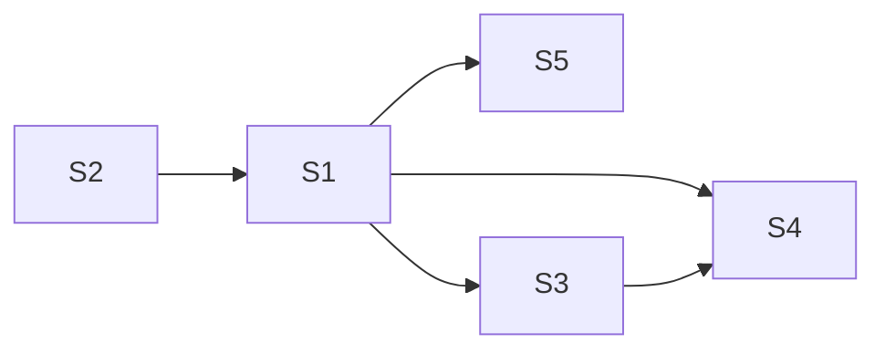

# Example: Medical Test Bayes — 99% Accurate, Disease 1/1000

Demonstrates Bayes primary + CLT validation + decision + information.

## Phase 0 — Rigor Level

**Rigor: standard.** Plain summary: *A positive result on 99% accurate test sounds scary, but when only 1 in 1000 has disease, about 9 in 10 positives are false alarms. Retest: second independent positive flips to ~91%.*

## Phase 1 — Parse

- System: screened population → test → decision.
- State: $D\in\{0,1\}$ true disease, $T\in\{+,-\}$ test outcome, belief $p=P(D\mid data)$.
- Inputs: prior $\pi=0.001$, $Se=0.99$, $Sp=0.99$, costs $c_{IJ}$.
- Goal: posterior $PPV=P(D\mid+)$ + expected-loss minimizing action.

## Phase 2 — Decompose

| # | Sub-problem | Nature | Archetype |
|---|---|---|---|
| S1 | First-test update $P(D\mid+)$ | uncertainty (Bayes) | Bayes/PPV |
| S2 | Sampling uncertainty on $Se,Sp,\pi$ | uncertainty | CLT / Wilson, Clopper–Pearson |
| S3 | Second-test policy | uncertainty (Markov) | 3-state chain |
| S4 | What to do | decision | $EU$, EVPI |
| S5 | Value of next test | information | $I(D;T)$ |
| S6 | Is positive association causal? | causal guard | DAG |



## Phase 3 — Parameters

| Symbol | Name | Unit | Range | Sensitivity |
|---|---|---|---|---|
| $\pi$ | prevalence $P(D)$ | – | 0.0005–0.01 | high |
| $Se$ | sensitivity $P(+\mid D)$ | – | 0.95–0.999 | high |
| $Sp$ | specificity $P(-\mid\neg D)$ | – | 0.95–0.999 | high |
| $\alpha=1-Sp$ | false-positive rate | – | 0.001–0.05 | high |
| $n_{Se},n_{Sp}$ | validation sample sizes | – | 100–5000 | med |
| $c_{FP},c_{FN}$ | cost of false alarm/miss | USD/QALY | domain-set | high |

Excluded: spectrum variation, test-retest correlation, prevalence drift.

Derived: $PPV=Se\pi/(Se\pi+\alpha(1-\pi))$, $LR_{+}=Se/\alpha$, $O_{post}=LR\cdot\pi/(1-\pi)$.

## Phase 4 — Assumptions

| # | Assumption | Type | Violation consequence |
|---|---|---|---|
| 1 | $\pi=0.001$ applies to this population | [S] | Referral bias shifts PPV 3–10× |
| 2 | $Se=Sp=0.99$ transport lab→field | [R] | Field $Sp=0.97$ drops PPV 9%→3% |
| 3 | Repeated tests conditionally independent | [S] | Correlated false positives make $P(D\mid+,+)\ll91\%$ |
| 4 | "99% accurate" = $Se=Sp=0.99$ | [S] | If overall accuracy then PPV ill-defined |
| 5 | $D\in\{0,1\}$ binary | [R] | Adds third outcome → Dirichlet |
| 6 | Loss linear in costs | [S] | Risk-averse $u(x)=\log x$ changes threshold |

Load-bearing: 1,3.

## Phase 5 — Perspectives

### Bayesian inference (primary)

$$PPV=\frac{0.99\times0.001}{0.99\times0.001+0.01\times0.999}\approx0.0902\;(9.0\%)$$

$$O_{prior}=0.001/0.999=0.001001,\; LR_{+}=99\Rightarrow O_{+}=0.0991\Rightarrow p_{+}=0.0902$$

Second independent positive: $O_{++}=99\times0.0991=9.81\Rightarrow p_{++}=0.907$ (91%).

Beta-Binomial uncertainty: $Sp\sim\text{Beta}(496,6)$ → 95% CrI $[0.975,0.996]$ → $PPV$ $[0.03,0.20]$.

**Unique insight:** explains why "99% accurate" ≠ 99% predictive.

### Frequentist / CLT & Interval

Treat $Se,Sp$ as Binomial. CLT $\hat p\pm1.96\sqrt{\hat p(1-\hat p)/n}$ valid only if $n\hat p(1-\hat p)\ge5$. Wilson and Clopper–Pearson preferred near $p\approx1$.

For $n_{Sp}=500$, $k=495$: Wald $[0.981,0.999]$, Wilson $[0.977,0.996]$, CP $[0.975,0.997]$.

**Unique insight:** honest interval for PPV; exposes Wald overconfidence.

### Decision theory

Options $A=\{\text{reassure},\text{retest},\text{refer}\}$, states $S=\{D,\neg D\}$ with $p_j=\{PPV,1-PPV\}$, payoffs $x_{ij}$ [USD].

$EU(a_i)=\sum_j p_j u(x_{ij})$, threshold refer iff $PPV>c_{FP}/(L-c_{FP})\approx2\%$ at $c_{FP}=200$, $L=10000$ → at 9% refer/retest dominates.

Minimax regret also favors retest. EVPI $=E_D[\max_a x_{aD}]-\max_a E[x_{aS}]\approx882$ USD — ceiling price for perfect test.

### Information theory

$$H(D)=-0.001\log_2 0.001-0.999\log_2 0.999\approx0.0114\text{ bits}$$

$$I(D;T)=H(D)-H(D\mid T)\approx0.06\text{ bits at }\pi=0.01$$

Second test adds $I(D;T_2\mid T_1)\approx0.43$ bits conditional on first $+$.

## Phase 6 — Comparison

| Criterion | Bayes | Frequentist | Decision | Information |
|---|---|---|---|---|
| Fidelity for "should I worry?" | 5 | 4 | 5 | 3 |
| Data needs | low | low | med | low |
| Answers goal (posterior) | ✓ 9% | ✓ interval | ✓ threshold | indirect |
| Answers goal (action) | — | — | ✓ retest | ranking |

Recommendation: Bayes primary (91% second test) + Frequentist validation + Decision.

## Phase 7 — Implementation

```python
import numpy as np
from scipy.stats import binom, beta, norm, bernoulli
pi, Se, Sp = 0.001, 0.99, 0.99
alpha=1-Sp
PPV=Se*pi/(Se*pi+alpha*(1-pi))
print(f"PPV={PPV:.4f}")  # 0.0902
# Monte Carlo N=200k
rng=np.random.default_rng(0); N=200_000
D=bernoulli.rvs(pi, size=N, random_state=rng)
T=np.where(D==1, bernoulli.rvs(Se, size=N, random_state=rng), bernoulli.rvs(alpha, size=N, random_state=rng))
print(f"MC PPV={D[T==1].mean():.4f}")
# Sensitivity sweep pi in [0.001,0.1]
for p in [0.001,0.005,0.01,0.05,0.1]:
    print(p, Se*p/(Se*p+(1-Sp)*(1-p)))
```

Sanity: $PPV,NPV\in[0,1]$, $\partial PPV/\partial\pi>0$, MC within $2SE$.

## Phase 8 — Predictions & Falsifiability

Predicts:
- Of 1000 positives, ~90 have disease, ~910 do not.
- Retesting 100 positives → ~90 false positives flip to negative; second-stage PPV ≈50% if independent.

Killed by:
- Field $PPV <3\%$ or $>20\%$ at matched $\pi=0.001$ (kills transport)
- $P(+\mid\neg D,+_1)\gg\alpha$ or $\rho>0.3$ between repeats (kills independence)
- Wilson/Bayes CrI systematically miss (kills normal approx)

