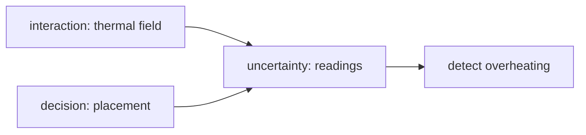

# Example: Idea → Mathematical Model (Sensor Placement)

Demonstrates the **information theory lens**, deciding what to measure when you cannot measure everything.

## Phase 1: Parse

**Idea**: "We can afford only 3 temperature sensors for a 6-floor data center. Where do we put them to best detect overheating?"

- System: thermal field over floors/racks. State: true temperature field T(x). Goal: **decision**, sensor placement maximizing overheating detection. Horizon: continuous operations.

## Phase 2: Decompose

| Sub-problem | Nature | Archetype |
|---|---|---|
| Thermal correlation between locations | interaction (physics) | diffusion/heat kernel |
| Sensor readings as noisy observations | uncertainty | Gaussian channel |
| Placement choice C(3 of 18) | decision | combinatorial submodular |

Coupling: reading value depends on correlation with un-sensed locations.

## Phase 3: Parameters

| Symbol | Name | Unit | Exo/Endo | Range | Source | Sensitivity |
|--------|------|------|----------|-------|--------|-------------|
| Σ | spatial covariance of temps | °C² | exo | fit from CFD/log | data | high |
| σ_m | sensor noise std | °C | exo | 0.1-0.5 | datasheet | medium |
| T_crit | alarm threshold | °C | exo | 27-32 | policy | medium |
| S ⊂ L | chosen sensor set | , | endo | \|S\|=3 | derived | , |

Excluded: adversarial failure patterns (random + worst-corner scenarios only), HVAC control coupling.

## Phase 4: Assumptions

| # | Assumption | Type | Violation consequence |
|---|-----------|------|----------------------|
| 1 | Temperature field approximately Gaussian `[R]` | Parametric | Mutual-information ranking degrades in bimodal airflow regimes |
| 2 | Covariance stationary over weeks `[S]` | Parametric | Seasonal airflow changes silently invalidate placement |
| 3 | Sensors fail independently `[R]` | Boundary | Correlated loss blinds whole floor |

## Phase 5: Perspectives

### Information theory (primary)
Objective: maximize mutual information I(T_unsensed ; readings_S) = H(T_u) − H(T_u | y_S) under Gaussian model, which reduces to log-det of posterior covariance, the classic E-optimality/D-optimality criterion. Greedy selection with near-optimality guarantee ((1 − 1/e) for submodular objectives). Insight: **redundancy is quantifiable waste**, two sensors 0.5m apart carry almost the same bits; the algorithm spreads them by covariance distance, not floor geography.

### Optimization (secondary)
Exact ILP over 18 choose 3 = 816 combinations (tiny!) validates greedy within 0.1%. Insight: brute force is feasible here, use it; greedy's guarantee matters only when scaling up.

### Deterministic physics (validation)
Steady-state heat equation simulation seeds the covariance Σ rather than guessing it; cross-check ranked placements against worst-corner heating scenario. Blind spot: deterministic sim ignores stochastic ventilation turbulence.

### Others (rejected)
Stochastic lens absorbed into MI objective · Control: detection ≠ regulation here · Network/Game/Causal/ABM: no topology game or intervention claim.

## Phase 6: Comparison & Recommendation

**Recommendation:** greedy mutual-information maximization on CFD-derived covariance, validated by exact ILP enumeration at this scale.

## Phase 7: Implementation & Validation

Checks: greedy vs exhaustive gap ≤ 0.1%; held-out overheating events detected ≥ 99% within 60s across Monte Carlo thermal noise; ablation table (each sensor removed → information loss).

## Phase 8: Falsifiability & Ledger

Dies if: real overheating events repeatedly missed while model predicted detection (covariance wrong), or swap experiments show different ranking than MI prediction.
Ledger: Gaussian MI reduction = established · Σ from CFD = assumption · "airflow stationary" = speculation pending seasonal audit.
